# Agentic SDLC Framework

**A way to let AI coding agents take part in software delivery without giving up control.** The framework has two parts that work together:

| Part | What it is | For |
|---|---|---|
| **Handbook** (`handbook/`) | Policies, a 6-phase process, 8 gates, roles, templates, checklists and runbooks | People: leadership, PM / BrSE (project manager, bridge system engineer), developers, reviewers, testers |
| **Platform** (`platform/`) | Self-hosted software that **enforces** the handbook: it runs AI agents through the 8 gates, keeps evidence and an audit log, and measures tokens and cost | The delivery team, every day |

The handbook says **what must happen and why**. The platform **makes sure it happens**. The design documents (`design/`) connect the two.

Built for small and medium software companies, including those working for Japanese clients. Everything is in plain English, written for non-native readers; the platform's messages go through a catalog, so Vietnamese and Japanese can be added.

**Status (2026-10-10): built and tested, not yet used on a real project.** The platform is built, with automated tests for each requirement ([what proves each criterion](design/MVP-DONE.md)). The trial on a fictional sample project has not started (anyone can run it: see below); the first real internal project comes after it. Before real client data, the server still needs the company's own certificate and named key holders for the secret manager (encrypted connections to it are built), a first restore drill on the server (backup and restore are built and tested), and measured resources (the open task A10).

**Try it: we are looking for teams to run the first trial.** The current release, **v0.1.0, is a preview for technical testers** (Docker, Node.js and pnpm needed); a friendlier set-up comes with v0.2.0. Deploy the platform on your own machine, take a few tasks of a fictional sample project through the 8 gates with an AI agent, and tell us what you found: [TRIAL.md](TRIAL.md).

**Supported today:** GitHub, projects built with Node.js and TypeScript (one sandbox image, `node24`), the OpenHands agent, and one server with Docker Compose. People reach the API and the dashboard on the server itself; access from other machines comes later ([where to run it](platform/deploy/README.md#where-to-run-it)).

---

## 1. In one sentence

> AI takes part in every stage of software development, but every **intent** (one change to make) passes **8 gates** (G1–G8) with **the right human approvers**, **evidence**, an **audit log that cannot be altered**, and **token and cost measured** per client, project and intent.



Red: always approved by a person (HITL, human in the loop). Orange: oversight depends on risk. Blue: an automatic policy check. Details: [codes table §4](handbook/00-introduction/05-codes.md).

## 2. Where to start

| You are | Read |
|---|---|
| **Trying the platform** in the community trial | [TRIAL.md](TRIAL.md): what you need, the set-up, three sample tasks, and the report |
| **Leadership** deciding whether to adopt | This page, then handbook Part I: [Ch.1 summary](handbook/01-policy/ch01-executive-summary.md) and [Ch.9 adoption roadmap](handbook/01-policy/ch09-adoption-roadmap.md) |
| **Bringing a project team onto the platform** (tech lead, leadership) | [platform/ROLLOUT-GUIDE.md](platform/ROLLOUT-GUIDE.md): where each role starts, the rollout step by step, the first week, common mistakes |
| **Preparing your application's repository** (Person A, the intent owner, or the repository owner) | [ROLLOUT-GUIDE step 1](platform/ROLLOUT-GUIDE.md#step-1-prepare-the-repository-person-a-the-repository-owner-12-days): the two repositories, what yours needs, the one file of agent instructions, Spec Kit and BMAD |
| **New to the platform** | [The platform in five minutes](platform/PLATFORM-IN-5-MINUTES.md), then the [tutorial: your first feature](platform/TUTORIAL-FIRST-FEATURE.md), one real feature from idea to release. Every platform guide in one list: [platform/README.md](platform/README.md) |
| **A team member** (Person A, who asks for changes; Person B, who reviews and approves; PM / BrSE) | [platform/USER-GUIDE.md](platform/USER-GUIDE.md): one intent from G1 to G8, by role, with the commands and what to do when something goes wrong |
| **Installing and operating the platform** (operator) | [platform/deploy/README.md](platform/deploy/README.md): where to run it, the GitHub App, "Fresh deployment" from an empty checkout to the first intent, restart, upgrade, troubleshooting, uninstall; runbook [T11](handbook/03-templates/T11-openbao-runbook.md) (OpenBao) |
| **Working on the platform's code** (not needed to use it) | [CONTRIBUTING.md](CONTRIBUTING.md) and [platform/GETTING-STARTED.md](platform/GETTING-STARTED.md) (the developers' set-up: dev stack, test GitHub App) |
| **Working on the handbook** | [CONTRIBUTING.md](CONTRIBUTING.md), the [contents](handbook/00-introduction/01-contents.md) and the [writing style](handbook/00-introduction/06-writing-style.md) |

A word you do not know? The [glossary](handbook/00-introduction/02-glossary.md) explains the words, and the [codes table](handbook/00-introduction/05-codes.md) the codes (G1–G8, L0–L4, HITL, HOTL, AUDIT).

## 3. How it works

**Two repositories.** The platform (this repository) is installed once on a server and serves many projects. Each project keeps its application in its own GitHub repository; the platform reaches it through a GitHub App, runs agents on a temporary clone, and opens pull requests there. It keeps no working copy of the code.

What it does keep: each run's diff, as evidence, for at least 180 days. If the optional tracing (Langfuse, the `observability` profile) is on, it also keeps the model prompts and answers until the retention purge.



**An intent goes through eight gates.** An intent is one change to make, with a code such as `INT-2026-0007` ([glossary](handbook/00-introduction/02-glossary.md)). Person A asks for it; Person B, the independent reviewer and approver, approves what others produced.

| Gate | What happens |
|---|---|
| G1 | Person A describes the change, its risk and its data class |
| G2 | A specification with acceptance criteria is linked |
| G3 | A plan says which files the agent may change; Person B approves it |
| G4 | The platform checks the agent, its permissions and the budget |
| G5 | The agent has worked in an isolated sandbox; the platform checks that it stayed inside the plan and the budget |
| G6 | The platform pushes the change and waits for CI (continuous integration: the build and the tests) and the security scans |
| G7 | Person B reviews the pull request and merges it |
| G8 | Person B approves the release with its evidence |

**The oversight of each gate depends on the risk.** Low-risk work passes some gates automatically when their conditions hold (HOTL, human on the loop), and a person can still block it within the **block window** (4 working hours by default, configurable). High-risk work lets the agent only write a proposal: a patch kept as evidence, never pushed. Critical work never runs an agent.

**People, in a "2+N" team:**

| Role | Does |
|---|---|
| **Person A**, the intent owner (owner and executor) | Creates the work, writes specifications and plans, follows the agent |
| **Person B**, the independent reviewer and approver | Approves plans, reviews and merges pull requests, approves releases |
| **Second approver** | A second approval for sensitive changes (migration, payment, personal data…) and Critical risk |
| **PM / BrSE** | Records the client's consent to AI use and the disclosure note |
| **Governance** (leadership) | Decides escalations nobody else answered |
| **N agents** | Write code inside the limits they were given |

**What the platform never does:**

- let the producer of a change approve it at review (G7) or release (G8) ([who the producers are](handbook/02-playbook/ch15-p5-release.md#producers)). Exception: at G1 the person who created the intent approves it, because G1 only confirms their own request;
- merge a pull request or deploy to production: people do;
- give an agent a real model key, access to secrets, or a way to push to the main branch;
- change or delete an audit record.

## 4. What the platform includes

| Area | What it does |
|---|---|
| **Gates G1–G8** | A workflow per intent; approvals through GitHub comments (`/approve G3`), GitHub reviews (G7) or the `sdlc` command; each approval bound to the exact version it approved, with an expiry |
| **Agent runs** | OpenHands (an open-source coding agent) in a hardened sandbox per run, network limited to the model gateway and a package proxy; iteration, time and cost caps; loop detection; a kill switch that stops a run within minutes |
| **Scope and budget** | Changed files compared with the approved plan; budgets per tenant (a client or unit, with its own data), intent and run, with a warning at 80 % and a stop at 100 % |
| **Evidence** | An Evidence Pack per intent: the hashes and references of the specification, plan and diff, CI, every gate decision, cost, the client AI disclosure note; never the code or the texts. Exportable as Markdown, sealed at release ([what it holds](handbook/02-playbook/ch15-p5-release.md#15102-the-evidence-pack)) |
| **Audit** | An append-only audit log per tenant. Each record holds the fingerprint (hash) of the record before it, so a changed record breaks the chain; `sdlc audit verify` checks it. Once a day the latest fingerprint is copied to storage that nobody can change |
| **Escalations** | Time limits per severity, a backup owner for each escalation, then governance; the work stays frozen while nobody answers |
| **Cost** | Every model call through one gateway (LiteLLM) with labels for tenant, project, intent and run; cost reports, including wasted cost |
| **Retention** | Evidence kept 180 days by default, longer when configured; holds for disputes; the audit log kept at least two years |
| **Dashboard** | A read-only web page: intents by gate, who each waits for and why, escalations, cost, gate waiting times, evidence |
| **Multi-tenant** | Every record belongs to a tenant; every query filters by it |

Interfaces keep the platform open to change: the Git host (GitHub today), the agent (OpenHands today), the policy engine and the model provider can each be replaced without changing the core.

## 5. Technology

| Layer | Choice |
|---|---|
| Platform | TypeScript: an API (NestJS), a workflow worker (Temporal), a sandbox runner, the `sdlc` command, the dashboard (Preact) |
| Self-hosted services | PostgreSQL, Temporal, LiteLLM, Langfuse, SeaweedFS (object storage), Valkey, OpenBao (secrets, contract signing) |
| Deployment | Docker Compose on one self-hosted server; no managed cloud service needed |
| Models | API models and self-hosted models, all through the LiteLLM gateway |
| Licences | Every reused component allows commercial use ([build vs buy](design/D-01-build-vs-buy.md)) |

## 6. Repository layout

```text
.
├── handbook/        # The handbook: introduction, policy (Ch.1–9), playbook (Ch.10–20), templates (T1–T18)
├── platform/
│   ├── apps/        # api, worker, runner, cli, dashboard
│   ├── packages/    # core, contracts, config, messages, secrets, telemetry, api-schemas, workflow-client, adapters/*
│   ├── deploy/      # Docker Compose, OpenBao and SeaweedFS set-up
│   ├── tests/       # unit, integration and end-to-end tests
│   ├── README.md    # index of the platform guides
│   ├── PLATFORM-IN-5-MINUTES.md, TUTORIAL-FIRST-FEATURE.md, USER-GUIDE.md, ROLLOUT-GUIDE.md, GETTING-STARTED.md
├── design/          # Design documents (D-xx), decisions (ADR-Mxx), open questions
├── diagrams/        # Mermaid sources and SVG
└── scripts/         # Backlog and issue tools
```

## 7. Documents

| Topic | Document |
|---|---|
| Codes: phases, gates, autonomy levels, oversight modes, risk tiers, roles | [Codes table](handbook/00-introduction/05-codes.md) |
| Words: intent, block window, producer, tenant admin… | [Glossary](handbook/00-introduction/02-glossary.md) |
| Handbook contents | [Contents](handbook/00-introduction/01-contents.md) |
| MVP scope and requirements | [D-02](design/D-02-mvp-scope.md) |
| Architecture | [D-03](design/D-03-mvp-architecture.md) |
| Data model | [D-05](design/D-05-data-model.md) |
| Models, tokens and cost | [D-07](design/D-07-model-and-token-management.md) |
| The sample repository used for tests | [D-09](design/D-09-sample-pilot-repo.md) |
| What the web interface may offer next | [MVP+1 interface scope (draft)](design/MVP1-UI-SCOPE.md) |
| Every design document and decision | [design/README.md](design/README.md) |
| Diagrams | [diagrams/README.md](diagrams/README.md) |
| The platform guides (five minutes, tutorial, user guide, rollout, deployment, developers) | [platform/README.md](platform/README.md) |
| Contributing, the repository's rules and CI | [CONTRIBUTING.md](CONTRIBUTING.md) |
| Reporting a security problem | [SECURITY.md](SECURITY.md) |
| Changes | [CHANGELOG.md](CHANGELOG.md) |

## 8. Help

- Questions, problems and ideas: [open an issue](https://github.com/hoanghainh1188/agentic-sdlc-framework/issues/new/choose) with the bug report or feature request template. Never paste a secret, a token or client data.
- Security problems: never in a public issue; see [SECURITY.md](SECURITY.md).
- Operators: [troubleshooting](platform/deploy/README.md#troubleshooting). Team members: [when something goes wrong](platform/USER-GUIDE.md#5-when-something-goes-wrong).
- Contributing: [CONTRIBUTING.md](CONTRIBUTING.md).

## 9. Licence

The code is [MIT](LICENSE). The documentation (`handbook/`, `design/`, `diagrams/`) is [CC BY 4.0](LICENSE-docs.md): reuse it, also commercially, with credit. Both stay open. The components the platform reuses keep their own licences; every one allows commercial use ([build vs buy](design/D-01-build-vs-buy.md)).
