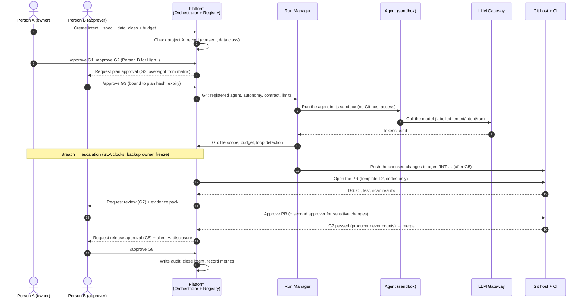

# D-02. MVP scope of the platform

| Item | Value |
|---|---|
| Version | 1.4 |
| Date | 2026-09-24 |
| Status | **Approved** (Harry, 2026-09-24) — version 1.0, aligned with the handbook (tag `design-v1.0`); 1.1 approved by Harry on 2026-09-27 in the C05 session 2 plan (local Ollama model on developer machines for the C05 proof only; QUESTIONS #78); 1.2 approved by Harry on 2026-10-03 in the C08 plan (§5 flow: the runner pushes after G5, the platform opens the pull request; QUESTIONS #52); 1.3 approved by Harry on 2026-10-06 (§4.2, §12: the trial M-E runs with the local Ollama model; the API-model run moves to before M-F; QUESTIONS #81); 1.4 approved by Harry on 2026-10-07 (§4.2: a read-only dashboard starts before MVP+1; QUESTIONS #255) |
| Readers | Leadership (sections 1–4, 10–12), tech lead / developers (all), Claude Code (sections 5–9, 13) |
| Related documents | D-01 (build vs buy), D-07 (models and tokens), handbook codes table and Chapters 2–6, 10–20 |

---

## 1. Purpose

- Fix **what the MVP does and does not do**.
- Serve as input for breaking down the work and handing it to Claude Code.
- MVP = the smallest version that is **really usable** on one pilot project.

## 2. MVP goal (one sentence)

> One task goes **all the way from G1 to G8** on a real repo, with an agent writing code in a sandbox. Every step has **the right human approver**, **evidence**, an **audit log** and **measured token cost**.

### Expected results
- Show that the 8-gate flow works and is not too heavy for the team.
- Real numbers: tokens, cost, gate waiting time, share of PRs that needed changes.
- A base to grow from: multi-tenancy, more agents, more Git hosts.

## 3. MVP users

The platform follows the handbook's **2+N team** (handbook Chapter 5).

| Role (project role in D-05) | Uses the MVP to |
|---|---|
| Person A (`person_a`) — owner / executor | Create intents, approve G1 and G2 (Low/Medium risk), operate runs, receive escalations about intent and budget |
| Person B (`person_b`) — independent reviewer / approver | Approve G2 (High+), G3, G6 (High+), G7, G8; receive technical and security escalations; freeze or lower autonomy |
| Second approver (`second_approver`) | Second approval at G7 for sensitive change types; Critical-risk G8 |
| PM / BrSE (`pm_brse`) | Maintain the project AI record (client consent); client disclosure note |
| Governance (`governance`) — leadership | Exceptions, raising autonomy, Critical escalations, agent approval for L3+ |
| Platform admin (`admin`) | Tenants, budgets, agent register, Git hosts |

The **producer of a change never approves it**. One person may hold several roles on different projects, never producer and approver of the same change.

---

## 4. Scope

### 4.1. IN scope for the MVP

| # | Component (from D-01) | What the MVP does |
|---|---|---|
| 1 | Gate Orchestrator | Runs the G1–G8 workflow on Temporal. Stores every gate decision |
| 2 | Intent / Spec Registry | Creates intents; links a spec file in the repo (path + hash); versions |
| 3 | Run Manager | Runs one agent in Docker + git worktree. Assigns run_id and labels. Token cap, iteration cap |
| 4 | Evidence Pack | Collects diff, CI results, tests, scans and review decisions into one JSON + Markdown pack |
| 5 | Audit Log | Append-only table with a hash chain. Has an integrity check command |
| 9 | Agent adapter | **OpenHands** |
| 6 | Git adapter | **GitHub**, with the interface ready for GitLab |
| 10 | Spec adapter | Reads Markdown spec files produced by Spec Kit/BMAD. **Read only, no conversion yet** |
| 7 | Cost Controller | Issues a LiteLLM virtual key per run, with a cost cap. Warns at 80%, stops at 100% |
| — | Multi-tenancy | Every table has `tenant_id` from day one. One installation |
| — | Oversight | Oversight mode (HITL / HOTL / AUDIT) per gate from the **gate × risk matrix** in project config; forced HITL at G3 for listed change types; dual approval at G7 for sensitive change types |
| — | Escalation | Triggers, response levels, acknowledge and resolve SLAs, backup owner, freeze when nobody answers (handbook Ch.6) |
| — | Approval binding | Every approval bound to a version/hash, scope and expiry; re-checked just before the action |
| — | Agent register | Minimal register: owner, status, pinned model version, instructions version, allowed tools, last recertification. Only active, registered agents may run |
| — | Kill switch | Stop any run within 5 minutes and revoke its credentials; loop detection |
| — | Project AI record | Client consent, allowed data classes, production-logs flag, disclosure format; checked at G1 and G4 |
| — | Retention | Audit log kept ≥ 2 years; evidence files 6 months; client data purged when a project is archived (unless on hold) |
| — | User interface | CLI + commands in PR/issue comments (see 6.3). **No separate web UI** |
| — | Deployment | Docker Compose on one self-hosted server |

### 4.2. OUT of scope for the MVP (later)

| Item | When |
|---|---|
| Second Git host | MVP+1 |
| Second agent, multi-agent | MVP+1 |
| WeKnora (document knowledge), code index, full context snapshots (#11) | MVP+1 |
| Self-hosted models (vLLM) | When the GPU decision is made. The MVP gateway only needs to be able to add models. Exception: a local Ollama model on a **developer machine** proves the agent path in C05 (QUESTIONS #78) and runs the trial M-E on the fictional sample repo (QUESTIONS #81); it is not a deployment target |
| Converting BMAD/Spec Kit specs into our own format | MVP+1 |
| Full OPA/Cedar policy engine (#8) | MVP+1. The MVP uses simple rules in code, behind an interface |
| Backlog / Jira integration (#12) | MVP+1 |
| Client reports (#13) | MVP+2 |
| Web UI, dedicated dashboard | MVP+1. The MVP uses Langfuse + Temporal UI. Exception: a **read-only** dashboard (intents and gates, escalations, cost and gate waiting times, evidence and audit), signed in with the personal API tokens, starts in parallel with the trial M-E (task U01, QUESTIONS #255). Actions in a web UI stay MVP+1 |
| SSO, Kubernetes, multiple installations | When selling to clients |
| Autonomy level 3 (agent acting in production) | Not in the MVP |
| Agent deploying to production | **Never automatic.** G8 production is always HITL |
| Incident module (records, workflow) | MVP+1. MVP: escalations at "Incident" level create an audit event and notify; the record uses handbook template T9 |
| Break-glass access | MVP+1 |
| Deferred approval queue (independent branches continue while waiting) | MVP+1. MVP runs one agent task at a time per intent |
| Automatic rollback / containment controller | MVP+1. MVP: kill switch and credential revocation only; agents never deploy |
| PQC metrics and observation-window automation | MVP+1. MVP records the events needed to compute them later |
| Recertification workflow | MVP+1. MVP stores the last recertification date and warns when older than 3 months |

---

## 5. MVP end-to-end flow

SVG version: [d10-mvp-flow.svg](../diagrams/svg/d10-mvp-flow.svg)

---

## 6. Functional requirements

Code: `FR-xx`. Each requirement has acceptance criteria (AC) so that Claude Code can write tests.

### 6.1. Intents and specs

| Code | Requirement | Acceptance criteria |
|---|---|---|
| FR-01 | Create an intent: title, description, repo, tenant, project, data_class, risk tier, token budget | The intent has an ID `INT-YYYY-NNNN` and status `draft` |
| FR-02 | Link a spec: file path in the repo + commit + hash | If the spec content changes after G2 → report the mismatch, require G2 again |
| FR-03 | The risk tier sets the maximum autonomy level (L0–L4) | Critical → L0 (the agent may not run). High → L1 (proposal only). Medium and Low → L2. L3–L4 not available in the MVP |

### 6.2. Gates G1–G8

Oversight per gate comes from the **gate × risk matrix** (handbook codes table §4), stored in the project config. Defaults:

| Gate | Low | Medium | High | Critical | Approver | How the MVP enforces it |
|---|---|---|---|---|---|---|
| G1 Intent/Scope/Risk | HITL | HITL | HITL | HITL | Person A | `approve` command; required fields; **project AI record present and consistent with the data class** |
| G2 Specification | HOTL | HITL | HITL | HITL | Person A; Person B for High+ | Acceptance criteria present; spec hash recorded |
| G3 Plan/Architecture | HOTL* | HITL | HITL | HITL | Person B | Plan with allowed paths; plan hash. *HITL at any tier when a forced-HITL change flag is set |
| G4 Execution boundary | Policy | Policy | HITL | — (no run) | Policy; Person A for High | Registered active agent, autonomy within max, contract signed, limits set |
| G5 Scope drift / budget | HOTL | HOTL | HOTL→HITL | — | Person A | Files vs plan; budget 80 % warn / 100 % stop; loop detection |
| G6 Verification | AUDIT | HOTL | HITL | HITL | Person B for High+ | CI status; security findings always HITL |
| G7 Review/Merge | HITL | HITL | HITL | HITL + 2nd | Person B (+ second approver) | PR approvals; producer never counts; **dual approval** for sensitive change types at any tier |
| G8 Release/Learning | HITL (prod) | HITL | HITL | HITL + business/security | Person B | `approve` command; evidence pack incl. client AI disclosure note |

HOTL at a human gate means: the gate passes automatically when the policy conditions hold, a person is notified and can block within the gate's window; AUDIT means the decision is sampled afterwards.

| Code | Requirement | Acceptance criteria |
|---|---|---|
| FR-10 | Each gate returns one decision: `approve`, `reject`, `request_changes`, `pause`, `block` | The decision is stored with the person, time, reason and hash of the input data |
| FR-11 | Separation of duties (2+N) | The approver must hold the gate's role (table above). **The producer of the change (human or agent) never approves it.** Agents never approve. Test: a producer's approval at G7 is ignored |
| FR-12 | Human gates have a deadline | Overdue → escalation (FR-18). Waiting time is recorded as a metric |
| FR-13 | Controlled rollback | G5 out of scope → back to G3. G6 fails beyond the retry limit → back to G2 or G3 |
| FR-14 | Oversight from the matrix | The oversight mode of each gate is resolved from project config (gate × risk tier, plus change flags). Changing the matrix is a config change recorded in the audit log |
| FR-15 | Forced HITL at G3 | Plans flagged with any of: migration / data model, breaking contract, new service boundary, security boundary, system of record, production infrastructure, core business rule → G3 is HITL at any tier |
| FR-16 | Dual approval at G7 | Changes flagged as migration, payment, personal data, production infrastructure, breaking change or safety function need Person B **and** a second approver, at any tier |
| FR-17 | Approval binding | An approval stores the reviewed version/hash, scope, environment and expiry. Just before the action, the platform re-checks; any mismatch or expiry → the approval is void and the gate is evaluated again |
| FR-18 | Escalation | Escalations have a trigger, severity, response level (observe, notify, pause, contain, incident), owner and backup owner, and two clocks (acknowledge, resolve) from the SLA table (Critical 15 min / High 1 h / Medium 1 working day / Low 3 working days). No acknowledgement → backup → governance; sensitive work stays frozen; approval never passes back to the producer |
| FR-19 | Project AI record | Each project has an AI record (client consent, allowed data classes, production-logs flag, disclosure format). G1 fails if it is missing; an intent's data class must be allowed by the record; unknown consent → `client_restricted` |

### 6.3. How users interact

| Code | Requirement | Acceptance criteria |
|---|---|---|
| FR-20 | CLI: create intents, view status, approve gates | `sdlc intent create`, `sdlc gate approve G2 INT-...` work |
| FR-21 | Commands in issue/PR comments: `/approve G3`, `/reject G3 <reason>` | MVP: the platform **polls GitHub** regularly to read new comments; webhooks come later. The commenter's permissions are checked |
| FR-22 | The platform posts gate status as a comment on the issue/PR | One summary comment for each status change |

[Proposal] Using comments on the Git host instead of a web UI means we do not build a UI, and users already know how to do it.

**Receiving GitHub events (decided by Harry, 2026-09-24):** the internal server does not accept connections from the internet → the MVP **polls** the GitHub API (default every 30 seconds, configurable). Webhooks are enabled later when public infrastructure exists. Both paths feed the same event handler (ADR-M11).

### 6.4. Running the agent

| Code | Requirement | Acceptance criteria |
|---|---|---|
| FR-30 | Run the agent in Docker, own git worktree, branch `agent/INT-...` | The agent cannot push to the main branch (branch protection) |
| FR-31 | Each run has a `run_id` and tenant/project/intent/gate labels | Every model call in Langfuse carries all labels |
| FR-32 | Token cap, iteration cap, time cap | Exceeding any cap → the run stops; the reason is written to the audit log |
| FR-33 | No long-lived secrets in the sandbox | Check that sandbox environment variables contain no real model-provider key |
| FR-34 | Kill switch | Person A, Person B, governance or the platform can stop any run; the sandbox stops and its credentials and virtual key are revoked within 5 minutes |
| FR-35 | Loop detection | More than 3 identical consecutive tool calls, or no progress within the configured window → the run stops as stalled |
| FR-36 | Registered agents only | A run starts only for an agent that is registered, active, with a pinned model version and an owner; last recertification older than 3 months → warning to the owner |

### 6.5. Evidence and audit

| Code | Requirement | Acceptance criteria |
|---|---|---|
| FR-40 | Evidence Pack per intent | Contains: spec + hash, plan, diff, CI/test/scan, the 8 gate decisions, tokens/cost |
| FR-41 | Append-only audit log with a hash chain | `sdlc audit verify` detects a modified record |
| FR-42 | Export the Evidence Pack as readable Markdown | One readable file that can be sent to a client (after redaction) |
| FR-43 | Client AI disclosure | The evidence pack / release record contains the AI disclosure note; G8 fails without it |
| FR-44 | Retention | Audit log and gate decisions kept at least 2 years; evidence files 6 months by default; archiving a project purges its client data and evidence files unless on hold, keeping hashes |

### 6.6. Tokens and cost (from D-07)

| Code | Requirement | Acceptance criteria |
|---|---|---|
| FR-50 | Every model call goes through LiteLLM | The agent never has a real provider key |
| FR-51 | Budgets at 3 levels: tenant/month, intent, run | Automated test: over budget → the request is blocked |
| FR-52 | Warn at 80%, stop at 100% | A warning comment appears on the issue/PR |
| FR-53 | Simple report per tenant / intent | `sdlc cost report` prints a table of tokens and cost |

---

## 7. Non-functional requirements

| Code | Requirement |
|---|---|
| NFR-01 | Fully self-hosted with Docker Compose. No dependency on managed services |
| NFR-02 | Multi-tenant at the data layer: every table has `tenant_id`, every query filters by tenant |
| NFR-03 | No secrets in the repo. Secrets live in OpenBao (or environment files outside the repo) |
| NFR-04 | Every chosen open-source component has a licence that allows commercial use (see D-01) |
| NFR-05 | Git host, agent, policy engine and model provider are all behind **interfaces**. Adding a new one does not change the core |
| NFR-06 | Structured logs; tracing with OpenTelemetry |
| NFR-07 | Automated tests for every FR with acceptance criteria |
| NFR-08 | Everything in English: docs, code, identifiers, commits, user-facing messages. User-facing messages go through a **message catalog** so that Vietnamese and Japanese can be added later |

---

## 8. MVP stack

| Layer | Choice | Status |
|---|---|---|
| Platform language | TypeScript (Node.js) | Decided (Q3) |
| API framework | NestJS | Chosen (D-03) |
| Workflow engine | Temporal (self-hosted, TS SDK) | Chosen (D-01) |
| Database | PostgreSQL | Chosen |
| Evidence Pack storage | SeaweedFS (S3 API, Apache 2.0, self-hosted) | Chosen after review |
| LLM gateway | LiteLLM Proxy + PostgreSQL + Valkey | Chosen (D-07). Valkey replaces Redis for licence reasons (review R2) |
| Observability | Langfuse + OpenTelemetry | Chosen (D-01) |
| Sandbox | Docker + git worktree | Chosen (D-01) |
| Policy | Simple rules in code, behind an interface for OPA/Cedar later | [Proposal] for the MVP |
| Agent | OpenHands | Decided (Q1) |
| First Git host | GitHub | Decided (Q2) |

---

## 9. Minimal data model

| Table | Main content |
|---|---|
| `tenants` | Client / unit. Monthly budget |
| `projects` | Belongs to a tenant. Repo, Git host |
| `intents` | ID, title, data_class, risk tier, budget, status |
| `spec_refs` | intent_id, path, commit, hash, version |
| `plans` | intent_id, list of planned files, hash |
| `runs` | run_id, intent_id, agent, token/iteration caps, status, stop reason |
| `gate_decisions` | intent_id, gate, decision, person, time, reason, input hash |
| `evidence` | intent_id, kind, SeaweedFS path, hash |
| `cost_records` | tenant, project, intent, run, model, tokens in/out, cost |
| `audit_log` | Append-only: event, data, previous hash, current hash |
| `users`, `role_bindings` | Users and their 2+N roles per project |
| `project_ai_records` | Client consent, allowed data classes, production-logs flag, disclosure format |
| `agents` | Agent register: owner, status, pinned model, instructions version, tools, last recertification |
| `escalations` | Trigger, severity, level, owners, SLA clocks, decision |

Details in D-05.

---

## 10. MVP definition of done

The MVP is done when **all** of the following are true:

1. One intent goes **all the way from G1 to G8** on the sample repo (A). (The trial on a real internal tool belongs to milestone M-F; it is not an MVP criterion.)
2. The agent never bypasses a human gate.
3. The Evidence Pack is complete and readable.
4. `sdlc audit verify` passes.
5. The "over budget" and "out of file scope" tests are both blocked correctly.
5b. Separation of duties, forced HITL at G3, dual approval at G7 and approval expiry are enforced (tests).
5c. An unanswered escalation freezes the work and moves to the backup owner, then governance (test).
5d. The kill switch stops a run and revokes its credentials within 5 minutes (test).
6. Every model call has all labels and a cost.
7. Everything runs from `docker compose up` following the README.

---

## 11. Decisions before coding

| # | Question | Decision | Date |
|---|---|---|---|
| Q1 | First agent | **OpenHands** | 2026-09-24 |
| Q2 | First Git host | **GitHub**. GitLab in MVP+1 through the same interface | 2026-09-24 |
| Q3 | Platform language | **TypeScript** (Node.js) | 2026-09-24 |
| Q4 | Pilot repo | **A → C → B**. Step A: a sample "order / inventory" repo, Vue + NestJS + PostgreSQL (see D-09) | 2026-09-24 |
| Q5 | Repo language | **English** for everything (see NFR-08) | 2026-09-24 |
| Q6 | Handbook alignment | The design follows the handbook. MVP includes items 1–10 of the alignment list; incidents, break-glass, deferred queue, automatic rollback and PQC automation are MVP+1 | 2026-09-24 |

### 11.1. Pilot repos

| Step | Repo | Used at milestone |
|---|---|---|
| A | Sample repo `pilot-order-inventory` (fictional, see [D-09](D-09-sample-pilot-repo.md)) | M-C, M-D, long-term integration tests |
| C | A real internal tool (not chosen yet) | M-F |
| B | The platform repo itself | After the MVP |

## 12. Assumptions and parameters (not decided yet)

| Item | Assumption in the MVP | Who decides, when |
|---|---|---|
| Monthly token budget | A **config parameter**. The pilot uses a small cap approved by Harry | Leadership, after 2–4 weeks of trial |
| GPUs / self-hosted models | The MVP **uses API models only**. The gateway is ready to add vLLM. Only exception: a local Ollama model on a developer machine for the C05 proof (QUESTIONS #78) and the trial M-E on the fictional sample repo; one API-model run is still needed before M-F (QUESTIONS #81) | Leadership, when token data exists |
| Charging clients for tokens | The MVP **records cost per tenant**. No charging yet | Leadership, before selling |
| Team and timeline for building | Not set | Leadership |

---

## 13. Handover to Claude Code

### 13.1. Handover package

| Item | Where | Status |
|---|---|---|
| Main instructions for Claude Code | `CLAUDE.md` at the repo root | ✅ |
| MVP scope | `design/D-02` (this file) | ✅ |
| Build vs buy | `design/D-01` | ✅ |
| Models and tokens | `design/D-07` | ✅ |
| Gate and autonomy codes | `handbook/00-introduction/05-codes.md` | ✅ |
| Detailed architecture | `design/D-03` | ✅ |
| Data model | `design/D-05` | ✅ |
| Task list with acceptance criteria | `design/D-08-mvp-backlog.md` | ✅ |

### 13.2. Working with Claude Code (proposal)

- [External] Claude Code reads `CLAUDE.md` at the start of every session. The file should contain build commands, conventions, repo layout and "always do X" rules.
- [External] `CLAUDE.md` is guidance, not enforcement. Anything that must run every time should use hooks or permissions.
- [Proposal] **One session = one small backlog task.** Claude Code plans first, a human approves, then it codes.
- [Proposal] **Use our own process**: Claude Code's work on the platform also goes spec → plan → PR → review. This is the earliest way to test the process.
- [Proposal] Every PR created by Claude Code states which parts the AI wrote (template T2).

### 13.3. Order of work (milestones, no dates)

**Principle (decided by Harry, 2026-09-24):** build the platform first, then try it on an application and adjust. Do not run the 8-gate process by hand beforehand.

- To offset the risk of "only knowing whether the process fits after building it": scenarios N1–N6 and tasks T01–T10 in D-09 become **automated integration tests** as soon as M-C exists.
- After M-D there is a separate **adjustment round** (M-F) before the trial on a real internal tool.

| Milestone | Content | Done when |
|---|---|---|
| M-A Foundation | Monorepo skeleton, Docker Compose: PostgreSQL, Temporal, LiteLLM, Langfuse, SeaweedFS, OpenBao | `docker compose up` starts all services |
| M-B Intent + G1–G3 | Registry, CLI, comment commands, G1–G3 workflow with oversight matrix and escalation, AI record, audit log | FR-01…03, FR-10…19, FR-20…22, FR-41 |
| M-0 Sample repo | Build `pilot-order-inventory` per D-09. Done **right before M-C** as the test environment | D-09 section 10 criteria |
| M-C Run + G4–G6 | Agent register, Run Manager, agent adapter, Git adapter, Cost Controller, kill switch | FR-30…36, FR-50…52 |
| M-D G7–G8 + evidence | Evidence Pack, G7 dual approval, G8, disclosure, retention, cost report (tasks `E01…` in D-08) | FR-40, FR-42…44, FR-53 |
| M-E Trial | Run T01–T10 on the sample repo. Measure gate waiting time, tokens, share of PRs changed | Data report available |
| M-F Adjustment | Adjust gates, budgets and rules based on M-E data. Then trial on a real internal tool (C) | At least 1 intent goes through G1 → G8 on the real internal tool |

---

## 14. Risks

| Risk | Mitigation |
|---|---|
| Scope creep | Every new request goes to "MVP+1" unless it blocks a section 10 criterion |
| 8 gates slow people down | Measure waiting time per gate (FR-12). Review after 2 weeks of trial |
| Temporal is hard for a small team | Set it up early in M-A; build one sample workflow before the real one |
| Agent changes files outside the plan | G5 compares actual changes with the plan. Branch protection |
| Token cost above expectations | 3-level caps + automated tests (FR-51) |
| Claude Code misunderstands the design | Clear acceptance criteria per FR. Review every PR |

---

## 15. References

**Internal**
- Draft v1.0: sections 5.8 (MVP architecture, build order), 5.10.5 (AWS/TS stack), 6.2 (8 sprint gates).
- design/D-01, design/D-07, handbook/00-introduction/05-codes.md.

**External** (accessed 2026-09-24)
- Claude Code, Memory (CLAUDE.md): https://code.claude.com/docs/en/memory
- Sources for Temporal, LiteLLM, Langfuse, OpenHands: see D-01 and D-07.

---

## Version history

| Version | Date | Author | Notes |
|---|---|---|---|
| 0.1 | 2026-09-24 | Claude (draft) | First version |
| 0.2 | 2026-09-24 | Claude (draft) | Q1 OpenHands, Q2 GitHub, Q3 TypeScript. Q4: A → C → B, sample repo per D-09 |
| 0.3 | 2026-09-24 | Claude (draft) | Platform first, trial later. M-0 moved to right before M-C. Added M-E trial, M-F adjustment |
| 0.4 | 2026-09-24 | Claude (draft) | After review: SeaweedFS, Valkey, GitHub polling, FR-11 (G7 ≠ intent creator), MVP vs M-F criteria separated |
| 1.0 | 2026-09-24 | Claude, approved by Harry | Aligned with the handbook: 2+N roles, L0–L4, gate × risk oversight matrix, forced HITL (G3), dual approval (G7), approval binding, escalation with SLA, project AI record, agent register, kill switch, retention. New FR-14…19, FR-34…36, FR-43…44 |
| 1.1 | 2026-09-27 | Claude (task C05, session 2), approved by Harry | §4.2 and §12: a local Ollama model on developer machines for the C05 proof only, not a deployment target; API-model run before M-E (QUESTIONS #78, #81) |
| 1.2 | 2026-10-03 | Claude (task C08, PR 1), approved by Harry | §5 flow and diagram D10: the runner, not the agent in the sandbox, pushes the checked changes after G5; the platform opens the pull request (QUESTIONS #52, ADR-M38) |
| 1.4 | 2026-10-07 | Claude (coordinator), approved by Harry | §4.2: a read-only dashboard (task U01) starts in parallel with the trial M-E; actions in a web UI stay MVP+1 (QUESTIONS #255) |
| 1.3 | 2026-10-06 | Claude (coordinator), approved by Harry | §4.2 and §12: the trial M-E runs with the local Ollama model on the owner's development machine; the API-model run moves to before M-F (QUESTIONS #81) |
| 0.5 | 2026-09-24 | Claude | Translated into English. NFR-08 and Q5 updated for the English decision (message catalog). Section 11.1 fixed: step C belongs to M-F |
