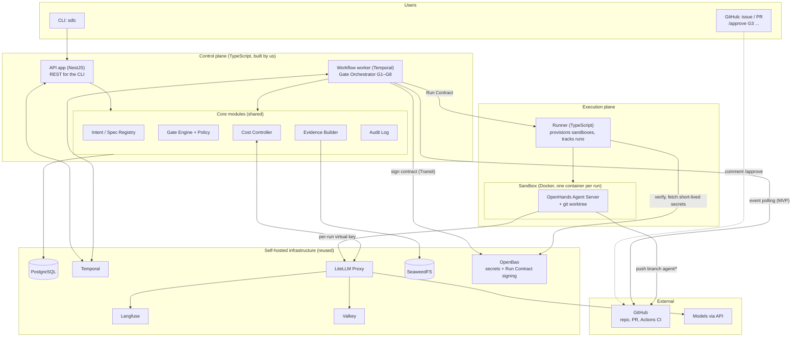
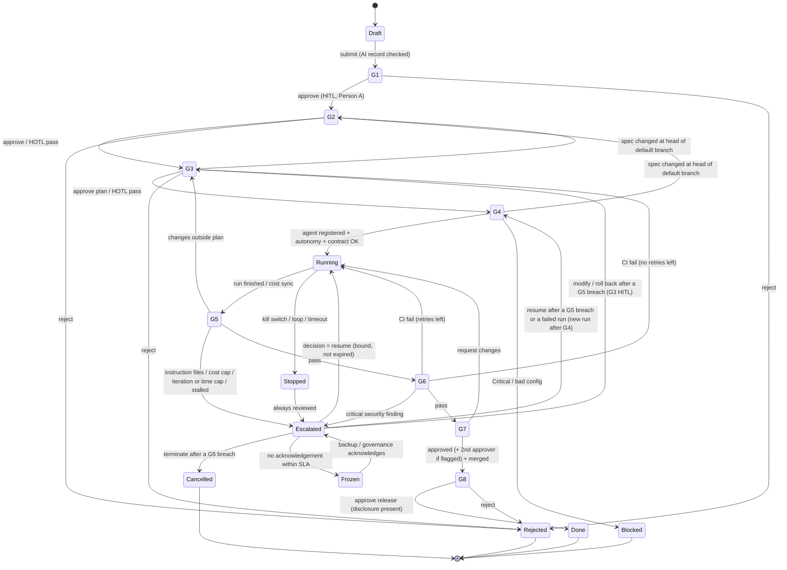

# D-03. MVP architecture

| Item | Value |
|---|---|
| Version | 1.17 |
| Date | 2026-09-24 |
| Status | **Approved** (Harry, 2026-09-24) — version 1.0, aligned with the handbook (tag `design-v1.0`); 1.1 approved by Harry on 2026-09-25 in the B01 plan (G6 security threshold, policy interface details); 1.2 approved by Harry on 2026-09-25 (QUESTIONS #1, #20); 1.3 approved by Harry on 2026-09-26 in the C02 plan (Run Contract fields, QUESTIONS #33, #34); 1.4 approved by Harry on 2026-09-26 in the B05 plan (worker reads the GitHub App key, Git host interface notes; QUESTIONS #42, #43); 1.5 approved by Harry on 2026-09-26 in the C03 plan (model gateway interface, one source for the LiteLLM master key; ADR-M24); 1.6 approved by Harry on 2026-09-27 in the C04 plan (sandbox egress, runner reaches GitHub, token handoff, sandbox image registry; QUESTIONS #44, #52–#54, #59; ADR-M25); 1.7 approved by Harry on 2026-09-27 in the B11 plan (escalation clocks in the database, not Temporal timers; QUESTIONS #73; ADR-M28); 1.8 approved by Harry on 2026-09-27 in the C05 session 2 plan (agent interface notes; ADR-M29); 1.9 approved by Harry on 2026-09-27 in the B07 session 2 plan (HOTL block window, C06 waits for it, the gate deadline timer; ADR-M30); 1.10 approved by Harry on 2026-09-27 in the B12 plan (project AI record module: codes only, write roles, G1 check at the submit; ADR-M32); 1.11 approved by Harry on 2026-09-27 in the C06 plan (G4 checks and decisions, `getBranchHead`, the worker holds the Cost Controller AppRole; QUESTIONS #108–#112; ADR-M33); 1.12 approved by Harry on 2026-09-27 in the C06 session 2 plan (the run's round after G4, the task queue `sdlc-runner`, a failed or lost run is escalated, `revokeRunKey`; ADR-M33 §2.6–§2.7); 1.13 approved by Harry on 2026-09-27 in the C06 session 2 plan, PR 2b (the L1 proposal as evidence, `EvidenceStore` as built, the runner reads a sandbox's workspace; ADR-M33 §2.9); 1.14 approved by Harry on 2026-09-30 in the A08 plan (OpenTelemetry Collector in the profile `observability`, one OTLP pipeline to Langfuse v4; QUESTIONS #4; ADR-M35); 1.15 approved by Harry on 2026-09-28 in the C07 plan (`listPaths`, the run's changes checked and stored by the runner, the in-run spend check; QUESTIONS #126, #130; ADR-M34); 1.16 approved by Harry on 2026-09-28 in the C07 plan and on 2026-10-03 (decisions A–C) (the G5 step, the G5 escalation and its decisions, the budget warning during the run; QUESTIONS #131–#134; ADR-M34 §2.8–§2.9); 1.17 approved by Harry on 2026-10-03 in the B08 plan (the spec is the file on the default branch, checked again at G2–G4; QUESTIONS #160–#164; ADR-M39) |
| Readers | Tech lead / architect, developers, Claude Code |
| Related documents | D-01 (build vs buy), D-02 (MVP scope), D-07 (models, tokens), D-09 (sample repo) |
| Main source | Draft v1.0, Chapter 4 (logical architecture), 5.8 (MVP). This document is **the reduced MVP version** |

---

## 1. Purpose

- Describe the parts of the MVP platform, what each part does and how they talk to each other.
- Fix the **interfaces**, so that later we can replace GitHub → GitLab, OpenHands → another agent, simple rules → OPA/Cedar without changing the core.
- Serve as input for D-05 (data model) and D-08 (backlog).

## 2. Scope

- **MVP** architecture only (D-02 section 4.1).
- The full architecture (8 planes, Signed Run Contract with KMS, multi-agent…) stays in draft v1.0 Chapter 4. The MVP **goes in the same direction**, in a lighter form.

---

## 3. Architecture principles

| # | Principle | Source |
|---|---|---|
| AP1 | The platform is an **orchestration + policy + evidence layer** around existing tools. We do not rebuild Git, CI or registries | [Doc] Draft 5.1.2 |
| AP2 | **Separate control from execution.** The agent runs in the execution part and cannot grant itself permissions | [Doc] Draft 4.4–4.6 |
| AP3 | **Evidence and audit are kept separately** and are append-only | [Doc] Draft 4.2.3 |
| AP4 | Everything external goes through an **interface (adapter)** | [Doc] + D-02 NFR-05 |
| AP5 | **Gates, budgets and rules are configuration**, not hard-coded | [Proposal] For tuning in M-F |
| AP6 | **Multi-tenant at the data layer** from day one | D-02 NFR-02 |
| AP7 | **Modular monolith** for the MVP: few processes, clear module boundaries. Split into services when needed | [Proposal] See ADR-M01 |

---

## 4. Overview diagram



SVG version: [d11-mvp-architecture.svg](../diagrams/svg/d11-mvp-architecture.svg)

- Note (version 1.6, QUESTIONS #52): the **runner**, not the agent in the sandbox, clones the repository and pushes `agent/*`; the sandbox reaches only LiteLLM and the package proxy (section 9). The arrow "OH → push branch agent/*" above, diagram D11 and the D-02 §5 flow are updated in task C08.

---

## 5. Components and responsibilities

### 5.1. Processes

| Process | Technology | Responsibilities |
|---|---|---|
| **api** | NestJS | REST API for the CLI. Authenticates users. Sends signals to workflows. (Later: receives GitHub webhooks) |
| **worker** | Temporal worker (TS SDK) | Runs the G1–G8 workflow of each intent. Calls core modules. Waits for approvals; runs escalation timers. **Poller**: regularly asks GitHub for new comments, reviews and CI status |
| **runner** | Node.js + Docker API | Receives the Run Contract. Creates the sandbox, worktree and virtual key. Calls the OpenHands Agent Server. Reports results |
| **cli** | Node.js | The `sdlc` command for users |

### 5.2. Core modules (shared by api and worker)

| Module | Responsibilities | Data (see D-05) |
|---|---|---|
| Intent / Spec Registry | Create intents, link specs (path + commit + hash), plans | `intents`, `spec_refs`, `plans` |
| Gate Engine | Evaluate gate conditions; **resolve the oversight mode** from the gate × risk matrix and change flags; check approver roles, separation of duties and dual approval; bind approvals to version, scope and expiry; record decisions | `gate_decisions` |
| Escalation | Create escalations from triggers; route to owner / backup / governance; run acknowledge and resolve clocks (Temporal timers); freeze work on no answer; record decisions | `escalations` |
| Agent Register | Register agents; check status, pinned model and instructions hash before a run; recertification warnings | `agents` |
| Project AI Record | Store client consent and allowed data classes (codes only; the human record is linked); checked at the submit (Draft → G1: the intent waits in `draft` with a G1 `fail` until the record allows its data class) and at G4. Written by the roles in config `access.ai_record_write_roles` (ADR-M32) | `project_ai_records`, `project_ai_record_versions` |
| Policy | Autonomy (L0–L4), oversight matrix, model routing, file scope, forbidden actions. MVP: rules in code behind an interface | YAML config |
| Cost Controller | Create a LiteLLM virtual key per run, set caps, read spend, warn at 80% / stop at 100% | `cost_records` |
| Evidence Builder | Collect diff, CI, tests, scans, gate decisions → JSON + Markdown pack | `evidence` + SeaweedFS |
| Audit Log | Append-only events, hash chain, integrity check | `audit_log` |
| Tenancy / Auth | Tenants, projects, users, roles, GitHub account mapping, API tokens | `tenants`, `projects`, `users`, `user_identities`, `role_bindings`, `api_tokens` |

### 5.3. Reused components

| Component | Role | Notes |
|---|---|---|
| Temporal | Runs long workflows, waits for humans, resumes after failures | Self-hosted |
| PostgreSQL | Platform data. May share a server with Temporal, LiteLLM and Langfuse, but **with separate databases** | |
| LiteLLM Proxy | Single entry point to models. Virtual keys, budgets | See D-07 |
| Langfuse | LLM traces, tokens; since version 1.14 also the traces of the api and the worker (one OTLP pipeline, QUESTIONS #4) | See D-07. Langfuse v4 accepts traces over OpenTelemetry only |
| OpenTelemetry Collector | Receives OTLP from the api, the worker and LiteLLM (`langfuse_otel`) without credentials and forwards it to Langfuse; the only holder of the Langfuse project key | Profile `observability`, no host port, never reachable from a sandbox (ADR-M35) |
| Valkey | Rate limiting and cache for LiteLLM and Langfuse | BSD; replaces Redis for licence reasons (review R2) |
| SeaweedFS | Stores Evidence Packs and run logs. Also used by Langfuse | S3 API, Apache 2.0. Replaces MinIO (no longer maintained, review R1) |
| **OpenBao** (Vault-compatible) | Stores secrets. Signs Run Contracts with the Transit engine; the key never leaves OpenBao | See section 8.1 |
| OpenHands Agent Server | Agent that writes code in the sandbox | See section 7.2 |
| GitHub + Actions | Repo, PRs, CI, branch protection | Through a GitHub App |

---

## 6. G1–G8 workflow (state machine)



SVG version: [d12-gate-state-machine.svg](../diagrams/svg/d12-gate-state-machine.svg)

General rules:
- G5 is checked **when the agent finishes a run** and **at every cost sync**.
- L1 tasks (High risk): the agent only submits a proposal → stored as evidence `proposal`, the run ends as `succeeded_proposal_only`, and the intent waits for a human decision.
- Every state change → write `gate_decisions` + `audit_log` + a comment on the issue/PR.
- Spec hash changed after G2 → back to G2 (FR-02). Plan hash changed after G3 → back to G3.
  - Version 1.17 (ADR-M39, QUESTIONS #160–#163): the spec of an intent is the file at its path on the **head of the default branch**, the commit G4 starts the run from. Whenever the intent waits at G2, G3 or G4, the step reads the head and the file before its transaction (G4 uses the same head read for `base_sha`). Changed content → the platform links it as a new spec version; at G3 or G4 the intent goes back to G2 (notice), where the approval binding voids the approvals of the old spec and the matrix decides again (HOTL at Low risk may pass it again). A spec a person links after G2 passed does the same. A file that cannot be read (removed, not Markdown text, larger than 256 KiB) → back to G2, where the intent waits; a Git host that cannot be read → the step waits and never passes. Only the SHA-256 is stored, never the content.
- **No gate is ever auto-approved by silence.** HOTL at a human gate passes only when all policy conditions hold, and the notified person can still block within the gate's window.
  - Version 1.9 (ADR-M30 §2.4b, QUESTIONS #88): the platform records the HOTL pass at once and the intent moves on. Within `oversight.hotl_block_window`, a person with the gate's role may reject the passed gate or request changes; a request for changes takes the intent back to that gate, a rejection ends it. An explicit approval opens no window. **C06 does not start a run before the last open window closes** (`hotlBlockWindowOpenUntil`). No HOTL pass again on an input a person sent back.
  - A human gate that waits past `oversight.hitl_gate_deadline` raises one escalation (trigger `time`, level from `oversight.gate_overdue`), closed when the gate is decided (ADR-M30 §2.9). This deadline is the only Temporal timer of the intent workflow.
- **G4** (version 1.11, ADR-M33 §2.4, QUESTIONS #110): the checks run in a fixed order (Critical or L0, block window, freeze, approved spec and plan, AI record, agent register, intent budget). Critical risk or an effective autonomy of L0 → `blocked`, which is final. Any other failed check records a system `fail` once per cause and the intent **waits at G4**; the next wake checks again. A G4 pass or approval is bound to the run proposal (plan, spec, agent and version, instructions, model, autonomy, tools, caps, base commit); a changed proposal voids a G4 approval (FR-17).
- **The run after G4** (version 1.12, ADR-M33 §2.6–§2.7): a decided G4 moves the intent to `running`; the workflow prepares the run, hands it to the runner on the Temporal task queue `sdlc-runner` (one heartbeat activity per run, one attempt), and finishes it. A succeeded run or a stop at a cap or the file scope → G5. A failed or lost run (heartbeat timeout) → `paused` and a `technical` escalation at `pause` or higher (the "Stopped → Escalated" arrow); the key is revoked at once. A contract that expires while its run waits → a new attempt, a few times (config), then the same escalation. A `resume` decision on that escalation takes the intent back to G4.
- **L1 runs** (version 1.13, ADR-M33 §2.9, FR-03, D-09 T09): the agent works in its sandbox, but nothing is committed or pushed. The runner reads the sandbox's `/workspace` (Docker archive, run sandboxes only), treats it as untrusted, streams it, leaves out what the ignore rules of the start commit ignore (for example `node_modules`), computes the proposal in its own clone with hardened git and stores it through `EvidenceStore`. The run ends `succeeded_proposal_only`; the intent is `paused` at G4 and Person A takes the proposal forward. No new run starts by itself.
- **G5** (version 1.16, ADR-M34 §2.8, QUESTIONS #131–#134): the step checks the run's result in a fixed order: agent instruction files, then the file scope, then the caps. It reads the runner's records (the diff, the counts of changed paths) and the run's synced spend, never what the agent reports. The G5 input hash binds the run, its contract, its diff, its changed paths and the intent's spend.
  - Instruction files added or changed → `fail instructions_unpinned`, `paused` at G5, a `security` escalation.
  - Files outside the plan → `fail out_of_scope` → back to **G3**, no escalation. G3 is HITL at every tier from then on; the earlier G3 approval is voided; the plan the run went outside of is never approved again.
  - The cost cap (the runner's stop, or a synced spend at `budget.stop_percent`) → `fail budget_exceeded`; the iteration cap, the time cap or a stall → `fail run_cap_reached`. Both: `paused` at G5, an `intent` escalation at `run.g5_breach_escalation` (`pause` or higher, rule M22).
  - Otherwise HOTL: a system `pass` → G6 (the block window applies; a request for changes within it starts a new run after G4). HITL (configuration): a person approves; the run's producer never does.
  - The escalation's decision: `resume` → back to G4 (a new run from the latest commit of the default branch), with a budget increase only when the decision names it with an amount (API); `modify` or `roll_back` → back to G3, HITL, the same plan allowed; `terminate` → `cancelled`. A changed G5 input voids the decision, closes the escalation and evaluates G5 again.
  - The budget warning at `budget.warn_percent` is posted during the run: the runner records the run event and the intent's notice in one transaction.
- Retry counts, thresholds, the oversight matrix and SLAs **come from per-project configuration**.

### 6.1. Resolving the oversight mode

```text
mode = matrix[gate][risk_tier]                     # project config (handbook codes table §4)
if gate == G3 and plan.change_flags ∩ FORCED_HITL_G3: mode = HITL
if gate == G6 and findings at or above g6_security_findings.min_severity > 0:
                                                   mode = HITL   # default threshold: high
if gate == G5 and limit breached:                   mode = matrix[G5][risk_tier].on_breach (if set)
if gate == G7: mode = HITL; approvals_needed = 2 if plan.change_flags ∩ DUAL_APPROVAL_G7 or risk == critical else 1
if gate == G8 and environment == production:        mode = HITL
```

The resolved mode is stored in the gate decision. Changing the matrix is a configuration change (new `config_hash`, audit event).

- G6 security findings (design/QUESTIONS.md #19): findings at or above `oversight.g6_security_findings.min_severity` (default `high`) make G6 HITL. A **critical** finding always makes G6 HITL; this is a mandatory rule (M6) that configuration cannot loosen. Findings below the threshold are recorded as evidence, and G6 keeps the matrix mode. The escalation for a critical finding stays in the workflow (state machine above).
- The G7 and production G8 HITL lines are guaranteed by the mandatory rules M2 and M3, so the engine reads them from the matrix like every other cell.

### 6.2. Who may approve

`canApprove(gate, actor, intent, change)`:
- the actor holds the gate's role in `role_bindings` (G1: `person_a`; G2: `person_a`, or `person_b` for High+; G3, G6 High+, G7, G8: `person_b`; second approval: `second_approver`);
- the actor is **not the producer** of the change (commit authors, the person who started the run for that change); agents never approve;
- for dual approval, the two approvals come from two different people.

### 6.3. Approval binding and expiry

Every approval stores `input_sha256` (the reviewed version), `scope` (environment, resources, allowed actions) and `expires_at`. Just before the protected action, the worker recomputes the hash and checks scope and time. Any mismatch or expiry → a `void` decision and the gate is evaluated again.

### 6.4. Escalation

```text
trigger (G5 breach, critical finding, disagreement, stopped run, gate overdue…)
→ create escalation (severity, response level, packet, owner, backup)
→ start timers: acknowledge (SLA), resolve (SLA)
→ no ack: remind → backup owner → governance; work stays frozen
→ decision (resume / modify / roll back / terminate) bound to version, scope, expiry
```

- Timers are Temporal timers inside the intent workflow; they survive restarts.
  - Version 1.9: the only timer of the intent workflow is the gate deadline that raises the escalation (ADR-M30 §2.9); from the raise on, the escalation's clocks are the database's.
  - **Changed in version 1.7 (ADR-M28, QUESTIONS #73):** the escalation clocks are stored in the `escalations` row and advanced by a loop in the worker (`next_check_at`, row lock, idempotent), not by Temporal timers. They survive restarts the same way. The intent workflow (B07) must not add a second timer for the same clock; it raises escalations, asks the freeze check before it acts and waits for the resolution.
- Actions on the pre-approved **safe list** (read-only, sandbox tests, drafts) may continue while waiting; everything else is frozen.
- Approval authority never passes back to the producer.
- SLA defaults: Critical 15 min / 1 h; High 1 h / same working day; Medium 1 working day / 3 working days; Low 3 working days / next planned work.

### 6.5. Kill switch

`sdlc run kill <run>` (or a comment command) → the runner stops the sandbox, revokes the GitHub token and the LiteLLM virtual key, writes `stopped_killed`, and opens an escalation for review. Target: under 5 minutes end to end. Loop detection (more than 3 identical consecutive tool calls, or no progress within the window) stops the run as `stopped_stalled`.

---

## 7. Interfaces (adapters)

Written in TypeScript. This is the **contract** Claude Code implements. Names may change while coding, but responsibilities must stay the same.

### 7.1. Git host

```ts
interface GitHostAdapter {
  createIssueComment(ref: RepoRef, issue: number, body: string): Promise<void>;
  getPullRequest(ref: RepoRef, pr: number): Promise<PullRequestInfo>;
  getChangedFiles(ref: RepoRef, pr: number): Promise<string[]>;
  getCheckStatus(ref: RepoRef, sha: string): Promise<CheckSummary>;
  getApprovals(ref: RepoRef, pr: number): Promise<Approval[]>;
  getFileAtCommit(ref: RepoRef, path: string, sha: string): Promise<string>;
  getBranchHead(ref: RepoRef, branch: string): Promise<string>;
  listPaths(ref: RepoRef, sha: string): Promise<string[]>;
  issueShortLivedToken(ref: RepoRef, scope: TokenScope): Promise<ShortLivedToken>;
  listEventsSince(ref: RepoRef, cursor: EventCursor): Promise<{ events: GitEvent[]; next: EventCursor }>; // MVP: polling
  verifyWebhook(headers: Record<string, string>, rawBody: Buffer): GitEvent; // enabled later
}
```
MVP: `GitHubAdapter` through a **GitHub App** (short-lived per-repo tokens), reading events by **polling**. MVP+1: `GitLabAdapter`, webhooks.

- Polling and webhooks return the same `GitEvent` type → one handler for `/approve` commands, reviews and CI.
- The `EventCursor` is stored per project in the database, so events are not processed twice after a restart.
- The exact TypeScript interface is `GitHostAdapter` in `@sdlc/contracts` (`platform/packages/contracts/src/git-host.ts`, task B05, ADR-M23). Same eleven methods and parameters as above. Notes:
  - `GitEvent` has three kinds: `comment_created`, `review_submitted`, `check_completed`. Each has a stable `id` (the same for polling and webhooks) and a `url` to store as a reference. Only a comment's `body` is free text; it is never stored in an append-only table.
  - Only **new** comments are events; an edited comment never is (QUESTIONS #43).
  - Actors carry the numeric account ID and `type: user | bot`. Users are mapped by the numeric ID only; bots never count as approvers (QUESTIONS #45).
  - `EventCursor` is opaque; the adapter returns `next` and the caller (B06) stores it. A new project starts from `INITIAL_EVENT_CURSOR` (no history).
  - `getChangedFiles` returns both paths of a renamed file and fails instead of returning a partial list. `getApprovals` returns each reviewer's latest decision, bound to the reviewed commit.
  - `getBranchHead` (version 1.11, task C06, QUESTIONS #109): the commit a branch points to now. G4 reads the head of the default branch as the run's `base_sha`.
  - `listPaths` (version 1.15, task C07, QUESTIONS #126): every path of a commit's tree that is not a directory, sorted. G4 reads it at `base_sha` and refuses a run when an agent instruction file other than the pinned one exists (`instructions_unpinned`, ADR-M34 §2.4). A tree the host lists only in part fails (`tree_truncated`) and G4 refuses the run: very large repositories cannot run an agent for now.
  - Later tasks add what they need, with a D-03 update: opening a pull request (C08), revoking a short-lived token (C11), the merge event (E01).

### 7.2. Agent

```ts
interface AgentAdapter {
  startRun(contract: RunContract, workspace: WorkspaceInfo): Promise<AgentRunHandle>;
  getStatus(handle: AgentRunHandle): Promise<AgentRunStatus>;
  stop(handle: AgentRunHandle, reason: string): Promise<void>;
  collectOutputs(handle: AgentRunHandle): Promise<AgentOutputs>; // plan, log, changed files
}
```
MVP: `OpenHandsAdapter`.
- [External] The OpenHands SDK offers Python and REST APIs. The agent can run in an ephemeral workspace (Docker/Kubernetes) through the **Agent Server**.
- [Proposal] The platform (TypeScript) calls the **Agent Server over REST**; it does not embed the Python SDK. The Agent Server runs inside the sandbox container.
- [Proposal] OpenHands points its model at **LiteLLM**, using the run's virtual key.
- **PoC needed** at the start of M-C: run the Agent Server in a container, call REST from Node.js, get the log and the list of changed files.
- The exact TypeScript interface is `AgentAdapter` in `@sdlc/contracts` (`platform/packages/contracts/src/agent.ts`, task C05, ADR-M29). Same responsibilities; differences from the sketch above:
  - `startRun` takes the contract, the endpoint (the sandbox URL on the run's network and the per-run session key, held by the runner only), the model access (model name, LiteLLM URL, virtual key) and the task (spec reference, plan). The model must be in `allowed_models` (QUESTIONS #79); the tools must be `file_editor`, `task_tracker` or `terminal`.
  - `getStatus` returns the agent's state (`running`, `finished`, `max_iterations`, `stopped`, `error`, `stuck`) and its step count; the runner decides the run status.
  - `stop` interrupts the agent. New `commitWork`: the runner commits what the agent left, with a fixed author that names the agent (QUESTIONS #80). `collectOutputs` returns the files changed since `base_sha`.
  - The runner joins the run's network to reach the Agent Server, and leaves it at clean-up; it listens on no port. What the sandbox reports (changed files, `head_sha`) is recomputed from the pushed branch outside the sandbox before a gate relies on it (C07, C08).

### 7.3. Policy

```ts
interface PolicyEngine {
  maxAutonomy(input: { riskTier: RiskTier; dataClass: DataClass }): AutonomyLevel; // L0–L4 (MVP: up to L2)
  oversightMode(input: { gate: GateCode; riskTier: RiskTier; changeFlags: ChangeFlag[]; context: GateContext }): { mode: OversightMode; approvalsNeeded: number };
  allowedModels(input: { dataClass: DataClass; taskKind: TaskKind }): string[];
  checkScope(input: { plannedFiles: string[]; changedFiles: string[] }): ScopeResult;
  canApprove(input: { gate: GateCode; actor: UserId; roles: ProjectRole[]; intent: IntentSummary; producers: UserId[] }): Decision;
  isForbidden(input: { action: AgentAction }): boolean; // handbook Ch.4 §4.7 — never overridable
}
```
MVP: `SimplePolicyEngine` reading YAML. MVP+1: `OpaPolicyEngine` or `CedarPolicyEngine`.

- The exact TypeScript interface is `PolicyEngine` in `@sdlc/contracts` (`platform/packages/contracts/src/policy.ts`, task B01). Differences from the sketch above, same responsibilities:
  - The engine is created from a `ValidatedProjectConfig`: a configuration that `@sdlc/config` has checked against the mandatory rules M1–M15. The adapter never repeats those checks.
  - `canApprove` receives the actor's role bindings (revoked ones never count), the producers for this gate, and the approvals already recorded. It returns the role the person approves under, or a refusal reason. POLICY and AUDIT cells have no approval step; a listed role may still approve a HOTL gate explicitly. Callers decide who the producers are for each gate; for example the intent creator is a producer at G7 but not at G1 (design/QUESTIONS.md #16).
  - `allowedModels` filters the gateway's model list (given when the engine is created) by the provider types allowed for the data class. `taskKind` is not used in the MVP (design/QUESTIONS.md #17).
  - `maxAutonomy` returns L0 for a data class that may go to no model (`prohibited`) (design/QUESTIONS.md #18).
  - `isForbidden` uses the two action lists in `@sdlc/contracts` (`FORBIDDEN_AGENT_ACTIONS`, `GRANT_REQUIRED_AGENT_ACTIONS`). They are not configuration.

### 7.4. Model gateway and cost

```ts
interface ModelGateway {
  createRunKey(input: { runId: string; labels: CostLabels; maxBudgetUsd: number; models: string[] }): Promise<VirtualKey>;
  revokeKey(keyId: string): Promise<void>;
  getSpend(keyId: string): Promise<SpendInfo>;
}
```
MVP: `LiteLLMGateway`.

- The exact TypeScript interface is `ModelGateway` in `@sdlc/contracts` (`platform/packages/contracts/src/model-gateway.ts`, task C03, ADR-M24). Same responsibilities; differences from the sketch above:
  - Money is a decimal string (`maxBudgetUsd: "0.5"`, D-05 D6). `createRunKey` also takes the key lifetime and the tenant's budget group.
  - `ensureTenantBudget` creates or updates the tenant's monthly budget at the gateway (a LiteLLM team; UTC calendar month; FR-51).
  - `listModels()` returns the gateway's models with their provider type (`api`, `self_hosted`): the model list the policy engine filters (QUESTIONS #17).
  - `listSpend(range)` returns the calls of a time range with their labels, for the sync into `cost_records`.
- `revokeRunKey(runId)` (version 1.12, ADR-M33 §2.6): revokes a run's key found by the run (LiteLLM key alias `run-<run_id>`), so the key's ID never travels with the run through the Temporal history.
- The Cost Controller (`@sdlc/core`) caps each key at the smallest of the run budget, what is left of the intent budget and what is left of the tenant's month; it refuses a key when either remainder is zero or less. The gateway's budgets are a backstop (QUESTIONS #14).

### 7.5. Evidence storage

```ts
interface EvidenceStore {
  put(tenantId: string, path: string, content: Buffer, contentType: string): Promise<{ uri: string; sha256: string }>;
  get(uri: string): Promise<Buffer>;
}
```
MVP: `S3EvidenceStore` (on SeaweedFS).

- The exact TypeScript interface is `EvidenceStore` in `@sdlc/contracts` (`platform/packages/contracts/src/evidence.ts`, task C06 session 2b, ADR-M33 §2.9); the adapter is `@sdlc/adapter-evidence-s3` (`@aws-sdk/client-s3`, pinned exactly). Same two methods; notes:
  - `put` returns the size too (`{ uri, sha256, sizeBytes }`). The key is `<store prefix><tenant>/<path>`; every put sends `If-None-Match: *`, so a taken path is refused (`EvidenceError('exists')`) and evidence is never overwritten. Errors are `EvidenceError` codes (`invalid_input`, `exists`, `forbidden`, `not_found`, `unavailable`), never the service's text.
  - First user: the runner stores L1 proposals at `s3://evidence/proposals/<tenant>/<intent>/<run>.patch` with its own SeaweedFS identity, which may only write under `evidence/proposals/` (no read, no list). SeaweedFS has no write-only action: this identity can also delete there; the bucket `evidence` is versioned, and E02 re-checks the SHA-256 in `evidence_items` (ADR-M33 §2.9 gaps).

---

## 8. Run Contract (light version for the MVP)

[Doc] Draft v1.0 (section 4.7) designs a **Signed Run Contract**: a digitally signed "execution contract" that the control plane issues for each run, stating what the agent may do, on which resources, for how long. The full version uses KMS/HSM and mTLS.

The MVP builds a light version that **keeps the main idea**:

| Field | Example |
|---|---|
| `run_id`, `intent_id`, `tenant_id`, `project_id` | |
| `repo`, `base_sha`, `branch` | `agent/INT-2026-0001` |
| `planned_files` | File list from the G3 plan |
| `agent_id`, `agent_version`, `instructions_sha256` | From the agent register |
| `schema_version` | `1` (ADR-M22) |
| `plan_id`, `plan_sha256` | The plan approved at G3 |
| `allowed_tools` | Agent's registered tools ∩ tools of the plan task (template T13, handbook Ch.13 G4; QUESTIONS #34) |
| `autonomy_level` | L2 |
| `max_tokens_usd`, `max_iterations`, `max_duration_min`, `loop_threshold` | Caps |
| `allowed_models` | From policy |
| `egress_allowlist` | Services as `alias:port`: `litellm:4000`, `npm-proxy:4873` (section 9, ADR-M25) |
| `issued_at`, `expires_at` | Short validity |
| `signature` | **Ed25519** signature with the platform key |

- The signed bytes are the RFC 8785 canonical JSON of the contract without the signature; `contract_sha256` is their SHA-256 (ADR-M22).
- Validity (`expires_at − issued_at`) covers issue → sandbox start only: `run.contract_validity_minutes` in the project config (default 15, warning above 60; QUESTIONS #33). The run itself is capped by `max_duration_min`. `run.contract_clock_skew_seconds` (default 0) applies to the "not yet valid" check only; expiry has no tolerance.
- The signing key lives in **OpenBao** (Transit engine). The platform sends the contract content to be signed; **the key never leaves OpenBao**.
- The runner verifies the signature with the public key obtained from OpenBao.
- The runner **rejects** contracts that are expired, wrongly signed, or not in the database. It also rejects contracts that differ from the stored one, are not yet valid, are revoked, or belong to a run that already left `queued`. The signature names its key version, so contracts signed before a key rotation verify until they expire (ADR-M22 §2.4).
- MVP+: add revocation and scheduled key rotation, as in draft v1.0.

### 8.1. Secret manager: OpenBao or HashiCorp Vault

Harry's decision (2026-09-24): **run a Vault-type secret manager from the MVP**.

Licence note [External]:

| | HashiCorp Vault | OpenBao |
|---|---|---|
| Licence | Business Source License 1.1 (since Aug 2023). Not an OSI open-source licence | MPL 2.0 (open source) |
| Origin | HashiCorp, now owned by IBM | Fork of Vault 1.14.0, under the Linux Foundation |
| Internal use | Allowed | Allowed |
| **Inside a product we sell** | BSL forbids offering the software as a competing product → **needs legal review** | No such restriction |
| MVP features needed (KV, Transit, AppRole) | Yes | Yes (Vault-compatible API) |

**Decision (Harry, 2026-09-24): use OpenBao.** Platform code uses the **standard Vault API**, so switching remains possible.

### 8.2. Secrets stored in OpenBao

| Secret | Engine | Who may read it |
|---|---|---|
| Run Contract signing key | Transit (non-exportable) | worker (signs), runner (reads the public key) |
| GitHub App private key | KV | api, worker (polls GitHub, posts gate comments, reads specs, issues the run's single-repository token; QUESTIONS #42, #44). **Not the runner**: it receives the run's token from the worker as an OpenBao response-wrapped token (single use), unwraps it once and keeps it in memory only (ADR-M25) |
| LiteLLM master key | KV (`kv/cost-controller/litellm-master-key`) | Cost Controller; LiteLLM through its OpenBao Agent sidecar (AppRole `litellm`, this one path only). One source for both (ADR-M24). Version 1.11 (ADR-M33 §2.5, QUESTIONS #112): the Cost Controller runs in the **worker** process, which logs in with two AppRoles (`worker` and `cost-controller`) and so can use this key. The worker hands the run's virtual key to the runner as a single-use wrapping token, like the GitHub token |
| Model provider API keys | KV | **LiteLLM only**, through an OpenBao Agent sidecar (AppRole `litellm`) that renders them to a tmpfs file LiteLLM reads at start-up. No LiteLLM Enterprise licence (QUESTIONS #1) |
| Database and SeaweedFS passwords | KV | The matching process |

- Each process logs in to OpenBao with **AppRole**, receives a short-lived token and can read only its own secrets.
- The agent sandbox has **no** access to OpenBao.
- OpenBao listener 8200 uses **TLS** with a certificate from the company's internal CA; every client verifies it (QUESTIONS #20).

---

## 9. Security

| Topic | What the MVP does |
|---|---|
| GitHub permissions | GitHub App with minimal permissions. Short-lived tokens, issued per run by the worker, for the run's repo only. Used by the runner to clone and push; never given to the sandbox |
| Branches | The agent only pushes `agent/*`. `main` has branch protection (D-09 section 6) |
| Model keys | The agent only has a LiteLLM **virtual key**, with a cap, revoked when the run ends |
| Sandbox network | Outbound only to LiteLLM and the package proxy (npm first), on an internal Docker network per run; no route to the internet. GitHub is reached by the runner, never by the sandbox: the runner clones and pushes `agent/*` with the run's short-lived single-repository token. Everything else is blocked (ADR-M25) |
| TLS for internal services | OpenBao 8200: internal CA, server certificate 1 year, CA 5 years, CA key offline; clients always verify (no skip-verify). Other internal services may reuse the CA later (QUESTIONS #20) |
| Secrets | Not in the repo, not in images. Fetched from OpenBao at runtime with short-lived tokens |
| GitHub events | MVP: polling through the GitHub App (no inbound port). When webhooks are enabled: verify signatures, expose only `/webhooks/github` |
| Approvers | Map GitHub accounts ↔ platform users. Check roles + block self-approval |
| Tenant isolation | Every query filters by `tenant_id`. [Proposal] Add PostgreSQL Row-Level Security in MVP+1 |
| Audit | Append-only, hash chain, `verify` command; kept at least 2 years |
| Kill switch | Stop any run and revoke its credentials within 5 minutes (6.5) |
| Agents | Only registered, active agents with a pinned model and a matching instructions hash may run |

[Doc] Draft section 4.14 has a full threat model based on the OWASP Top 10 for Agentic Applications (ASI01–ASI10). Applied fully in MVP+1.

---

## 10. Deployment (Docker Compose, one server)

| Container | Notes |
|---|---|
| `postgres` | Several databases: `platform`, `temporal`, `litellm`, `langfuse` |
| `temporal` + `temporal-ui` | |
| `litellm` + `valkey` | Valkey for rate limiting and cache (shared with Langfuse) |
| `langfuse-web`, `langfuse-worker`, `clickhouse` | Following Langfuse's self-hosting guide |
| `otel-collector` (profile `observability`) | OpenTelemetry Collector (core distribution, pinned) on a small pinned base image with a health check. Tracing of the platform processes and LiteLLM is off unless `SDLC_OTEL_ENDPOINT` points at it (version 1.14, ADR-M35) |
| `seaweedfs` | S3 API for Evidence Packs and Langfuse. Single node |
| `openbao` | Raft storage. Needs an unseal procedure and key backup (see 10.2) |
| `sdlc-api`, `sdlc-worker`, `sdlc-runner` | Built by us. Version 1.12: the runner is a Temporal worker on the task queue `sdlc-runner`, its activity slots = its sandbox limit, so extra runs wait in Temporal (ADR-M33 §2.6). Version 1.13: the runner writes L1 proposals to SeaweedFS with its own write-only identity from OpenBao (`kv/runner/evidence`); its Docker access adds reading the archive of a run sandbox (ADR-M33 §2.9) |
| OpenHands sandbox | **Not declared up front**. The runner creates it per run, from the project's sandbox image pinned by digest (config `sandbox.image`), with its own internal network and workspace volume, and removes all three afterwards (ADR-M25) |
| `npm-proxy`, `docker-socket-proxy`, `registry` (profile `sandbox`) | Package proxy for sandboxes (Verdaccio); the runner's limited access to Docker; a local registry for sandbox images (`registry:2`; GHCR after the GitHub Team upgrade). Added in C04 session 3 (ADR-M25, QUESTIONS #54, #59) |

- The runner needs control of Docker to create sandboxes.

### 10.1. Internal server of moderate size

Harry's decision (2026-09-24): **an internal server; no need for a high spec yet**.

[Proposal] To fit the server:
- **Limit concurrent runs**: 1–2 sandboxes (configurable). A third run waits in Temporal.
- **Docker Compose profiles**: `core` (required) and `observability` (Langfuse + ClickHouse, the heaviest part). On a small server, enable `observability` later and use LiteLLM spend data meanwhile.
- **Temporal uses PostgreSQL**; no Elasticsearch.
- **API models only** in the MVP. The internal server needs no GPU.
- **Measure real resource use in M-A** before fixing the server spec. No numbers set in advance.
- If possible, run the runner in a **separate VM** on the same server, to isolate Docker permissions.
- **OpenBao**: needs an unseal procedure after a reboot, and unseal keys backed up somewhere safe, off the server.

### 10.2. Unseal key custody and OpenBao recovery (proposal)

**Why it matters:** data in OpenBao is encrypted. After a reboot, OpenBao is "sealed". The **unseal key** is needed to open it. Losing this key = losing every secret.

#### Splitting the key [Proposal]

- At initialisation, split the unseal key into **3 shares**. Any **2 shares** open it (Shamir 3-of-2).
- **3 people hold the 3 shares**, one each. Nobody holds two.
- Why 3-of-2: in a small company we must be able to unseal when one person is away, but one person alone cannot.

| Share | Holder (by role) | Stored where |
|---|---|---|
| Share 1 | A leadership representative (e.g. director / deputy technical director) | Personal password manager + sealed printed copy in the company safe |
| Share 2 | Tech lead / platform owner | Personal password manager + sealed printed copy in the safe |
| Share 3 | Infrastructure operator (IT / DevOps) | Personal password manager + sealed printed copy in the safe |

- Harry chooses **the actual people** for the three roles. If one person holds two roles, pick someone else for one share.
- Printed copies: one sealed, signed and dated envelope per share. The safe has a log of who opened it and when.
- **Never** store unseal keys on the OpenBao server itself, in the repo, in chat or in email.

#### Root token

- Use the **root token** (highest privilege) only for initialisation and initial configuration.
- Once configured → **revoke the root token** immediately.
- When needed again → generate a new root token using key shares (2 people), revoke after use. Log every occurrence in the operations log.
- Daily work uses admin accounts with limited permissions.

#### Backups

| What | Frequency (proposal) | Where |
|---|---|---|
| OpenBao data snapshot (Raft) | Daily | Storage **off the server**, encrypted |
| OpenBao configuration (policies, AppRoles) | On every change | Internal Git repo, **no secrets** |

- A snapshot still needs the unseal key to be used → keeping the keys and keeping the snapshots are two separate jobs, and both are required.

#### Recovery drills

- **First drill: milestone M-A.** Set up OpenBao on a test machine, restore from a snapshot, unseal with 2 shares.
- Then: **every 3 months**, and whenever a key holder changes.
- When a key holder changes (leaves, changes role) → **rekey** (create a new set of shares) and destroy the old envelopes.

#### After a server reboot

1. The operator announces it in the internal channel.
2. Two key holders enter their shares (remotely over a secure connection, or on site).
3. Check that the platform processes reconnect.
4. Record it in the operations log.

[Proposal] This procedure becomes a **runbook** in the handbook (Part III, T11).

#### Later (not in the MVP)

- **Auto-unseal**: opens automatically at start-up using an HSM or a key-management service. More convenient, but needs extra hardware or a service. Consider it when selling to clients or running several servers.

---

## 11. Code layout in the monorepo

```text
platform/
├── apps/
│   ├── api/          # NestJS
│   ├── worker/       # Temporal worker + G1–G8 workflow
│   ├── runner/       # Provisions sandboxes, calls the agent
│   └── cli/          # sdlc command
├── packages/
│   ├── core/         # Core modules: registry, gate, cost, evidence, audit, tenancy
│   ├── contracts/    # Types, Run Contract, schemas
│   ├── adapters/
│   │   ├── git-github/
│   │   ├── agent-openhands/
│   │   ├── model-litellm/
│   │   ├── evidence-s3/
│   │   └── policy-simple/
│   └── config/       # Reads gate, budget and rule config (YAML)
├── deploy/
│   └── docker-compose.yml   # + OpenBao bootstrap and backup scripts
└── tests/
    └── integration/  # Scenarios N1–N6, tasks T01–T10 (D-09)
```

---

## 12. Architecture decisions (short ADRs)

| Code | Decision | Why | Trade-off |
|---|---|---|---|
| ADR-M01 | Modular monolith: 4 processes sharing core modules | Small team, easy to deploy and debug | Module boundaries need discipline |
| ADR-M02 | Temporal for the G1–G8 workflow | Waits days for humans, resumes after failures | One more piece of infrastructure to operate |
| ADR-M03 | Approvals via GitHub comments + CLI, no web UI | No UI to build; users already know it | Harder to get an overview → use CLI + Temporal UI |
| ADR-M04 | Call OpenHands through the Agent Server REST API | Platform is TypeScript; the OpenHands SDK is Python | Depends on the Agent Server API → pin the version |
| ADR-M05 | Run Contracts signed with Ed25519 via **OpenBao Transit**. Secrets in OpenBao, one AppRole per process | The key never leaves the secret manager. Self-hosted. No licence issue when selling | One more system to operate (unseal, backups) |
| ADR-M06 | Simple YAML policy behind an interface | Fast. A path to OPA/Cedar | Complex rules are hard to express |
| ADR-M07 | G7 relies on PR approvals on GitHub | Reuses existing review | Depends on correct branch protection settings |
| ADR-M08 | One internal server, limited concurrent runs, Compose profiles | Matches the infrastructure decision; saves cost | No failover if the server breaks → regular backups |
| ADR-M11 | GitHub events by polling in the MVP, webhooks later | The internal server does not accept inbound internet connections | Delay of tens of seconds; uses API quota → configurable interval |
| ADR-M13 | Oversight as a data-driven matrix (gate × risk + change flags) in project config | The handbook defines oversight by risk; tuning must not need code changes | Matrix must be validated; wrong config can loosen control → config changes audited and reviewed |
| ADR-M14 | Escalations as part of the Temporal intent workflow (timers, signals). **Partly superseded by ADR-M28:** the clocks live in the database, advanced by the worker | Durable clocks, no extra scheduler | Workflow grows more complex → escalation logic kept in its own module with tests |
| ADR-M15 | Minimal agent register in the platform database | Handbook requires owned, pinned, recertified agents | Recertification workflow deferred to MVP+1 |
| ADR-M12 | SeaweedFS instead of MinIO, Valkey instead of Redis | MinIO is no longer maintained; Redis licence does not fit a product we sell | Team learns new tools; S3 API / Redis protocol unchanged, so code is unaffected |

ADR-M09 (database/migration tool) and ADR-M10 (OpenHands PoC result) are written during tasks A06 and C01.

---

## 13. Risks

| Risk | Mitigation |
|---|---|
| OpenHands Agent Server changes its API | Pin the version. PoC at the start of M-C. Integration tests |
| Runner has Docker access = broad power | Separate machine/VM. Minimal permissions. Log every action |
| Modular monolith turns into a "big ball of mud" | Lint checks on module dependencies. Architecture review at every milestone |
| Too much infrastructure on one server | Measure in M-A. Limit concurrent runs. Compose profiles |
| Losing the OpenBao unseal key = losing all secrets | Shamir 3-of-2, 3 holders, printed copies in the safe, drills every 3 months (section 10.2) |
| Server reboots when not enough key holders are available | The platform stays down until unsealed. Accepted for the MVP. Auto-unseal later |

## 14. Open questions

- ~~Where to store keys and secrets?~~ → Decided: **OpenBao** from the MVP (section 8.1).
- ~~Which server?~~ → Decided: internal server, moderate spec (section 10.1).
- Choose **the actual people** for the three key-holder roles (section 10.2). The procedure is proposed.

## 15. References

**Internal**
- Draft v1.0: 4.2 (overall architecture), 4.4–4.6 (control/execution planes), 4.7 (Signed Run Contract), 4.14 (security), 5.1.2 (build vs buy), 5.8 (MVP).
- design/D-01, D-02, D-07, D-09.

**External** (accessed 2026-09-24)
- OpenHands Software Agent SDK: https://github.com/OpenHands/software-agent-sdk and https://docs.openhands.dev/sdk
- Temporal: https://temporal.io/
- SeaweedFS: https://github.com/seaweedfs/seaweedfs
- Valkey: https://valkey.io/
- OpenBao: https://openbao.org/ and https://github.com/openbao/openbao
- Vault vs OpenBao comparison (WZ-IT, Sept 2026): https://wz-it.com/en/blog/openbao-vs-vault-comparison/
- IBM engineers hatch Linux Foundation HashiCorp Vault fork (TechTarget): https://techtarget.com/searchitoperations/news/366563095/IBM-engineers-hatch-Linux-Foundation-HashiCorp-Vault-fork
- LiteLLM, Langfuse: see D-07.

---

## Version history

| Version | Date | Author | Notes |
|---|---|---|---|
| 0.1 | 2026-09-24 | Claude (draft) | First version |
| 0.2 | 2026-09-24 | Claude (draft) | Vault-type secret manager from the MVP (OpenBao proposed). Moderate internal server: run limits, Compose profiles |
| 0.3 | 2026-09-24 | Claude (draft) | OpenBao confirmed. Unseal key custody, root token, backups, drills (10.2) |
| 0.4 | 2026-09-24 | Claude (draft) | After review: SeaweedFS, Valkey, GitHub polling (ADR-M11, M12), clearer G5 and Level 1, added `api_tokens` |
| 1.0 | 2026-09-24 | Claude, approved by Harry | Handbook alignment: oversight resolution, 2+N approval rules, approval binding and expiry, escalation with SLA timers, kill switch, agent register, AI record; new state machine; ADR-M13…M15 |
| 1.1 | 2026-09-25 | Claude (task B01), approved by Harry | §6.1: G6 security threshold `min_severity` (critical always HITL, rule M6) and G5 `on_breach`; §7.3: notes on the contracts `PolicyEngine` (validated config, `canApprove` inputs, model list, `prohibited` → L0, forbidden-action lists). QUESTIONS.md #16–#19 |
| 1.2 | 2026-09-25 | Claude, approved by Harry | §8.2: provider keys reach LiteLLM through an OpenBao Agent sidecar (tmpfs), no Enterprise licence; §8.2/§9: TLS on OpenBao 8200 with an internal CA (QUESTIONS #1, #20) |
| 1.3 | 2026-09-26 | Claude (task C02), approved by Harry | §8: `schema_version`, `plan_id`, `plan_sha256`, `allowed_tools`; signed form; contract validity and clock skew from config; rejection list; key rotation (ADR-M22, QUESTIONS #33, #34) |
| 1.4 | 2026-09-26 | Claude (task B05), approved by Harry | §7.1: notes on the contracts `GitHostAdapter` (event kinds, new comments only, numeric account IDs and bots, cursor, later additions); §8.2: the worker reads the GitHub App key (ADR-M23, QUESTIONS #42, #43, #45) |
| 1.5 | 2026-09-26 | Claude (task C03), approved by Harry | §7.4: notes on the contracts `ModelGateway` (decimal money, tenant budget group, `listModels`, `listSpend`) and the Cost Controller caps; §8.2: the LiteLLM master key has one source, read by the Cost Controller and the LiteLLM sidecar (ADR-M24) |
| 1.6 | 2026-09-27 | Claude (task C04), approved by Harry | §4: note, the runner clones and pushes (flow and D11 updated in C08); §8: `egress_allowlist` names services; §8.2: the runner no longer reads the GitHub App key, token handed over response-wrapped; §9: sandbox network is LiteLLM and the package proxy only, per-run internal network; §10: sandbox image by digest, profile `sandbox` (QUESTIONS #44, #52–#54, #59; ADR-M25) |
| 1.7 | 2026-09-27 | Claude (task B11), approved by Harry | §6.4 and §12 (ADR-M14): escalation clocks stored in the database and advanced by the worker, not Temporal timers; B07 adds no second timer (QUESTIONS #73, ADR-M28) |
| 1.8 | 2026-09-27 | Claude (task C05, session 2), approved by Harry | §7.2: notes on the contracts `AgentAdapter` (endpoint and session key, model from `allowed_models`, agent states, `commitWork`, outputs recomputed outside the sandbox) (ADR-M29, QUESTIONS #79, #80) |
| 1.9 | 2026-09-27 | Claude (task B07, session 2), approved by Harry | §6 general rules: the HOTL block window, C06 waits for it, overdue human gates; §6.4 the gate deadline is the workflow's only timer (ADR-M30 §2.4b, §2.9; QUESTIONS #88, #90) |
| 1.10 | 2026-09-27 | Claude (task B12), approved by Harry | §5.2 Project AI Record: codes only, version history, write roles, the G1 check at the submit (ADR-M32, QUESTIONS #103–#106) |
| 1.11 | 2026-09-27 | Claude (task C06, session 1), approved by Harry | §6: G4 check order, blocked is final, failed checks wait at G4, G4 bound to the run proposal; §7.1: `getBranchHead` (ten methods); §8.2: the worker holds the Cost Controller AppRole, the virtual key is handed over wrapped (ADR-M33, QUESTIONS #108–#112) |
| 1.12 | 2026-09-27 | Claude (task C06, session 2a), approved by Harry | §6: the run after G4 (round, G5, failed or lost runs escalated, resume); §7.4: `revokeRunKey`; §10: the runner's task queue (ADR-M33 §2.6–§2.7) |
| 1.13 | 2026-09-27 | Claude (task C06, session 2b), approved by Harry | §6: L1 runs end with a proposal stored as evidence; §7.5: `EvidenceStore` as built (size, never overwritten, error codes, the runner's write-only identity); §10: the runner's evidence identity and archive read (ADR-M33 §2.9) |
| 1.14 | 2026-09-30 | Claude (task A08), approved by Harry | §5.3: Langfuse also receives the api and worker traces; new OpenTelemetry Collector; §10: container `otel-collector` in the profile `observability` (QUESTIONS #4, ADR-M35) |
| 1.15 | 2026-10-03 | Claude (task C07, PR 1), approved by Harry | §7.1: `listPaths` (eleven methods), a truncated tree is refused; §6: the runner checks and stores the run's changes, and stops the run at the budget (ADR-M34, QUESTIONS #126, #130) |
| 1.16 | 2026-10-03 | Claude (task C07, PR 2), approved by Harry | §6: the G5 step, its outcomes and the escalation's decisions; state machine and diagram D12: G5 → Escalated causes, Escalated → G4 / G3 / Cancelled (ADR-M34 §2.8–§2.9, QUESTIONS #131–#134) |
| 1.17 | 2026-10-03 | Claude (task B08), approved by Harry | §6: the spec is the file on the default branch, checked again at G2–G4 before the transaction; changed or unreadable → back to G2; state machine and diagram D12: G3 → G2, G4 → G2 (ADR-M39, QUESTIONS #160–#164) |
| 0.5 | 2026-09-24 | Claude | Translated into English. Principles renamed AP1–AP7 (to avoid clashing with phase codes P1–P6). ADRs listed in order. Content unchanged |
