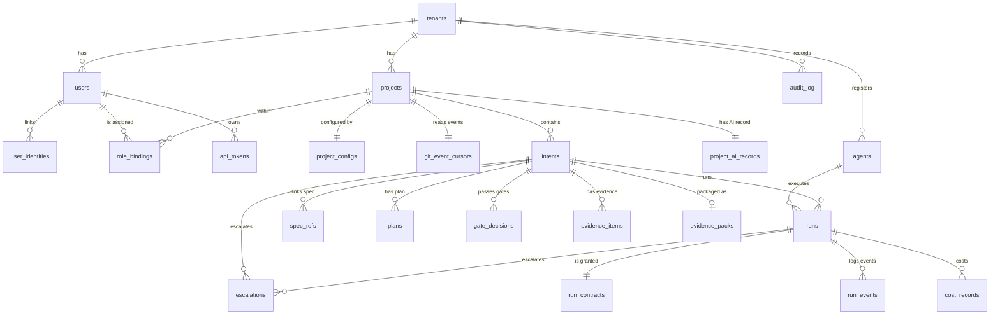

# D-05. MVP data model

| Item | Value |
|---|---|
| Version | 1.6 |
| Date | 2026-09-24 |
| Status | **Approved** (Harry, 2026-09-24) — version 1.0, aligned with the handbook (tag `design-v1.0`); 1.1 approved by Harry on 2026-09-25 (`config_hash` definition); 1.2 approved by Harry on 2026-09-25 in the A07 plan (audit log details); 1.3 approved by Harry on 2026-09-25 in the B01 plan (`intents.created_by` note); 1.4 approved by Harry on 2026-09-25 in the B02 plan (gate decisions: `gate_check_mode`, `voids_decision_id`, reason codes; ADR-M20); 1.5 approved by Harry on 2026-09-26 in the C02 plan (runs, run events; ADR-M22); 1.6 approved by Harry on 2026-09-26 in the C03 plan (cost records; ADR-M24) |
| Readers | Tech lead, developers, Claude Code |
| Related documents | D-02 (FR/NFR), D-03 (architecture), D-07 (tokens), handbook/00-introduction/05-codes.md |
| Main sources | Draft v1.0: 4.11 (artifacts, evidence), 4.15 (logical data model), 5.5 (physical data), 5.7 (audit trail) |

---

## 1. Purpose

- Define the tables, columns and relationships of the MVP platform.
- Fix how **data is separated per tenant** and how the **tamper-proof audit log** works.
- Serve as input for Claude Code to write migrations and tests.

## 2. Scope

- Only the `platform` database in PostgreSQL.
- **Excludes** the data of Temporal, LiteLLM, Langfuse and OpenBao (each manages its own database).
- **Never stored here**: client source code, model prompts/responses (they live in Langfuse), secrets (they live in OpenBao).

---

## 3. Principles

| # | Principle | Source |
|---|---|---|
| D1 | Every business table has `tenant_id`. Every query filters by tenant | D-02 NFR-02 |
| D2 | Foreign keys **include the tenant** (composite), so data from two tenants can never be joined by mistake | [Proposal] |
| D3 | **Append-only tables**: `audit_log`, `gate_decisions`, `cost_records`, `run_events`. No UPDATE / DELETE | [Doc] Draft 5.7 |
| D4 | All evidence data has a **SHA-256 hash** | [Doc] Draft 4.11 |
| D5 | Times stored as `timestamptz` (UTC). Displayed in the user's time zone | [Proposal] |
| D6 | Money stored as `numeric(18,6)` in USD. No floating point | [Proposal] |
| D7 | No hard deletes of business data. Use statuses (`archived`, `cancelled`) | [Proposal] |
| D8 | Table and column names: English, `snake_case` | CLAUDE.md |

---

## 4. Entity-relationship diagram (ERD)



SVG version: [d13-mvp-erd.svg](../diagrams/svg/d13-mvp-erd.svg)

---

## 5. Enumerations

Use the canonical codes (handbook/00-introduction/05-codes.md).

| Enum | Values |
|---|---|
| `gate_code` | `G1` … `G8` |
| `phase_code` | `P1` … `P6` |
| `autonomy_level` | `L0`, `L1`, `L2`, `L3`, `L4` (handbook codes table §2.1). MVP allows L0–L2 |
| `oversight_mode` | `HITL`, `HOTL`, `AUDIT` |
| `gate_check_mode` | `HITL`, `HOTL`, `AUDIT`, `POLICY` (automatic policy check at G4, QUESTIONS #6). Used by `gate_decisions.oversight_mode` (ADR-M20) |
| `risk_tier` | `low`, `medium`, `high`, `critical` |
| `data_class` | `public`, `internal`, `client_confidential` (may go to API models if the client allows), `client_restricted` (**self-hosted models only**), `prohibited` (never given to AI) |
| `intent_status` | `draft`, `in_gate`, `running`, `paused`, `blocked`, `done`, `rejected`, `cancelled` |
| `gate_decision` | `approve`, `reject`, `request_changes`, `pause`, `block`, `pass`, `fail`, `void` (an earlier approval became invalid: expired or mismatched) |
| `actor_type` | `human`, `system` (workflow, job), `agent` |
| `run_status` | `queued`, `provisioning`, `running`, `stopping`, `succeeded`, `succeeded_proposal_only` (L1: proposal only), `failed`, `stopped_budget`, `stopped_scope`, `stopped_timeout`, `stopped_stalled` (loop / no progress), `stopped_killed` (kill switch), `cancelled` |
| `project_role` | `person_a`, `person_b`, `second_approver`, `pm_brse`, `governance`, `admin`, `viewer` (handbook 2+N) |
| `change_flag` | G3 forced HITL: `migration`, `breaking_contract`, `new_service_boundary`, `security_boundary`, `system_of_record`, `prod_infrastructure`, `core_business_rule`. G7 dual approval: `migration`, `payment`, `personal_data`, `prod_infrastructure`, `breaking_contract`, `safety_function` |
| `agent_status` | `proposed`, `active`, `suspended`, `quarantined`, `retired` |
| `escalation_trigger` | `risky_action`, `uncertainty`, `out_of_scope`, `disagreement`, `unusual_behaviour`, `accumulated_risk`, `time` |
| `severity` | `critical`, `high`, `medium`, `low` |
| `response_level` | `observe`, `notify`, `pause`, `contain`, `incident` |
| `escalation_status` | `open`, `acknowledged`, `resolved`, `closed` |
| `git_provider` | `github` (MVP), `gitlab` (MVP+1) |
| `event_source` | `polling`, `webhook` |
| `gate_reason_code` | `spec_unclear`, `tests_insufficient`, `security_finding`, `out_of_scope`, `policy_denied`, `budget_exceeded`, `ci_failed`, `ai_record_missing`, `data_class_not_allowed`, `expired`, `input_mismatch`, `scope_mismatch`, `other` (ADR-M20) |

- [Proposal] `gate_decision`: `pass` / `fail` are used by automatic gates (G4, G5, G6). The other values are used by human gates.
- The `data_class` of an intent is set at G1 and **can never be lowered** afterwards (it can only be raised).

---

## 6. Table definitions

Legend: **PK** primary key · **FK** foreign key · **AO** append-only.
Every table (except `tenants`) has `tenant_id uuid not null` and `created_at timestamptz not null default now()`. These are not repeated below.

### 6.1. Tenants, users, permissions

**`tenants`**

| Column | Type | Notes |
|---|---|---|
| id | uuid PK | |
| slug | text unique | e.g. `internal`, `client-abc` |
| name | text | |
| monthly_budget_usd | numeric(18,6) null | Monthly cost cap. Null = use the configured default |
| status | text | `active`, `suspended` |

**`projects`**

| Column | Type | Notes |
|---|---|---|
| id | uuid PK | |
| slug | text | Unique within the tenant |
| name | text | |
| git_provider | git_provider | |
| repo_full_name | text | e.g. `org/pilot-order-inventory` |
| default_branch | text | `main` |
| status | text | `active`, `archived` |

**`project_configs`** (1–1 with project, versioned)

| Column | Type | Notes |
|---|---|---|
| project_id | uuid PK, FK | |
| version | int | Incremented on every change |
| config_yaml | text | Gates: deadlines, retry counts, warning thresholds. Default budgets. Policy rules |
| config_hash | char(64) | SHA-256 of the RFC 8785 canonical JSON of the **effective** configuration (defaults merged with `config_yaml`, validated). Comments, whitespace, key order and values that only repeat a default do not change it (ADR-M18) |
| updated_by | uuid FK users | |

- [Proposal] Every gate decision records the `config_hash` in force, so we know which configuration the gate ran under (supports tuning in M-F).

**`users`**

| Column | Type | Notes |
|---|---|---|
| id | uuid PK | |
| display_name | text | |
| email | text | Unique within the tenant |
| status | text | `active`, `disabled` |

**`user_identities`** (links to GitHub, GitLab… accounts)

| Column | Type | Notes |
|---|---|---|
| id | uuid PK | |
| user_id | uuid FK | |
| provider | git_provider | |
| external_id | text | Numeric GitHub account ID (not the username, which can change) |
| external_login | text | Current username, display only |

- Unique: (`tenant_id`, `provider`, `external_id`).

**`role_bindings`**

| Column | Type | Notes |
|---|---|---|
| id | uuid PK | |
| user_id | uuid FK | |
| project_id | uuid FK | |
| role | project_role | One person may have several rows. The platform never lets the same person act as producer and approver of one change |

**`api_tokens`** (personal tokens for the CLI / API)

| Column | Type | Notes |
|---|---|---|
| id | uuid PK | |
| user_id | uuid FK | |
| name | text | e.g. `laptop-harry` |
| token_hash | char(64) | SHA-256 of the token. **The token itself is never stored** |
| last_used_at | timestamptz null | |
| expires_at | timestamptz | Expiry is mandatory |
| revoked_at | timestamptz null | |

**`git_event_cursors`** (cursor for reading GitHub events by polling)

| Column | Type | Notes |
|---|---|---|
| project_id | uuid PK, FK | |
| cursor | text | Timestamp / ID of the last processed event |
| last_polled_at | timestamptz | |

**`project_ai_records`** (1–1 with project; handbook Chapter 2 §2.5, template T7)

| Column | Type | Notes |
|---|---|---|
| project_id | uuid PK, FK | |
| version | int | Incremented on every change |
| ai_allowed | text | `no`, `yes`, `yes_with_conditions` |
| allowed_data_classes | data_class[] | Unknown consent → only `client_restricted` handling |
| allowed_tools_locations | text | e.g. "business plan, data in Japan" |
| prod_logs_allowed | text | `no`, `yes_masked` (asked separately) |
| disclosure_format | text | `client_format`, `standard_note` |
| confirmed_by, confirmed_at | text, date | Client contact and date |
| updated_by | uuid FK users | |

- G1 fails when the record is missing, or when the intent's `data_class` is not in `allowed_data_classes`.

**`agents`** (agent register; handbook Chapter 20)

| Column | Type | Notes |
|---|---|---|
| id | uuid PK | |
| agent_key | text | e.g. `coder-openhands`; unique per tenant |
| version | text | |
| status | agent_status | Only `active` agents may run |
| owner_id | uuid FK users | Technical owner |
| model_ref | text | Pinned, e.g. `provider/model@version` |
| instructions_ref | text | e.g. `AGENTS.md@v5`, with hash |
| instructions_sha256 | char(64) | Checked before each run |
| allowed_tools | text[] | |
| max_autonomy | autonomy_level | |
| approved_environments | text[] | |
| last_recertified_at | date null | Warning when older than 3 months |
| updated_at | timestamptz | |

### 6.2. Intents, specs, plans

**`intents`**

| Column | Type | Notes |
|---|---|---|
| id | uuid PK | |
| code | text | `INT-YYYY-NNNN`, unique within the tenant |
| project_id | uuid FK | |
| title | text | |
| description | text | |
| created_by | uuid FK users | The intent owner (Person A), who approves G1. The workflow counts the creator as a producer at G7, so the creator never approves G7 (design/QUESTIONS.md #16) |
| risk_tier | risk_tier | |
| data_class | data_class | |
| max_autonomy | autonomy_level | Computed by policy (risk_tier, data_class) |
| budget_usd | numeric(18,6) | Token budget of the intent |
| current_gate | gate_code null | |
| status | intent_status | |
| issue_number | int null | GitHub issue linked to the intent |
| pr_number | int null | PR created by the agent |
| updated_at | timestamptz | |

- This is the **only** table in the intent group that is UPDATEd (current state). History lives in `gate_decisions` and `audit_log`.

**`spec_refs`**

| Column | Type | Notes |
|---|---|---|
| id | uuid PK | |
| intent_id | uuid FK | |
| version | int | Incremented each time a new spec is linked |
| path | text | File path in the repo |
| commit_sha | char(40) | |
| content_sha256 | char(64) | Content hash. Compared to detect specs changed after G2 (FR-02) |
| source_tool | text null | `spec-kit`, `bmad`, `manual` |

**`plans`**

| Column | Type | Notes |
|---|---|---|
| id | uuid PK | |
| intent_id | uuid FK | |
| version | int | |
| planned_files | text[] | Files / path patterns expected to change. G5 compares them with the real changes |
| summary | text | |
| plan_sha256 | char(64) | |
| proposed_by_type | actor_type | `human` or `agent` |
| change_flags | change_flag[] | Set by Person A / B at G3; drive forced HITL (G3) and dual approval (G7) |

### 6.3. Gates

**`gate_decisions`** (AO)

| Column | Type | Notes |
|---|---|---|
| id | uuid PK | |
| intent_id | uuid FK | |
| gate | gate_code | |
| decision | gate_decision | |
| oversight_mode | gate_check_mode | Resolved from the matrix at decision time. `POLICY` only at G4, with `actor_type = system` |
| approver_role | project_role null | Role under which the person approved |
| actor_type | actor_type | |
| decided_by | uuid FK users null | Null when `system` |
| reason_code | gate_reason_code null | Required for `reject`, `request_changes`, `block`, `fail`, `void`. **No free text**: this table is kept at least 2 years and never changes (ADR-M20) |
| reason_ref | text null | Optional `https://` link (max 512 characters) to the Git host comment that holds the human explanation. The text stays on the Git host, where it can be edited or deleted |
| input_sha256 | char(64) | Hash of the gate's input data (spec, plan, diff…) — the **bound version** |
| scope | jsonb null | Environment, resources, allowed actions bound to the approval |
| expires_at | timestamptz null | Approval validity; after it, a `void` decision is written and the gate is re-evaluated |
| config_hash | char(64) | Project configuration at decision time |
| source | text | `cli`, `github_comment`, `github_review`, `workflow` |
| event_source | event_source null | Whether the event came from polling or a webhook |
| waited_seconds | int null | Time spent waiting for the approver (FR-12 metric) |
| voids_decision_id | uuid FK null | Set exactly when `decision = void`: the approval this row cancels, of the same intent and gate. Each approval is voided at most once (ADR-M20) |

- Separation of duties (FR-11): the approver must hold the gate's role; the producer of the change (the run's agent, and the person who authored the commits) is never counted as approver. Dual approval (FR-16) = two `approve` rows from different people, one `person_b` and one `second_approver`. Checked by Policy `canApprove` **and** covered by tests.
- Approval binding (FR-17): an `approve` row always has `approver_role`, `expires_at` and a HITL or HOTL mode. When the approval no longer holds (expired, other input hash, other scope), the platform writes a `void` row with `voids_decision_id` pointing to it. The approval row itself never changes (ADR-M20).
- Agents never decide (`actor_type` is `human` or `system`). A `system` row has no `decided_by` and no `approver_role`.

### 6.4. Runs

**`runs`**

| Column | Type | Notes |
|---|---|---|
| id | uuid PK | `run_id` |
| intent_id | uuid FK | |
| plan_id | uuid FK | Plan approved at G3 |
| attempt | int | Attempt number for the intent (retries) |
| agent_id | uuid FK agents | Registered agent (FR-36). No foreign key until the agent register exists: C10 adds `(tenant_id, agent_id) → agents`; C06 checks the agent is registered and active before a contract is issued (QUESTIONS #32) |
| agent_version | text | Copied from the register at start |
| branch | text | `agent/INT-…` |
| base_sha | char(40) | |
| head_sha | char(40) null | Last commit pushed by the agent |
| status | run_status | |
| stop_reason | text null | A code (`^[a-z][a-z0-9_]{0,63}$`), never free text (ADR-M22) |
| triggered_by | uuid FK users null | The G3/G4 approver who allowed the run. Used by the optional rule "G7 ≠ G3 approver" |
| started_at, finished_at | timestamptz null | |
| iterations | int | Iterations completed |
| killed_by | uuid FK users null | Set when stopped by the kill switch |
| updated_at | timestamptz | |

- `id` is generated by the issuer, so the contract can be signed before the insert. `platform_app` may update only the state columns (`status`, `stop_reason`, `head_sha`, `started_at`, `finished_at`, `iterations`, `killed_by`, `updated_at`). Once the status is final (`succeeded*`, `failed`, `stopped_*`, `cancelled`), a trigger refuses any change (ADR-M22).

**`run_contracts`**

| Column | Type | Notes |
|---|---|---|
| run_id | uuid PK, FK | |
| contract_json | jsonb | Contract content (D-03 section 8) |
| contract_sha256 | char(64) | |
| signature | text | Signature from OpenBao Transit |
| key_version | int | Signing key version |
| issued_at, expires_at | timestamptz | |
| revoked_at | timestamptz null | MVP+ |

- Written once (`SELECT, INSERT` only for `platform_app`). `key_version` equals the version in the signature prefix; `contract_json` holds the same `run_id` and `tenant_id` as the row (ADR-M22).

**`run_events`** (AO)

| Column | Type | Notes |
|---|---|---|
| id | bigserial PK | |
| run_id | uuid FK | |
| event_type | text | `snake_case`: `contract_issued`, `contract_accepted`, `contract_rejected` (C02); `sandbox_created`, `agent_started`, `budget_warning`, `scope_violation`, `push`, `stopped`… added by later tasks |
| payload | jsonb | **Coded values only**: the fields declared for the event type (IDs, hashes, versions, counts, codes). Never free text, secrets, code, personal or client data. The database refuses nested values and strings with spaces or `@` (ADR-M22 §2.5) |

### 6.4b. Escalations

**`escalations`**

| Column | Type | Notes |
|---|---|---|
| id | uuid PK | `ESC-…` code in `code` |
| code | text | |
| intent_id | uuid FK | |
| run_id | uuid FK null | |
| trigger | escalation_trigger | |
| severity | severity | |
| response_level | response_level | |
| packet | jsonb | Decision packet (handbook template T16) |
| owner_id, backup_owner_id | uuid FK users | Routed by type (handbook Ch.6 §6.4) |
| ack_due_at, resolve_due_at | timestamptz | From the SLA table in project config |
| acknowledged_by, acknowledged_at | uuid, timestamptz null | |
| current_step | text | `owner`, `backup`, `governance` |
| status | escalation_status | |
| decision | jsonb null | Resume / modify / roll back / terminate, bound to version, scope, expiry |
| updated_at | timestamptz | |

- Every change is also written to `audit_log`. Updates are allowed only on `status`, `current_step`, acknowledgement and decision fields.

### 6.5. Cost

**`cost_records`** (AO)

| Column | Type | Notes |
|---|---|---|
| id | bigserial PK | |
| project_id | uuid FK | |
| intent_id | uuid FK null | |
| run_id | uuid FK null | |
| gate | gate_code null | |
| agent | text null | |
| model | text | |
| provider_type | text | `api`, `self_hosted` |
| input_tokens, output_tokens | bigint | |
| cached_input_tokens | bigint | Tokens read from cache |
| cost_usd | numeric(18,6) | For self-hosted models: internal cost equivalent (D-07) |
| source_ref | text | ID of the original LiteLLM record, for reconciliation |
| occurred_at | timestamptz | |

- [Proposal] The Cost Controller syncs from LiteLLM into this table on a schedule. Unique (`tenant_id`, `source_ref`) prevents duplicates.
- Implemented in C03 (ADR-M24 §2.6): `id` is an identity; every text column is a code with a format CHECK (`model`, `agent`, `source_ref`, `provider_type`), never free text; `run_id` needs `intent_id`; `cached_input_tokens` ≤ `input_tokens`; extra index (`tenant_id`, `occurred_at`) for the tenant's month total. Append-only: triggers and `SELECT, INSERT` only for `platform_app` (section 7.2). `source_ref` is the gateway's request ID; `model` is the name the caller asked for (the name in `allowed_models`).

### 6.6. Evidence

**`evidence_items`**

| Column | Type | Notes |
|---|---|---|
| id | uuid PK | |
| intent_id | uuid FK | |
| run_id | uuid FK null | |
| kind | text | `spec`, `plan`, `proposal` (agent proposal at L1), `diff`, `ci_result`, `test_report`, `scan_report`, `review`, `cost_summary`, `disclosure_note` (client AI disclosure, FR-43) |
| storage_uri | text | SeaweedFS path: `s3://evidence/{tenant}/{intent}/…` |
| sha256 | char(64) | |
| size_bytes | bigint | |
| purged_at | timestamptz null | When the file was deleted from SeaweedFS |

**`evidence_packs`**

| Column | Type | Notes |
|---|---|---|
| intent_id | uuid PK, FK | |
| manifest_uri | text | JSON listing every evidence_item + hash |
| manifest_sha256 | char(64) | |
| markdown_uri | text | Readable version (FR-42) |
| sealed_at | timestamptz | Sealed when G8 passes |
| retention_hold | boolean | Default false. True = do not delete at expiry |
| purged_at | timestamptz null | When the files were deleted from SeaweedFS |

### 6.7. Audit log

**`audit_log`** (AO)

| Column | Type | Notes |
|---|---|---|
| id | bigint identity PK | Same behaviour as `bigserial` |
| seq | bigint | Sequence number **within the tenant**, continuous, no gaps |
| hash_version | smallint | Version of the hashed field list and canonicalisation (section 7.1). Only `1` so far |
| actor_type | actor_type | |
| actor_id | uuid null | Null for `system` |
| action | text | `intent.created`, `gate.decided`, `run.started`, `config.changed`… |
| entity_type, entity_id | text null, uuid null | Both or neither: some events (tenant-level, configuration) have no single entity |
| payload | jsonb | **Only IDs, codes, hashes and versions**, declared per action. No secrets, no personal data, no client data (see below) |
| prev_hash | char(64) | Hash of the previous record (same tenant) |
| hash | char(64) | Hash of this record |
| occurred_at | timestamptz | |

- Unique: (`tenant_id`, `seq`).
- The audit log is never deleted and is kept at least 2 years (section 10), so personal or client data written there could never be erased. The platform accepts only the payload fields declared for each action, each with a strict format, and at most 2048 bytes (ADR-M09 section 2.8).

---

## 7. Audit log: hash chain

[Doc] Draft v1.0 (5.7) proposes an append-only table + hash chain, with an extra copy on locked object storage.

### 7.1. Calculation

- **One chain per tenant** [Proposal]. Reason: when selling to clients, we can export and verify one client's audit on its own.
- `hash = SHA-256( prev_hash || canonical_json(record without the hash field) )`.
- Hashed fields (version 1): `hash_version`, `tenant_id`, `seq`, `actor_type`, `actor_id`, `action`, `entity_type`, `entity_id`, `payload`, `occurred_at` (ISO 8601 UTC, millisecond precision), `prev_hash`. `id` and `created_at` are set by the database and are not hashed. A change to this list or to canonicalisation needs a new `hash_version`; older rows keep verifying under their own version.
- First record of a tenant: `prev_hash` = 64 zeros.
- `canonical_json`: the JSON Canonicalization Scheme (RFC 8785): sorted keys, no whitespace, times in ISO 8601 UTC. Same module as `config_hash`.
- Write each new record in **a transaction holding a per-tenant lock** (advisory lock), so two processes cannot produce the same `seq` or `prev_hash`. An insert trigger also refuses a row that does not follow the tenant's last row.

### 7.2. Blocking updates and deletes in the database

```sql
CREATE FUNCTION forbid_mutation() RETURNS trigger AS $$
BEGIN
  RAISE EXCEPTION 'append-only table: % not allowed on %', TG_OP, TG_TABLE_NAME;
END; $$ LANGUAGE plpgsql;

CREATE TRIGGER audit_log_no_update BEFORE UPDATE OR DELETE ON audit_log
  FOR EACH ROW EXECUTE FUNCTION forbid_mutation();
CREATE TRIGGER audit_log_no_truncate BEFORE TRUNCATE ON audit_log
  FOR EACH STATEMENT EXECUTE FUNCTION forbid_mutation();
-- Same for gate_decisions, run_events, cost_records.
```

- In addition: the application's database user has **no** UPDATE / DELETE / TRUNCATE privilege on AO tables.

### 7.3. Integrity check (`sdlc audit verify`, FR-41)

1. Read the tenant's records in ascending `seq`.
2. Check that `seq` is continuous with no gaps.
3. Recompute each record's `hash`; compare with the stored value and with the next record's `prev_hash`.
4. Report the first broken record (if any).

### 7.4. External anchoring

- [Proposal] Every day, write the latest `hash` of each tenant to SeaweedFS (a bucket with object locking, if it can be configured) and to the operations log.
- Purpose: if someone with database access rewrites the whole chain, the external anchor still reveals it.

---

## 8. Tenant isolation

| Layer | MVP | MVP+1 |
|---|---|---|
| `tenant_id` column on every table | ✅ | ✅ |
| Composite foreign keys `(tenant_id, id)` | ✅ | ✅ |
| Repository/DAO requires a tenant | ✅ | ✅ |
| Test: queries for tenant A never see tenant B data | ✅ | ✅ |
| PostgreSQL Row-Level Security | — | ✅ (D-03 section 9) |
| SeaweedFS: path prefix per tenant | ✅ | Separate bucket per tenant |
| LiteLLM: team/key per tenant | ✅ | ✅ |

---

## 9. Main indexes

| Table | Indexes |
|---|---|
| intents | (`tenant_id`, `code`) unique · (`tenant_id`, `project_id`, `status`) |
| gate_decisions | (`tenant_id`, `intent_id`, `created_at`) |
| runs | (`tenant_id`, `intent_id`, `attempt`) unique · (`tenant_id`, `status`) |
| cost_records | (`tenant_id`, `project_id`, `occurred_at`) · (`tenant_id`, `intent_id`) · (`tenant_id`, `source_ref`) unique |
| audit_log | (`tenant_id`, `seq`) unique |
| user_identities | (`tenant_id`, `provider`, `external_id`) unique |

---

## 10. Retention and deletion

| Data | Retention (proposal) | Notes |
|---|---|---|
| Audit log, gate_decisions, escalations | **At least 2 years** (handbook Ch.3); never deleted in the MVP | This is evidence |
| Evidence Pack (files in SeaweedFS) | **6 months by default** from `sealed_at` (decided by Harry, 2026-09-24). Configurable per tenant / project | When selling: the client chooses per contract |
| run_events | 1 year, then summarised | |
| cost_records | Never deleted in the MVP | Used for cost calculation |

### 10.1. Deleting Evidence Packs after 6 months [Proposal]

- Delete the **files** in SeaweedFS (diffs, logs, reports). **Keep** in the database: the file list, hashes and times. The audit can still prove "which evidence existed".
- Columns `purged_at timestamptz null` on `evidence_items` and `evidence_packs`.
- Each deletion writes an `evidence.purged` event to `audit_log`.
- The purge job runs daily (Temporal schedule). A SeaweedFS lifecycle rule is a safety net.
- **Hold**: the `retention_hold boolean` flag on `evidence_packs`. Set it for disputes, incidents or client requests → the job skips it.
- Configuration: `evidence_retention_days` in `project_configs` (default 180); can also be set at tenant level.

- **Project archive**: archiving a project purges its evidence files and any stored client material (unless `retention_hold`), keeping hashes and audit records; writes `project.purged` to the audit log (FR-44).
- [Proposal] When selling to clients, we will need a policy for deleting data on client request. Deleting from AO tables **conflicts** with the append-only principle → needs its own design (e.g. delete content, keep hashes). Planned for MVP+2.

---

## 11. Migration tool

- [Proposal] Choose the ORM / migration tool in milestone M-A (task A06, ADR-M09). Requirements:
  - Supports **raw SQL migrations** (triggers, grants, advisory locks).
  - Good TypeScript support.
- Migrations run automatically when `api` starts in development. In production: run with a separate command, after a backup.

---

## 12. Risks

| Risk | Mitigation |
|---|---|
| Forgetting to filter by `tenant_id` → data leaks between clients | DAO requires a tenant + cross-tenant tests + RLS in MVP+1 |
| Concurrent audit writes break the hash chain | Per-tenant advisory lock + concurrency test |
| AO tables grow large | Monthly partitioning in MVP+1 |
| Client data-deletion requests conflict with the audit | Separate design in MVP+2 (section 10) |

## 13. Open questions

- ~~Evidence Pack retention?~~ → Decided: **6 months**, configurable (section 10.1).

## 14. References

**Internal**
- Draft v1.0: 4.11, 4.15, 5.5, 5.7.
- design/D-02, D-03, D-07.

**External**
- RFC 8785, JSON Canonicalization Scheme: https://www.rfc-editor.org/rfc/rfc8785
- PostgreSQL, Row Security Policies: https://www.postgresql.org/docs/current/ddl-rowsecurity.html

---

## Version history

| Version | Date | Author | Notes |
|---|---|---|---|
| 0.1 | 2026-09-24 | Claude (draft) | First version |
| 0.2 | 2026-09-24 | Claude (draft) | Evidence Pack retention 6 months; purge, hold, new columns |
| 0.3 | 2026-09-24 | Claude (draft) | Added `api_tokens` table (CLI/API authentication, task B03) |
| 0.4 | 2026-09-24 | Claude (draft) | After review: `actor_type` enum with `agent`; `succeeded_proposal_only`; evidence `proposal`; `runs.triggered_by`; `git_event_cursors`; SeaweedFS |
| 0.5 | 2026-09-24 | Claude | Translated into English. Content unchanged |
| 1.0 | 2026-09-24 | Claude, approved by Harry | Handbook alignment: L0–L4, oversight_mode, 2+N roles, change flags, `project_ai_records`, `agents`, `escalations`, approval binding (scope, expiry, `void`), kill switch, retention ≥ 2 years, project purge |
| 1.1 | 2026-09-25 | Claude (task A05), approved by Harry | §6.1 `config_hash`: hash of the effective configuration in RFC 8785 canonical JSON, not of the raw YAML text (QUESTIONS.md #8, ADR-M18) |
| 1.2 | 2026-09-25 | Claude (task A07), approved by Harry | §6.7: `hash_version` column, `id` as identity, `entity_type` / `entity_id` nullable (both or neither), payload rule (IDs, codes, hashes, versions only); §7.1: hashed field list and versioning; §7.2: TRUNCATE trigger (ADR-M09 §2.8) |
| 1.3 | 2026-09-25 | Claude (task B01), approved by Harry | §6.2: `intents.created_by` no longer "blocks self-approval of G1 and G7". Person A owns the intent and approves G1; the creator is a producer at G7 only (QUESTIONS.md #16) |
| 1.4 | 2026-09-25 | Claude (task B02), approved by Harry | §5: `gate_check_mode` (adds `POLICY`, QUESTIONS #6) and `gate_reason_code`; §6.3 `gate_decisions`: `oversight_mode` uses `gate_check_mode`, free-text `reason` replaced by `reason_code` + `reason_ref`, new `voids_decision_id`; binding and actor notes (ADR-M20) |
| 1.5 | 2026-09-26 | Claude (task C02), approved by Harry | §6.4: `run_events.payload` coded values only; `runs.stop_reason` a code; `runs.agent_id` without a foreign key until C10 (QUESTIONS #32); run state columns and final-status trigger; `run_contracts` written once; index (`tenant_id`, `status`) (ADR-M22) |
| 1.6 | 2026-09-26 | Claude (task C03), approved by Harry | §6.5: `cost_records` as implemented: code formats, `run_id` needs `intent_id`, cached ≤ input tokens, month index, append-only (ADR-M24) |
