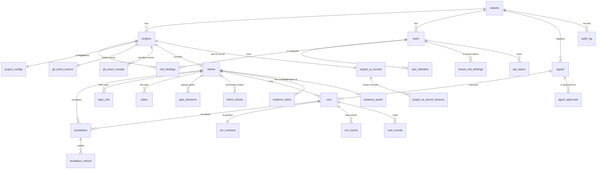

# D-05. MVP data model

| Item | Value |
|---|---|
| Version | 1.23 |
| Date | 2026-09-24 |
| Status | **Approved** (Harry, 2026-09-24) — version 1.0, aligned with the handbook (tag `design-v1.0`); 1.1 approved by Harry on 2026-09-25 (`config_hash` definition); 1.2 approved by Harry on 2026-09-25 in the A07 plan (audit log details); 1.3 approved by Harry on 2026-09-25 in the B01 plan (`intents.created_by` note); 1.4 approved by Harry on 2026-09-25 in the B02 plan (gate decisions: `gate_check_mode`, `voids_decision_id`, reason codes; ADR-M20); 1.5 approved by Harry on 2026-09-26 in the C02 plan (runs, run events; ADR-M22); 1.6 approved by Harry on 2026-09-26 in the C03 plan (cost records; ADR-M24); 1.7 approved by Harry on 2026-09-27 in the B03 plan (API token format; ADR-M26); 1.8 approved by Harry on 2026-09-27 in the B06 plan (Git event receipts; ADR-M27); 1.9 approved by Harry on 2026-09-27 in the B11 plan (escalations, notices; ADR-M28); 1.10 approved by Harry on 2026-09-27 in the C05 session 2 plan (agent run events and stop reasons; ADR-M29, QUESTIONS #82); 1.11 approved by Harry on 2026-09-27 in the C10 plan (agent register; ADR-M31); 1.12 approved by Harry on 2026-09-27 in the B07 plan (intent workflow: `gate_entered_at`, one open intent per issue, status notices; ADR-M30, QUESTIONS #68, #91); 1.13 approved by Harry on 2026-09-27 in the B07 session 2 plan (notice kinds `hotl_passed` and `returned`, `waited_seconds`, clocks of `escalations.created_at` and gate decision events; ADR-M30 §2.4b, §2.9); 1.14 approved by Harry on 2026-09-27 in the B12 plan (project AI record: codes only, version history; ADR-M32, QUESTIONS #103–#106); 1.15 approved by Harry on 2026-09-27 in the C06 plan (G4 reason codes, notice kinds and `intent_notices.agent_id`, a blocked intent is finished; ADR-M33, QUESTIONS #110); 1.16 approved by Harry on 2026-09-27 in the C06 session 2 plan (run notice kinds and stop reasons; ADR-M33 §2.6–§2.7); 1.17 approved by Harry on 2026-09-27 in the C06 session 2 plan, PR 2b (`evidence_items` as built, notice kind `proposal_ready`, run event `proposal_stored`; ADR-M33 §2.9); 1.18 approved by Harry on 2026-09-28 in the C07 plan and 2026-10-03 (G4 reason code `instructions_unpinned`, run events `key_issued`, `budget_warning`, `diff_stored`, `changes_checked`, the `decimal` value kind, stop reasons `max_budget` and `agent_changes_unavailable`, evidence `diff`; ADR-M34, QUESTIONS #126, #130); 1.19 approved by Harry on 2026-10-03 in the B13 plan (tenant admins, unlinked identities, the hash of the stored configuration YAML; ADR-M37, QUESTIONS #95, #150); 1.20 approved by Harry on 2026-09-28 in the C07 plan and on 2026-10-03 (G5 reason code `run_cap_reached`, `intents.run_budget_usd`, budgets only go up, the G5 notice kinds; ADR-M34 §2.8–§2.9, QUESTIONS #131–#134); 1.21 approved by Harry on 2026-10-03 in the B13 plan (agent approvals; ADR-M37 §2.8, QUESTIONS #153); 1.22 approved by Harry on 2026-10-03 in the B08 plan (spec versions linked by the platform, notice kinds `spec_changed`, `spec_unavailable`; ADR-M39, QUESTIONS #160–#163); 1.23 approved by Harry on 2026-10-03 in the C08 plan (`runs.head_sha` is the pushed commit, run events `branch_pushed`, `publish_refused`, `publish_failed`, notice kinds of the push, `intents.pr_number` linked by the platform; ADR-M38, QUESTIONS #155, #156) |
| Readers | Tech lead, developers, Claude Code |
| Related documents | D-02 (FR/NFR), D-03 (architecture), D-07 (tokens), handbook/00-introduction/05-codes.md |
| Main sources | Draft v1.0: 4.11 (artifacts, evidence), 4.15 (logical data model), 5.5 (physical data), 5.7 (audit trail) |

---

## 1. Purpose

- Define the tables, columns and relationships of the MVP platform.
- Fix how **data is separated per tenant** and how the **tamper-proof audit log** works.
- Serve as input for Claude Code to write migrations and tests.

## 2. Scope

- Only the `platform` database in PostgreSQL.
- **Excludes** the data of Temporal, LiteLLM, Langfuse and OpenBao (each manages its own database).
- **Never stored here**: client source code, model prompts/responses (they live in Langfuse), secrets (they live in OpenBao).

---

## 3. Principles

| # | Principle | Source |
|---|---|---|
| D1 | Every business table has `tenant_id`. Every query filters by tenant | D-02 NFR-02 |
| D2 | Foreign keys **include the tenant** (composite), so data from two tenants can never be joined by mistake | [Proposal] |
| D3 | **Append-only tables**: `audit_log`, `gate_decisions`, `cost_records`, `run_events`. No UPDATE / DELETE | [Doc] Draft 5.7 |
| D4 | All evidence data has a **SHA-256 hash** | [Doc] Draft 4.11 |
| D5 | Times stored as `timestamptz` (UTC). Displayed in the user's time zone | [Proposal] |
| D6 | Money stored as `numeric(18,6)` in USD. No floating point | [Proposal] |
| D7 | No hard deletes of business data. Use statuses (`archived`, `cancelled`) | [Proposal] |
| D8 | Table and column names: English, `snake_case` | CLAUDE.md |

---

## 4. Entity-relationship diagram (ERD)



SVG version: [d13-mvp-erd.svg](../diagrams/svg/d13-mvp-erd.svg)

---

## 5. Enumerations

Use the canonical codes (handbook/00-introduction/05-codes.md).

| Enum | Values |
|---|---|
| `gate_code` | `G1` … `G8` |
| `phase_code` | `P1` … `P6` |
| `autonomy_level` | `L0`, `L1`, `L2`, `L3`, `L4` (handbook codes table §2.1). MVP allows L0–L2 |
| `oversight_mode` | `HITL`, `HOTL`, `AUDIT` |
| `gate_check_mode` | `HITL`, `HOTL`, `AUDIT`, `POLICY` (automatic policy check at G4, QUESTIONS #6). Used by `gate_decisions.oversight_mode` (ADR-M20) |
| `risk_tier` | `low`, `medium`, `high`, `critical` |
| `data_class` | `public`, `internal`, `client_confidential` (may go to API models if the client allows), `client_restricted` (**self-hosted models only**), `prohibited` (never given to AI) |
| `intent_status` | `draft`, `in_gate`, `running`, `paused`, `blocked`, `done`, `rejected`, `cancelled` |
| `gate_decision` | `approve`, `reject`, `request_changes`, `pause`, `block`, `pass`, `fail`, `void` (an earlier approval became invalid: expired or mismatched) |
| `actor_type` | `human`, `system` (workflow, job), `agent` |
| `run_status` | `queued`, `provisioning`, `running`, `stopping`, `succeeded`, `succeeded_proposal_only` (L1: proposal only), `failed`, `stopped_budget`, `stopped_scope`, `stopped_timeout`, `stopped_stalled` (loop / no progress), `stopped_killed` (kill switch), `cancelled` |
| `project_role` | `person_a`, `person_b`, `second_approver`, `pm_brse`, `governance`, `admin`, `viewer` (handbook 2+N) |
| `change_flag` | G3 forced HITL: `migration`, `breaking_contract`, `new_service_boundary`, `security_boundary`, `system_of_record`, `prod_infrastructure`, `core_business_rule`. G7 dual approval: `migration`, `payment`, `personal_data`, `prod_infrastructure`, `breaking_contract`, `safety_function` |
| `agent_status` | `proposed`, `active`, `suspended`, `quarantined`, `retired` |
| `escalation_trigger` | `risky_action`, `uncertainty`, `out_of_scope`, `disagreement`, `unusual_behaviour`, `accumulated_risk`, `time` |
| `severity` | `critical`, `high`, `medium`, `low` |
| `response_level` | `observe`, `notify`, `pause`, `contain`, `incident` |
| `escalation_status` | `open`, `acknowledged`, `resolved`, `closed` |
| `escalation_route` | `intent`, `technical`, `security`, `policy`: who receives an escalation first (handbook Ch.6 §6.4; ADR-M28) |
| `escalation_step` | `owner`, `backup`, `governance`: the chain when nobody acknowledges (handbook Ch.6 §6.5; ADR-M28) |
| `tenant_role` | `tenant_admin`: tenant-level roles, not tied to a project (QUESTIONS #150; ADR-M37) |
| `git_provider` | `github` (MVP), `gitlab` (MVP+1) |
| `event_source` | `polling`, `webhook` |
| `gate_reason_code` | `spec_unclear`, `tests_insufficient`, `security_finding`, `out_of_scope`, `policy_denied`, `budget_exceeded`, `ci_failed`, `ai_record_missing`, `data_class_not_allowed`, `expired`, `input_mismatch`, `scope_mismatch`, `agent_not_runnable`, `instructions_mismatch`, `autonomy_not_allowed` (G4, ADR-M33), `instructions_unpinned` (G4 and G5: an agent instruction file the register does not pin, or a commit the Git host lists only in part; ADR-M34 §2.4), `run_cap_reached` (G5: the run stopped at its iteration or time cap, or stalled; the exact cause in the audit event `gate.g5_check_failed`; ADR-M34 §2.8), `other` (ADR-M20) |

- [Proposal] `gate_decision`: `pass` / `fail` are used by automatic gates (G4, G5, G6). The other values are used by human gates.
- The `data_class` of an intent is set at G1 and **can never be lowered** afterwards (it can only be raised).

---

## 6. Table definitions

Legend: **PK** primary key · **FK** foreign key · **AO** append-only.
Every table (except `tenants`) has `tenant_id uuid not null` and `created_at timestamptz not null default now()`. These are not repeated below.

### 6.1. Tenants, users, permissions

**`tenants`**

| Column | Type | Notes |
|---|---|---|
| id | uuid PK | |
| slug | text unique | e.g. `internal`, `client-abc` |
| name | text | |
| monthly_budget_usd | numeric(18,6) null | Monthly cost cap. Null = use the configured default |
| status | text | `active`, `suspended` |

**`projects`**

| Column | Type | Notes |
|---|---|---|
| id | uuid PK | |
| slug | text | Unique within the tenant |
| name | text | |
| git_provider | git_provider | |
| repo_full_name | text | e.g. `org/pilot-order-inventory` |
| default_branch | text | `main` |
| status | text | `active`, `archived` |

**`project_configs`** (1–1 with project, versioned)

| Column | Type | Notes |
|---|---|---|
| project_id | uuid PK, FK | |
| version | int | Incremented on every change |
| config_yaml | text | Gates: deadlines, retry counts, warning thresholds. Default budgets. Policy rules |
| config_hash | char(64) | SHA-256 of the RFC 8785 canonical JSON of the **effective** configuration (defaults merged with `config_yaml`, validated). Comments, whitespace, key order and values that only repeat a default do not change it (ADR-M18) |
| override_sha256 | char(64) | SHA-256 of `config_yaml` as stored (UTF-8 text), written by the repository (B13, QUESTIONS #95). When `config_hash` no longer matches but this hash does, only the platform defaults changed: the start-up check re-hashes the configuration and saves a new version (actor `system`, ADR-M37 §2.5); otherwise the YAML was changed outside the platform and the project fails closed |
| updated_by | uuid FK users | |

- [Proposal] Every gate decision records the `config_hash` in force, so we know which configuration the gate ran under (supports tuning in M-F).

**`users`**

| Column | Type | Notes |
|---|---|---|
| id | uuid PK | |
| display_name | text | |
| email | text | Unique within the tenant |
| status | text | `active`, `disabled` |

**`user_identities`** (links to GitHub, GitLab… accounts)

| Column | Type | Notes |
|---|---|---|
| id | uuid PK | |
| user_id | uuid FK | |
| provider | git_provider | |
| external_id | text | Numeric GitHub account ID (not the username, which can change) |
| external_login | text | Current username, display only |
| unlinked_at | timestamptz null | Set once when the identity is unlinked (B13); never set on insert. Null = linked |

- Unique: (`tenant_id`, `provider`, `external_id`) for **linked** identities only (B13), so an account can be linked again after it was unlinked.
- `external_id` is the numeric account ID (CHECK: digits, no leading zero); a login can never be stored there (QUESTIONS #45, ADR-M37 §2.3). `external_login` is 1–100 characters.
- An identity is unlinked, never deleted; an unlinked identity never changes again (trigger, `SDA11`). Unlinked identities never decide and are never mentioned.
- Comment commands and reviews are mapped to users by `external_id` only, never by `external_login`; bots never decide (QUESTIONS #45, ADR-M27).

**`role_bindings`**

| Column | Type | Notes |
|---|---|---|
| id | uuid PK | |
| user_id | uuid FK | |
| project_id | uuid FK | |
| role | project_role | One person may have several rows. The platform never lets the same person act as producer and approver of one change |

- Granted and revoked by a tenant admin or the project's `admin` (B13, ADR-M37 §2.2): nobody grants a role to themselves, and one person never holds both roles of a pair in config `access.conflicting_roles` (always Person A and Person B, rule M21).

**`tenant_role_bindings`** (task B13, QUESTIONS #150, ADR-M37 §2.1): tenant-level roles.

| Column | Type | Notes |
|---|---|---|
| id | uuid PK | |
| user_id | uuid FK | |
| role | tenant_role | `tenant_admin`: projects, users, identities, tokens, the agent register, `audit verify`, and the roles and configuration of every project. Never a gate approver |
| revoked_at | timestamptz null | Set once when the role is withdrawn (trigger, `SDA11`). Null = active |

- One active row per person and role (partial unique index). `platform_app` may update `revoked_at` only; no DELETE.
- The tenant always keeps one active tenant admin whose user is active: the last one cannot be revoked or disabled. `sdlc admin bootstrap` makes the first user a tenant admin.

**`api_tokens`** (personal tokens for the CLI / API)

| Column | Type | Notes |
|---|---|---|
| id | uuid PK | |
| user_id | uuid FK | |
| name | text | e.g. `laptop-harry` |
| token_hash | char(64) | SHA-256 of the token. **The token itself is never stored** |
| last_used_at | timestamptz null | |
| expires_at | timestamptz | Expiry is mandatory |
| revoked_at | timestamptz null | |

- Tokens are `sdlc_pat_` + 32 random bytes in base64url, so secret scanners find leaks (Gitleaks rule `sdlc-api-token`). Default lifetime 90 days, maximum 365 days (platform settings). Issuing and revoking append `api_token.issued` / `api_token.revoked` to the audit log, with IDs only (ADR-M26).

**`git_event_cursors`** (cursor for reading GitHub events by polling)

| Column | Type | Notes |
|---|---|---|
| project_id | uuid PK, FK | |
| cursor | text | Timestamp / ID of the last processed event |
| last_polled_at | timestamptz | |

- The poller moves the cursor with compare-and-set, in the same transaction as the effects of the events (ADR-M27 §2.2).

**`project_ai_records`** (1–1 with project; handbook Chapter 2 §2.5, template T7)

| Column | Type | Notes |
|---|---|---|
| project_id | uuid PK, FK | |
| version | int | Incremented on every change |
| ai_allowed | text | `no`, `yes`, `yes_with_conditions` |
| allowed_data_classes | data_class[] | Never `prohibited`; no `client_*` class when `ai_allowed = no`; no `client_confidential` while consent is unknown (handbook Ch.2 Rule 3). CHECK constraints |
| prod_logs_allowed | text | `no`, `yes_masked` (asked separately) |
| disclosure_format | text | `client_format`, `standard_note`. Read by E02 / E03 (FR-43) |
| confirmed_at | date null | When the client confirmed in writing. Null = consent unknown. Never in the future |
| record_ref | text null | `https://` link (≤ 512) to the human AI record (template T7, e.g. `docs/project/ai-record.md`), which holds the client contact, allowed tools and locations, and special conditions. Required when `confirmed_at` is set |
| record_sha256 | char(64) | SHA-256 of the RFC 8785 canonical JSON of the coded record (ADR-M32 §2.2) |
| updated_by | uuid FK users | The accountable person; holds a write role (config `access.ai_record_write_roles`) |

- Codes only (QUESTIONS #104): the free-text columns `confirmed_by` (a client contact) and `allowed_tools_locations` were dropped in B12; that text stays in the linked human record, where it can be edited or deleted.
- G1 fails when the record is missing, or when it does not allow the intent's `data_class` (FR-19, ADR-M32 §2.5). The platform never raises the intent's data class.
- `platform_app` may update every column except `project_id`, `tenant_id` and `created_at`; a trigger allows only the next version and appends it to `project_ai_record_versions`.

**`project_ai_record_versions`** (AO; task B12, ADR-M32 §2.3): every version of a project AI record.

| Column | Type | Notes |
|---|---|---|
| project_id, version | uuid FK, int | PK with `tenant_id`. FK (`tenant_id`, `project_id`) → `project_ai_records` |
| ai_allowed, allowed_data_classes, prod_logs_allowed, disclosure_format, confirmed_at, record_ref, record_sha256, updated_by | as above | Same CHECK constraints as the record |

- Written by a trigger on `project_ai_records`, so no save can skip it. Codes, dates, one link and IDs only. Append-only (triggers, `SELECT, INSERT` only for `platform_app`).

**`agents`** (agent register; handbook Chapter 20; task C10, ADR-M31)

| Column | Type | Notes |
|---|---|---|
| id | uuid PK | |
| agent_key | text | e.g. `coder-openhands`; unique per tenant, also after retirement: an identity is never reused (handbook Ch.20 §20.10) |
| version | text | Version label. A change of the configuration is a new version (Ch.20 §20.9) |
| status | agent_status | Only `active` agents may run. Allowed moves: see below |
| owner_id | uuid FK users | Technical owner; receives the recertification warning |
| model_ref | text null | The LiteLLM gateway model name, which includes the model version, e.g. `claude-haiku-4-5-20251001`, `gpt-oss-20b`. Must be in the run's `allowed_models` (QUESTIONS #79, #93). Changing the model behind a gateway name counts as a new agent version. Required once `active` |
| instructions_ref | text | `<path in the repository>@<label>`, e.g. `AGENTS.md@v5` |
| instructions_sha256 | char(64) | SHA-256 of that file; checked before each run against the file at the run's `base_sha`. Any edit of the file means a new agent version (QUESTIONS #94) |
| allowed_tools | text[] | Tool codes |
| max_autonomy | autonomy_level | At most L2 in the MVP |
| approved_environments | text[] | `sandbox`, `staging`, `production`; runs need `sandbox` |
| last_recertified_at | date null | Warning when older than config `agents.recertification_months` (default 3, rule M18). Set by the first activation when empty (ADR-M31 §2.7) |
| updated_at | timestamptz | |

- Codes only, no free text; rows are never deleted (no DELETE grant). Every change appends an `agent.*` audit event with keys, codes and hashes only.

**`agent_approvals`** (AO; task B13 AC7, handbook Ch.20 §20.7, §20.11, ADR-M37 §2.8): one row per person who approved an agent's activation or retirement.

| Column | Type | Notes |
|---|---|---|
| id | uuid PK | |
| agent_id | uuid FK | |
| agent_version | text | The agent's version when approved |
| purpose | text | `activate`, `retire` |
| capacity | text | `owner`, `person_a`, `person_b`, `governance`: the capacity the person approved in |
| approver_id | uuid FK users | |
| round_at | timestamptz | The agent's `updated_at` when approved: any later change of the agent starts a new round, and older approvals no longer count |

- Unique per (agent, purpose, round) for each approver and for each capacity: the approvers of a set are always different people. When every required capacity has approved, the status changes in the same transaction.
- Codes and IDs only. Append-only (triggers, `SELECT, INSERT` only for `platform_app`).
- Status moves (trigger, `SDA09`): `proposed` → `active`, `retired`; `active` → `suspended`, `quarantined`, `retired`; `suspended` → `active`, `quarantined`, `retired`; `quarantined` → `suspended`, `retired`; `retired` is final. The configuration columns change only while `proposed` or `suspended`, and only with a new `version`.

### 6.1b. Git event receipts

**`git_event_receipts`** (task B06, ADR-M27): one row per command comment that the poller handled. Idempotency by event ID, and the outbox of the reply comment.

| Column | Type | Notes |
|---|---|---|
| id | bigint identity PK | Replies are posted in `id` order (event order) |
| project_id | uuid FK | |
| event_id | text | `GitEvent.id`, for example `github:comment:123`. Unique per (`tenant_id`, `project_id`) |
| outcome | text | Code: `decided`, `refused`, `syntax_error`, `user_not_linked`, `intent_not_linked`, `intent_ambiguous`, `ignored_bot`, `failed`; `failing` (handling failed, retried) and `failed_internal` (given up) |
| gate_decision_id | uuid FK null | The decision recorded for the command |
| escalation_id | uuid FK null | The escalation a `/ack` or `/decide` command acted on (B11). Never together with `gate_decision_id` |
| issue_number | int null | Issue or pull request to reply on; required with a reply |
| reply_code | text null | Code of the reply (`comment.reply.<code>` in the message catalog). Null: no reply (for example a successful command) |
| reply_params | jsonb null | Codes only (gate, refusal reason): a flat object of at most 8 short codes. A CHECK refuses anything else |
| event_attempts | smallint | Failed attempts to handle the event, counted in their own transaction (ADR-M27 §2.2) |
| reply_attempts | smallint | Failed and successful posts |
| reply_posted_at, reply_abandoned_at | timestamptz null | Delivery; final once set (trigger, `SDA06`) |

- No text from the Git host: the comment text stays on GitHub. A decision links to it with `gate_decisions.reason_ref`.
- A `failing` receipt holds no decision and no reply; it gets its result once (a retry succeeds or is refused, or it becomes `failed_internal`, which never holds a gate decision). After that, a trigger fixes the result, and only the reply delivery moves forward (`SDA06`). `platform_app` may update the result columns, `event_attempts` and the delivery columns only. No DELETE.

### 6.2. Intents, specs, plans

**`intents`**

| Column | Type | Notes |
|---|---|---|
| id | uuid PK | |
| code | text | `INT-YYYY-NNNN`, unique within the tenant |
| project_id | uuid FK | |
| title | text | |
| description | text | |
| created_by | uuid FK users | The intent owner (Person A), who approves G1. The workflow counts the creator as a producer at G7, so the creator never approves G7 (design/QUESTIONS.md #16) |
| risk_tier | risk_tier | |
| data_class | data_class | |
| max_autonomy | autonomy_level | Computed by policy (risk_tier, data_class) |
| budget_usd | numeric(18,6) | Token budget of the intent |
| current_gate | gate_code null | |
| status | intent_status | |
| issue_number | int null | GitHub issue linked to the intent |
| pr_number | int null | The pull request of the intent's agent branch, linked by the platform after the push (C08, ADR-M38 §2.4; audit `intent.pr_linked`) |
| updated_at | timestamptz | |
| gate_entered_at | timestamptz null | When the intent last entered `current_gate` (B07). Gives the gate's waiting time (FR-12, E06). Null when `current_gate` is null (CHECK) |
| run_budget_usd | numeric(18,6) null | The run budget of the intent's next runs (C07, QUESTIONS #133): set by a G5 `resume` decision with a budget increase X to the stopped run's cap + X. Null: the project's `budget.default_run_usd`. G4 reads it into the run proposal |

- This is the **only** table in the intent group that is UPDATEd (current state). History lives in `gate_decisions` and `audit_log`.
- `budget_usd` and `run_budget_usd` only go up, and `run_budget_usd` never goes back to null (trigger, `SDA12`; migration `0015-gate-g5`). Only a G5 `resume` decision that names `budget_increase` with an amount raises them, in one transaction with the audit event `intent.budget_increased` (amounts, the escalation ID). `platform_app` may update both columns (ADR-M34 §2.9).
- Only the intent workflow moves `status`, `current_gate` and `gate_entered_at`, with a compare-and-set on status and gate (ADR-M30 §2.2).
- One open intent per issue and per pull request of a project: partial unique indexes on (`tenant_id`, `project_id`, `issue_number`) and (`tenant_id`, `project_id`, `pr_number`) for intents not `done`, `rejected`, `cancelled` or `blocked` (`blocked` since 1.15: a blocked intent is finished, ADR-M33 §2.4). A comment command always names exactly one intent (QUESTIONS #68, ADR-M30 §2.6).
- A gate decision counts only when recorded after the intent last entered the gate, and after the last request for changes at that gate. The order comes from the audit chain (`audit_log.seq`), indexed by (`tenant_id`, `entity_id`, `seq`) (ADR-M30 §2.4).

**`spec_refs`**

| Column | Type | Notes |
|---|---|---|
| id | uuid PK | |
| intent_id | uuid FK | |
| version | int | Incremented each time a new spec is linked |
| path | text | File path in the repo |
| commit_sha | char(40) | |
| content_sha256 | char(64) | Content hash. Compared to detect specs changed after G2 (FR-02) |
| source_tool | text null | `spec-kit`, `bmad`, `manual` |

- Version 1.22 (B08, ADR-M39): `path` is a safe relative path to a Markdown file (`.md`, `.markdown`) of at most 256 KiB; `content_sha256` is the SHA-256 of the file's bytes; the content itself is never stored. The spec is the file on the head of the default branch: a person links it (API, `sdlc spec link`; config `access.spec_link_roles`), and the workflow links the head version itself when the content changed there (audit `spec.linked` with cause `head_changed`, actor `system`).

**`plans`**

| Column | Type | Notes |
|---|---|---|
| id | uuid PK | |
| intent_id | uuid FK | |
| version | int | |
| planned_files | text[] | Files / path patterns expected to change. G5 compares them with the real changes |
| summary | text | |
| plan_sha256 | char(64) | |
| proposed_by_type | actor_type | `human` or `agent` |
| change_flags | change_flag[] | Set by Person A / B at G3; drive forced HITL (G3) and dual approval (G7) |

**`intent_notices`** (task B07, ADR-M30 §2.5): the outbox of the gate status comments (FR-22).

| Column | Type | Notes |
|---|---|---|
| id | bigint identity PK | Posted in `id` order |
| intent_id | uuid FK | |
| kind | text | Code: `submitted`, `advanced`, `rejected`, `changes_requested`; session 2: `hotl_passed` (the platform passed a HOTL gate), `returned` (a block within the block window took the intent back); B12: `ai_record_refused` (the project AI record check stopped the submit; the intent stays `draft`, ADR-M32 §2.5); C06: `g4_refused` (a G4 check failed; the intent waits at G4), `blocked` (Critical or L0: the agent never runs), `run_proposed` (HITL: a new run proposal to approve), `agent_recertification_due` (a run uses an agent whose recertification is overdue; mentions the owner through `agent_id`) (ADR-M33); C06 session 2a: `run_started`, `run_finished` (the intent waits at G5), `run_failed` (paused and escalated), `run_not_started` (back to G4), `run_resumed` (back to G4 after the escalation) (ADR-M33 §2.6–§2.7); C06 session 2b: `proposal_ready` (an L1 run stored its proposal as evidence; the intent is paused at G4 for Person A, ADR-M33 §2.9); C07 PR 2 (ADR-M34 §2.8–§2.9): `budget_warning` (recorded by the runner with the run event, during the run), `scope_returned` (G5 → G3, files outside the plan), `g5_breach` (paused at G5 with an escalation), `g5_returned` (`modify` or `roll_back` → G3), `terminated` (`terminate` → `cancelled`); B08 (ADR-M39 §2.4): `spec_changed` (the spec changed at the head of the default branch, or a new spec was linked after G2: the intent is back at G2), `spec_unavailable` (the spec cannot be read at head: the intent waits at G2); C08 PR 1 (ADR-M38 §2.4–§2.5): `pr_opened` (the platform pushed and opened the pull request), `g6_publish_stopped` (paused at G6 with a `technical` escalation), `g6_returned` (`modify` or `roll_back` at G6 → G3) |
| status | intent_status | The intent's status after the change |
| gate, previous_gate | gate_code null | The gate after and before the change |
| decision_id | uuid FK gate_decisions null | The decision that caused the change; null for the submit |
| audience_roles | project_role[] | Roles mentioned in the comment: the people who act next. Never `viewer`, at most 8 |
| agent_id | uuid FK agents null | C06: the agent the notice is about; its current owner is mentioned (login read when posted, never stored) |
| attempts | smallint | |
| posted_at, abandoned_at | timestamptz null | Delivery; final once set (trigger, `SDA10`) |

- The workflow records one notice per status change, in the transaction of the change. The poller posts it on the intent's issue after its replies and escalation notices; the text comes from the message catalog, and logins are read at posting time, never stored.
- `platform_app` may update the delivery columns only. No DELETE.

### 6.3. Gates

**`gate_decisions`** (AO)

| Column | Type | Notes |
|---|---|---|
| id | uuid PK | |
| intent_id | uuid FK | |
| gate | gate_code | |
| decision | gate_decision | |
| oversight_mode | gate_check_mode | Resolved from the matrix at decision time. `POLICY` only at G4, with `actor_type = system` |
| approver_role | project_role null | Role under which the person approved |
| actor_type | actor_type | |
| decided_by | uuid FK users null | Null when `system` |
| reason_code | gate_reason_code null | Required for `reject`, `request_changes`, `block`, `fail`, `void`. **No free text**: this table is kept at least 2 years and never changes (ADR-M20) |
| reason_ref | text null | Optional `https://` link (max 512 characters) to the Git host comment that holds the human explanation. The text stays on the Git host, where it can be edited or deleted |
| input_sha256 | char(64) | Hash of the gate's input data (spec, plan, diff…) — the **bound version** |
| scope | jsonb null | Environment, resources, allowed actions bound to the approval |
| expires_at | timestamptz null | Approval validity; after it, a `void` decision is written and the gate is re-evaluated |
| config_hash | char(64) | Project configuration at decision time |
| source | text | `cli`, `github_comment`, `github_review`, `workflow` |
| event_source | event_source null | Whether the event came from polling or a webhook |
| waited_seconds | int null | Time spent waiting for the approver (FR-12 metric): decision time − `intents.gate_entered_at`, wall-clock seconds. Set on people's decisions at the current gate and on the HOTL `pass`; null on a block of a passed gate (B07 session 2) |
| voids_decision_id | uuid FK null | Set exactly when `decision = void`: the approval this row cancels, of the same intent and gate. Each approval is voided at most once (ADR-M20) |

- Separation of duties (FR-11): the approver must hold the gate's role; the producer of the change (the run's agent, and the person who authored the commits) is never counted as approver. Dual approval (FR-16) = two `approve` rows from different people, one `person_b` and one `second_approver`. Checked by Policy `canApprove` **and** covered by tests.
- Approval binding (FR-17): an `approve` row always has `approver_role`, `expires_at` and a HITL or HOTL mode. When the approval no longer holds (expired, other input hash, other scope), the platform writes a `void` row with `voids_decision_id` pointing to it. The approval row itself never changes (ADR-M20).
- Agents never decide (`actor_type` is `human` or `system`). A `system` row has no `decided_by` and no `approver_role`.
- Time rules on decisions (the HOTL block window, the gate clock after a request for changes) read the `occurred_at` of the decision's `gate.decided` audit event, which the registry writes from its own clock, in the order of the audit chain (ADR-M30 §2.4b, §2.9). HOTL at G2 and G3: a system `pass` when the conditions hold; within the block window a person may still reject the passed gate or request changes.

### 6.4. Runs

**`runs`**

| Column | Type | Notes |
|---|---|---|
| id | uuid PK | `run_id` |
| intent_id | uuid FK | |
| plan_id | uuid FK | Plan approved at G3 |
| attempt | int | Attempt number for the intent (retries) |
| agent_id | uuid FK agents | Registered agent (FR-36). Foreign key `(tenant_id, agent_id) → agents` since C10 (migration `0008-agents`, QUESTIONS #32); C06 calls `checkAgentForRun` before a contract is issued (ADR-M31 §2.6) |
| agent_version | text | Copied from the register at start |
| branch | text | `agent/INT-…` |
| base_sha | char(40) | |
| head_sha | char(40) null | The commit the runner pushed for the run (C08, ADR-M38 §2.2): made by the runner from the checked diff, never the HEAD the sandbox reported (that stays in the run event `agent_finished`). Written once, after G5, on a `succeeded` run (migration 0017) |
| status | run_status | |
| stop_reason | text null | A code (`^[a-z][a-z0-9_]{0,63}$`), never free text (ADR-M22). C05: `max_iterations` (status `stopped_budget`: the iteration cap counts as a budget, QUESTIONS #82), `max_duration` (`stopped_timeout`), `agent_stuck` (`stopped_stalled`), `agent_error` and `agent_<code>` (`failed`). C06 session 2a (ADR-M33 §2.6–§2.7): `runner_lost` (`failed`: the runner's heartbeat was lost), `key_unavailable` (`failed`: the virtual key's wrapping token was already used), `agent_cancelled` (`failed`: the runner's activity was cancelled; the agent was stopped first), `contract_expired`, `budget_exceeded`, `not_decided`, `prepare_failed` (`cancelled` before the run started). C06 session 2b (ADR-M33 §2.9): an L1 run that finished ends `succeeded_proposal_only` (no stop reason, no `head_sha`); `agent_proposal_unavailable` and `agent_proposal_failed` (`failed`: the runner had no evidence store, or could not read, compute or store the proposal). C07 (ADR-M34 §2.2, §2.6): `max_budget` (`stopped_budget`: the run's key reached `budget.stop_percent` of its cap, also when the agent ended with an error and the spend read again shows it), `agent_changes_unavailable` (`failed`: the runner could not compute, store or check the changes of a run that would go to G5) |
| triggered_by | uuid FK users null | The G3/G4 approver who allowed the run. Used by the optional rule "G7 ≠ G3 approver" |
| started_at, finished_at | timestamptz null | |
| iterations | int | Iterations completed |
| killed_by | uuid FK users null | Set when stopped by the kill switch |
| updated_at | timestamptz | |

- `id` is generated by the issuer, so the contract can be signed before the insert. `platform_app` may update only the state columns (`status`, `stop_reason`, `head_sha`, `started_at`, `finished_at`, `iterations`, `killed_by`, `updated_at`). Once the status is final (`succeeded*`, `failed`, `stopped_*`, `cancelled`), a trigger refuses any change (ADR-M22), except `head_sha` from null to a value on a `succeeded` run (migration 0017, C08).

**`run_contracts`**

| Column | Type | Notes |
|---|---|---|
| run_id | uuid PK, FK | |
| contract_json | jsonb | Contract content (D-03 section 8) |
| contract_sha256 | char(64) | |
| signature | text | Signature from OpenBao Transit |
| key_version | int | Signing key version |
| issued_at, expires_at | timestamptz | |
| revoked_at | timestamptz null | MVP+ |

- Written once (`SELECT, INSERT` only for `platform_app`). `key_version` equals the version in the signature prefix; `contract_json` holds the same `run_id` and `tenant_id` as the row (ADR-M22).

**`run_events`** (AO)

| Column | Type | Notes |
|---|---|---|
| id | bigserial PK | |
| run_id | uuid FK | |
| event_type | text | `snake_case`: `contract_issued`, `contract_accepted`, `contract_rejected` (C02); `workspace_prepared`, `sandbox_created`, `sandbox_ready`, `provisioning_failed`, `sandbox_removed`, `run_abandoned` (C04); `agent_started`, `agent_stopped`, `agent_finished`, `agent_failed` (C05, ADR-M29); `proposal_stored` (C06 session 2b: the proposal's SHA-256, size and number of changed paths, never the paths); C07 (ADR-M34): `key_issued` (the key's cap and which budget set it: `run`, `intent`, `tenant`), `budget_warning` (spend, cap, percent; once per run), `diff_stored` (the run's diff: SHA-256, size, count), `changes_checked` (counts of changed, out-of-plan and agent instruction paths, and the SHA-256 of the sorted paths, never a path); C08 (ADR-M38 §2.2): `branch_pushed` (the pushed commit, its parent, the diff and paths hashes G5 checked), `publish_refused` and `publish_failed` (a code); later tasks add more |
| payload | jsonb | **Coded values only**: the fields declared for the event type (IDs, hashes, versions, counts, codes, and since C07 `decimal`: an amount in USD as a decimal string with at most 6 decimals, never a float, D6). Never free text, secrets, code, personal or client data. The database refuses nested values and strings with spaces or `@` (ADR-M22 §2.5) |

### 6.4b. Escalations

**`escalations`** (task B11, ADR-M28). Kept at least 2 years (section 10), so it holds codes, IDs, hashes and references only, never free text or personal or client data.

| Column | Type | Notes |
|---|---|---|
| id | uuid PK | |
| code | text | `ESC-YYYY-NNNN`, unique within the tenant (same numbering rules as intent codes) |
| intent_id | uuid FK | |
| run_id | uuid FK null | |
| trigger | escalation_trigger | |
| route | escalation_route | Who receives it first; the roles per route come from project config `escalation.routing` |
| severity | severity | |
| response_level | response_level | A G5 breach uses at least `pause` (QUESTIONS #21) |
| packet | jsonb | Decision packet (handbook template T16), **coded fields only**: `subject_kind`, `subject_sha256` (the version a decision binds to), optional `gate`, `run_id`, `agent_id`, `reason_code`, `recommendation`, and one `https://` `ref`. A CHECK refuses nested values, spaces and `@` |
| producer_ids | uuid[] | Producers of the change: never owner, backup, acknowledger or decider (FR-18; CHECK) |
| owner_id, backup_owner_id | uuid FK users null | Routed by type (handbook Ch.6 §6.4). Null when the role has no holder: that step is skipped |
| current_step | escalation_step | |
| status | escalation_status | Allowed moves only (trigger, ADR-M28 §2.4); nothing changes once `closed` |
| ack_due_at | timestamptz | First acknowledge deadline, from the SLA table (kept for metrics) |
| step_due_at, remind_at, reminded_step | timestamptz, timestamptz null, escalation_step null | Acknowledge window of the current step; each step gets a fresh window |
| ack_missed_at | timestamptz null | First missed acknowledgement; from then on `observe` and `notify` freeze the intent too |
| governance_overdue_at | timestamptz null | Governance, the last step, missed its window too |
| resolve_due_at, resolve_overdue_at | timestamptz null | Resolve clock; null for "next planned work" |
| next_check_at | timestamptz null | Earliest pending clock, read by the worker loop (ADR-M28 §2.2) |
| acknowledged_by, acknowledged_at | uuid, timestamptz null | Written once |
| decision | jsonb null | Resume / modify / roll back / terminate / escalate further, bound to version, scope, expiry; coded fields only |
| decided_by, decided_at | uuid FK users null, timestamptz null | |
| closed_at | timestamptz null | |
| updated_at | timestamptz | |

- Every change is also written to `audit_log` (`escalation.*` actions). `platform_app` may update only the state, clock, acknowledgement and decision columns.
- `created_at` is written from the escalation clock, like the other clock columns (B07 session 2): the workflow raises one overdue escalation per gate clock start and compares it with `intents.gate_entered_at` (ADR-M30 §2.9).

**`escalation_notices`** (task B11, ADR-M28 §2.5): the outbox of the notices the escalation clock records.

| Column | Type | Notes |
|---|---|---|
| id | bigint identity PK | |
| escalation_id | uuid FK | |
| kind | text | Code: `raised`, `reminder`, `step_changed`, `ack_overdue`, `resolve_overdue`, `incident_due` |
| step | escalation_step | |
| audience_role | project_role | A role, never a person; never `viewer`. Unique per (escalation, kind, step, role) |
| attempts | smallint | |
| posted_at, abandoned_at | timestamptz null | Final once set (trigger, `SDA08`) |

### 6.5. Cost

**`cost_records`** (AO)

| Column | Type | Notes |
|---|---|---|
| id | bigserial PK | |
| project_id | uuid FK | |
| intent_id | uuid FK null | |
| run_id | uuid FK null | |
| gate | gate_code null | |
| agent | text null | |
| model | text | |
| provider_type | text | `api`, `self_hosted` |
| input_tokens, output_tokens | bigint | |
| cached_input_tokens | bigint | Tokens read from cache |
| cost_usd | numeric(18,6) | For self-hosted models: internal cost equivalent (D-07) |
| source_ref | text | ID of the original LiteLLM record, for reconciliation |
| occurred_at | timestamptz | |

- [Proposal] The Cost Controller syncs from LiteLLM into this table on a schedule. Unique (`tenant_id`, `source_ref`) prevents duplicates.
- Implemented in C03 (ADR-M24 §2.6): `id` is an identity; every text column is a code with a format CHECK (`model`, `agent`, `source_ref`, `provider_type`), never free text; `run_id` needs `intent_id`; `cached_input_tokens` ≤ `input_tokens`; extra index (`tenant_id`, `occurred_at`) for the tenant's month total. Append-only: triggers and `SELECT, INSERT` only for `platform_app` (section 7.2). `source_ref` is the gateway's request ID; `model` is the name the caller asked for (the name in `allowed_models`).

### 6.6. Evidence

**`evidence_items`**

| Column | Type | Notes |
|---|---|---|
| id | uuid PK | |
| intent_id | uuid FK | |
| run_id | uuid FK null | |
| kind | text | `spec`, `plan`, `proposal` (agent proposal at L1), `diff`, `ci_result`, `test_report`, `scan_report`, `review`, `cost_summary`, `disclosure_note` (client AI disclosure, FR-43) |
| storage_uri | text | SeaweedFS path: `s3://evidence/{tenant}/{intent}/…`. L1 proposals (C06): `s3://evidence/proposals/{tenant}/{intent}/{run}.patch`; run diffs (C07, kind `diff`): `s3://evidence/diffs/{tenant}/{intent}/{run}.patch` |
| sha256 | char(64) | |
| size_bytes | bigint | |
| purged_at | timestamptz null | When the file was deleted from SeaweedFS |

- Built in C06 session 2b (migration `0012-evidence-items`, ADR-M33 §2.9): `kind` and `storage_uri` are CHECKed (an `s3://` URI of at most 700 characters, no `.` or `..` segment); unique (`tenant_id`, `storage_uri`), since evidence is never overwritten; foreign keys to `intents` and `runs` include the tenant. Written once: `SELECT, INSERT` only for `platform_app`; the purge (E05) gets UPDATE on `purged_at` when it is built. Codes, a URI, a hash and a size only: the file itself (client code) stays in SeaweedFS.

**`evidence_packs`**

| Column | Type | Notes |
|---|---|---|
| intent_id | uuid PK, FK | |
| manifest_uri | text | JSON listing every evidence_item + hash |
| manifest_sha256 | char(64) | |
| markdown_uri | text | Readable version (FR-42) |
| sealed_at | timestamptz | Sealed when G8 passes |
| retention_hold | boolean | Default false. True = do not delete at expiry |
| purged_at | timestamptz null | When the files were deleted from SeaweedFS |

### 6.7. Audit log

**`audit_log`** (AO)

| Column | Type | Notes |
|---|---|---|
| id | bigint identity PK | Same behaviour as `bigserial` |
| seq | bigint | Sequence number **within the tenant**, continuous, no gaps |
| hash_version | smallint | Version of the hashed field list and canonicalisation (section 7.1). Only `1` so far |
| actor_type | actor_type | |
| actor_id | uuid null | Null for `system` |
| action | text | `intent.created`, `gate.decided`, `run.started`, `config.changed`… |
| entity_type, entity_id | text null, uuid null | Both or neither: some events (tenant-level, configuration) have no single entity |
| payload | jsonb | **Only IDs, codes, hashes and versions**, declared per action. No secrets, no personal data, no client data (see below) |
| prev_hash | char(64) | Hash of the previous record (same tenant) |
| hash | char(64) | Hash of this record |
| occurred_at | timestamptz | |

- Unique: (`tenant_id`, `seq`).
- The audit log is never deleted and is kept at least 2 years (section 10), so personal or client data written there could never be erased. The platform accepts only the payload fields declared for each action, each with a strict format, and at most 2048 bytes (ADR-M09 section 2.8).

---

## 7. Audit log: hash chain

[Doc] Draft v1.0 (5.7) proposes an append-only table + hash chain, with an extra copy on locked object storage.

### 7.1. Calculation

- **One chain per tenant** [Proposal]. Reason: when selling to clients, we can export and verify one client's audit on its own.
- `hash = SHA-256( prev_hash || canonical_json(record without the hash field) )`.
- Hashed fields (version 1): `hash_version`, `tenant_id`, `seq`, `actor_type`, `actor_id`, `action`, `entity_type`, `entity_id`, `payload`, `occurred_at` (ISO 8601 UTC, millisecond precision), `prev_hash`. `id` and `created_at` are set by the database and are not hashed. A change to this list or to canonicalisation needs a new `hash_version`; older rows keep verifying under their own version.
- First record of a tenant: `prev_hash` = 64 zeros.
- `canonical_json`: the JSON Canonicalization Scheme (RFC 8785): sorted keys, no whitespace, times in ISO 8601 UTC. Same module as `config_hash`.
- Write each new record in **a transaction holding a per-tenant lock** (advisory lock), so two processes cannot produce the same `seq` or `prev_hash`. An insert trigger also refuses a row that does not follow the tenant's last row.

### 7.2. Blocking updates and deletes in the database

```sql
CREATE FUNCTION forbid_mutation() RETURNS trigger AS $$
BEGIN
  RAISE EXCEPTION 'append-only table: % not allowed on %', TG_OP, TG_TABLE_NAME;
END; $$ LANGUAGE plpgsql;

CREATE TRIGGER audit_log_no_update BEFORE UPDATE OR DELETE ON audit_log
  FOR EACH ROW EXECUTE FUNCTION forbid_mutation();
CREATE TRIGGER audit_log_no_truncate BEFORE TRUNCATE ON audit_log
  FOR EACH STATEMENT EXECUTE FUNCTION forbid_mutation();
-- Same for gate_decisions, run_events, cost_records.
```

- In addition: the application's database user has **no** UPDATE / DELETE / TRUNCATE privilege on AO tables.

### 7.3. Integrity check (`sdlc audit verify`, FR-41)

1. Read the tenant's records in ascending `seq`.
2. Check that `seq` is continuous with no gaps.
3. Recompute each record's `hash`; compare with the stored value and with the next record's `prev_hash`.
4. Report the first broken record (if any).

### 7.4. External anchoring

- [Proposal] Every day, write the latest `hash` of each tenant to SeaweedFS (a bucket with object locking, if it can be configured) and to the operations log.
- Purpose: if someone with database access rewrites the whole chain, the external anchor still reveals it.

---

## 8. Tenant isolation

| Layer | MVP | MVP+1 |
|---|---|---|
| `tenant_id` column on every table | ✅ | ✅ |
| Composite foreign keys `(tenant_id, id)` | ✅ | ✅ |
| Repository/DAO requires a tenant | ✅ | ✅ |
| Test: queries for tenant A never see tenant B data | ✅ | ✅ |
| PostgreSQL Row-Level Security | — | ✅ (D-03 section 9) |
| SeaweedFS: path prefix per tenant | ✅ | Separate bucket per tenant |
| LiteLLM: team/key per tenant | ✅ | ✅ |

---

## 9. Main indexes

| Table | Indexes |
|---|---|
| intents | (`tenant_id`, `code`) unique · (`tenant_id`, `project_id`, `status`) |
| gate_decisions | (`tenant_id`, `intent_id`, `created_at`) |
| runs | (`tenant_id`, `intent_id`, `attempt`) unique · (`tenant_id`, `status`) |
| cost_records | (`tenant_id`, `project_id`, `occurred_at`) · (`tenant_id`, `intent_id`) · (`tenant_id`, `source_ref`) unique |
| audit_log | (`tenant_id`, `seq`) unique |
| user_identities | (`tenant_id`, `provider`, `external_id`) unique |

---

## 10. Retention and deletion

| Data | Retention (proposal) | Notes |
|---|---|---|
| Audit log, gate_decisions, escalations | **At least 2 years** (handbook Ch.3); never deleted in the MVP | This is evidence |
| Evidence Pack (files in SeaweedFS) | **6 months by default** from `sealed_at` (decided by Harry, 2026-09-24). Configurable per tenant / project | When selling: the client chooses per contract |
| run_events | 1 year, then summarised | |
| cost_records | Never deleted in the MVP | Used for cost calculation |
| project_ai_record_versions | Never deleted in the MVP | Evidence of the client's consent over time (codes only); purged only by the separate client data-deletion design (MVP+2) |

### 10.1. Deleting Evidence Packs after 6 months [Proposal]

- Delete the **files** in SeaweedFS (diffs, logs, reports). **Keep** in the database: the file list, hashes and times. The audit can still prove "which evidence existed".
- Columns `purged_at timestamptz null` on `evidence_items` and `evidence_packs`.
- Each deletion writes an `evidence.purged` event to `audit_log`.
- The purge job runs daily (Temporal schedule). A SeaweedFS lifecycle rule is a safety net.
- **Hold**: the `retention_hold boolean` flag on `evidence_packs`. Set it for disputes, incidents or client requests → the job skips it.
- Configuration: `evidence_retention_days` in `project_configs` (default 180); can also be set at tenant level.

- **Project archive**: archiving a project purges its evidence files and any stored client material (unless `retention_hold`), keeping hashes and audit records; writes `project.purged` to the audit log (FR-44).
- [Proposal] When selling to clients, we will need a policy for deleting data on client request. Deleting from AO tables **conflicts** with the append-only principle → needs its own design (e.g. delete content, keep hashes). Planned for MVP+2.

---

## 11. Migration tool

- [Proposal] Choose the ORM / migration tool in milestone M-A (task A06, ADR-M09). Requirements:
  - Supports **raw SQL migrations** (triggers, grants, advisory locks).
  - Good TypeScript support.
- Migrations run automatically when `api` starts in development. In production: run with a separate command, after a backup.

---

## 12. Risks

| Risk | Mitigation |
|---|---|
| Forgetting to filter by `tenant_id` → data leaks between clients | DAO requires a tenant + cross-tenant tests + RLS in MVP+1 |
| Concurrent audit writes break the hash chain | Per-tenant advisory lock + concurrency test |
| AO tables grow large | Monthly partitioning in MVP+1 |
| Client data-deletion requests conflict with the audit | Separate design in MVP+2 (section 10) |

## 13. Open questions

- ~~Evidence Pack retention?~~ → Decided: **6 months**, configurable (section 10.1).

## 14. References

**Internal**
- Draft v1.0: 4.11, 4.15, 5.5, 5.7.
- design/D-02, D-03, D-07.

**External**
- RFC 8785, JSON Canonicalization Scheme: https://www.rfc-editor.org/rfc/rfc8785
- PostgreSQL, Row Security Policies: https://www.postgresql.org/docs/current/ddl-rowsecurity.html

---

## Version history

| Version | Date | Author | Notes |
|---|---|---|---|
| 0.1 | 2026-09-24 | Claude (draft) | First version |
| 0.2 | 2026-09-24 | Claude (draft) | Evidence Pack retention 6 months; purge, hold, new columns |
| 0.3 | 2026-09-24 | Claude (draft) | Added `api_tokens` table (CLI/API authentication, task B03) |
| 0.4 | 2026-09-24 | Claude (draft) | After review: `actor_type` enum with `agent`; `succeeded_proposal_only`; evidence `proposal`; `runs.triggered_by`; `git_event_cursors`; SeaweedFS |
| 0.5 | 2026-09-24 | Claude | Translated into English. Content unchanged |
| 1.0 | 2026-09-24 | Claude, approved by Harry | Handbook alignment: L0–L4, oversight_mode, 2+N roles, change flags, `project_ai_records`, `agents`, `escalations`, approval binding (scope, expiry, `void`), kill switch, retention ≥ 2 years, project purge |
| 1.1 | 2026-09-25 | Claude (task A05), approved by Harry | §6.1 `config_hash`: hash of the effective configuration in RFC 8785 canonical JSON, not of the raw YAML text (QUESTIONS.md #8, ADR-M18) |
| 1.2 | 2026-09-25 | Claude (task A07), approved by Harry | §6.7: `hash_version` column, `id` as identity, `entity_type` / `entity_id` nullable (both or neither), payload rule (IDs, codes, hashes, versions only); §7.1: hashed field list and versioning; §7.2: TRUNCATE trigger (ADR-M09 §2.8) |
| 1.3 | 2026-09-25 | Claude (task B01), approved by Harry | §6.2: `intents.created_by` no longer "blocks self-approval of G1 and G7". Person A owns the intent and approves G1; the creator is a producer at G7 only (QUESTIONS.md #16) |
| 1.4 | 2026-09-25 | Claude (task B02), approved by Harry | §5: `gate_check_mode` (adds `POLICY`, QUESTIONS #6) and `gate_reason_code`; §6.3 `gate_decisions`: `oversight_mode` uses `gate_check_mode`, free-text `reason` replaced by `reason_code` + `reason_ref`, new `voids_decision_id`; binding and actor notes (ADR-M20) |
| 1.5 | 2026-09-26 | Claude (task C02), approved by Harry | §6.4: `run_events.payload` coded values only; `runs.stop_reason` a code; `runs.agent_id` without a foreign key until C10 (QUESTIONS #32); run state columns and final-status trigger; `run_contracts` written once; index (`tenant_id`, `status`) (ADR-M22) |
| 1.6 | 2026-09-26 | Claude (task C03), approved by Harry | §6.5: `cost_records` as implemented: code formats, `run_id` needs `intent_id`, cached ≤ input tokens, month index, append-only (ADR-M24) |
| 1.7 | 2026-09-27 | Claude (task B03), approved by Harry | §6.1 `api_tokens`: token format, lifetime, audit events (ADR-M26, QUESTIONS #63) |
| 1.8 | 2026-09-27 | Claude (task B06), approved by Harry | New §6.1b `git_event_receipts` (with `event_attempts`, outcomes `failing` and `failed_internal` from the review of PR #94); §6.1 notes: users mapped by numeric account ID, cursor compare-and-set (ADR-M27, QUESTIONS #43, #45) |
| 1.9 | 2026-09-27 | Claude (task B11), approved by Harry | §5: new enums `escalation_route`, `escalation_step`; §6.4b `escalations` as built (route, producers, nullable owners, clock columns, coded packet and decision) and new `escalation_notices`; §6.1b `git_event_receipts.escalation_id` (ADR-M28, QUESTIONS #73–#77) |
| 1.10 | 2026-09-27 | Claude (task C05, session 2), approved by Harry | §6.4: `run_events` types of C04 and C05, `runs.stop_reason` codes of C05; the iteration cap ends as `stopped_budget` with `max_iterations` (ADR-M29, QUESTIONS #82) |
| 1.11 | 2026-09-27 | Claude (task C10), approved by Harry | §6.1 `agents` as built: `model_ref` is the gateway model name with its version, `instructions_ref` format, status moves, config changes only with a new version, tombstones; §6.4 `runs.agent_id` foreign key (ADR-M31, QUESTIONS #32, #93, #94) |
| 1.12 | 2026-09-27 | Claude (task B07, session 1), approved by Harry | §4 ERD and §6.2: `intents.gate_entered_at`, one open intent per issue and pull request, decisions ordered by the audit chain, new table `intent_notices` (ADR-M30, QUESTIONS #68, #91) |
| 1.13 | 2026-09-27 | Claude (task B07, session 2), approved by Harry | §6.2 `intent_notices.kind`: `hotl_passed`, `returned`; §6.3 `waited_seconds` and the time of decision events; §6.4b `escalations.created_at` from the escalation clock (ADR-M30 §2.4b, §2.9). No migration |
| 1.14 | 2026-09-27 | Claude (task B12), approved by Harry | §4 ERD and §6.1: `project_ai_records` codes only (`confirmed_by`, `allowed_tools_locations` dropped; `record_ref`, `record_sha256` added; fixed rules as CHECKs), new append-only `project_ai_record_versions` (ADR-M32, QUESTIONS #103–#106) |
| 1.15 | 2026-09-27 | Claude (task C06, session 1), approved by Harry | §5 `gate_reason_code`: `agent_not_runnable`, `instructions_mismatch`, `autonomy_not_allowed`; §6.2 `intent_notices`: kinds `g4_refused`, `blocked`, `run_proposed`, `agent_recertification_due`, column `agent_id`; one open intent per issue excludes `blocked` (migration `0011-gate-g4`, ADR-M33, QUESTIONS #110) |
| 1.16 | 2026-09-27 | Claude (task C06, session 2a), approved by Harry | §6.2 `intent_notices.kind`: `run_started`, `run_finished`, `run_failed`, `run_not_started`, `run_resumed`; §6.4 `runs.stop_reason` codes of C06. No migration (ADR-M33 §2.6–§2.7) |
| 1.17 | 2026-09-27 | Claude (task C06, session 2b), approved by Harry | §6.6 `evidence_items` as built (migration `0012-evidence-items`, written once, never overwritten); §6.2 notice kind `proposal_ready`; §6.4 run event `proposal_stored`, stop reasons `agent_proposal_unavailable`, `agent_proposal_failed` (ADR-M33 §2.9) |
| 1.18 | 2026-10-03 | Claude (task C07, PR 1), approved by Harry | §5 `gate_reason_code`: `instructions_unpinned`; §6.4 run events `key_issued`, `budget_warning`, `diff_stored`, `changes_checked`, the `decimal` value kind, stop reasons `max_budget`, `agent_changes_unavailable`; §6.6 diff URIs (migration `0013-gate-g5-runner`, ADR-M34, QUESTIONS #126, #130) |
| 1.19 | 2026-10-03 | Claude (task B13, PR 1), approved by Harry | §4 ERD (D13): `tenant_role_bindings`; §5 enum `tenant_role`; §6.1 `tenant_role_bindings`, `user_identities.unlinked_at` (numeric `external_id`, unique while linked), `project_configs.override_sha256`, the role-grant rules (migration `0014-admin-onboarding`, ADR-M37, QUESTIONS #95, #150, #151, #154) |
| 1.20 | 2026-10-03 | Claude (task C07, PR 2), approved by Harry | §5 `gate_reason_code`: `run_cap_reached`; §6.2 `intents.run_budget_usd`, budgets only go up (`SDA12`), notice kinds of G5 (migration `0015-gate-g5`, ADR-M34 §2.8–§2.9, QUESTIONS #131–#134) |
| 1.21 | 2026-10-03 | Claude (task B13, PR 2), approved by Harry | §4 ERD (D13) and §6.1: append-only `agent_approvals` (migration `0016-agent-approvals`, ADR-M37 §2.8, QUESTIONS #153) |
| 1.22 | 2026-10-03 | Claude (task B08), approved by Harry | §6.2 `spec_refs`: Markdown path, hash of the file's bytes, content never stored, versions linked by the platform; `intent_notices.kind`: `spec_changed`, `spec_unavailable`. No migration (ADR-M39, QUESTIONS #160–#163) |
| 1.23 | 2026-10-03 | Claude (task C08, PR 1), approved by Harry | §6.2 `intents.pr_number` linked after the push, notice kinds `pr_opened`, `g6_publish_stopped`, `g6_returned`; §6.4 `runs.head_sha` = the commit the runner pushed (written once on a succeeded run, migration 0017), run events `branch_pushed`, `publish_refused`, `publish_failed` (ADR-M38 §2.2–§2.5, QUESTIONS #155, #156) |
