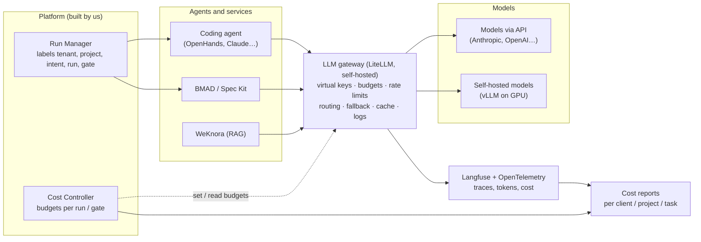

# D-07. LLM model and token management

| Item | Value |
|---|---|
| Version | 0.5 |
| Date | 2026-09-24 |
| Status | **Approved** (Harry, 2026-09-24); 0.4 approved by Harry on 2026-09-27 in the C05 session 2 plan (Ollama on developer machines; QUESTIONS #78); 0.5 approved by Harry on 2026-10-06 (the trial M-E on the local model; QUESTIONS #81) |
| Readers | Leadership (sections 1, 2, 7, 9), tech lead / architect (all) |
| Related decisions | Fully self-hosted. Models: **both API and self-hosted** |

---

## 1. Purpose

- Let the platform use **both models called over an API and models running on our own servers**.
- **Measure** tokens and cost per client, project, task, agent run and gate.
- **Stop** overspending before the invoice arrives.
- **Reduce** tokens and cost without lowering quality.

A token is the unit models use to count text. Providers charge by the number of input and output tokens.

## 2. Scope

- Applies to every model call made by the platform: coding agents, document generation, RAG (WeKnora), output evaluation.
- Does not cover personal AI tools outside the platform (e.g. web chat). Those fall under the AI usage policy (handbook Ch.2).

---

## 3. Architecture: every model call goes through one gateway

**Principle:** agents and services **never call** a model provider directly. Every call goes through the **LLM gateway**.

SVG version: [d9-token-flow-gateway.svg](../diagrams/svg/d9-token-flow-gateway.svg)

| Component | Choice | Type | Why |
|---|---|---|---|
| LLM gateway | **LiteLLM Proxy** | Reuse (open source) | OpenAI-compatible gateway in front of 100+ providers. Virtual keys, spend tracking and budgets per key/team, rate limits, routing and fallback |
| Self-hosted models (developer machines only) | **Ollama** (MIT), local tags only | Reuse | A local model on a developer's machine (for example `gpt-oss:20b`, Apache-2.0) proves the agent path without an API key (C05, QUESTIONS #78) and runs the trial M-E on the fictional sample repo (QUESTIONS #81). Never on the internal server (no GPU) and never an Ollama `:cloud` model (those send data to ollama.com). Same rules as any self-hosted model: through LiteLLM, `provider_type: self_hosted`, an internal cost above 0 |
| Self-hosted models | **vLLM** | Reuse (Apache 2.0) | The most widely used serving engine, with an OpenAI-compatible API. Has prefix caching (reuses identical prompt prefixes) |
| Observability | Langfuse + OpenTelemetry | Reuse | Chosen in D-01. WeKnora also integrates with Langfuse |
| Cost Controller | **Build** (inside the Run Manager) | Build | Links cost to intent, run and gate G1–G8. The gateway does not know these concepts |
| Cost reports | **Build** | Build | Reports per client, for selling the product later |

### Notes on LiteLLM

- The free open-source edition includes: virtual keys, spend tracking, budgets, rate limits, fallback, logs, Prometheus metrics.
- The paid Enterprise edition adds: SSO + SCIM, audit logs, organisation/team administration. **SSO is free for up to 5 users only.**
- The "Project" feature (grouping keys by application, each with its own budget) is listed on the Enterprise page. [Proposal] The platform manages tenants/projects itself and maps them to teams/keys in the open-source edition. **Confirm with a PoC.**
- **A database is mandatory.** Without one, budgets block nothing and requests continue past the limit.
- If a self-hosted model is declared with cost 0, **budget checks are skipped**. [Proposal] Declare an internal cost (GPU cost spread per token) instead of 0, so usage is still measured and capped.

---

## 4. Routing: when to use API models and when to use self-hosted models

[Proposal] Route by **data sensitivity first**, then by **task difficulty**.

| `data_class` (from D-05) | Allowed models |
|---|---|
| `public`, `internal` | API or self-hosted |
| `client_confidential` (client **allows** API use) | API (business account, data not used for training) or self-hosted |
| `client_restricted` (client **does not allow** data to leave) | **Self-hosted only** (vLLM on company infrastructure; a developer's Ollama model is for fixtures, proofs and the trial M-E on the fictional sample repo only, never for client data) |
| `prohibited` | No model |

Within the allowed set, route by difficulty:

| Kind of task | Examples | Model tier (proposal) |
|---|---|---|
| Simple, high volume | Log classification, short summaries, commit messages, short translations | Small / cheap model, or self-hosted |
| Medium | Code from a clear spec, test cases, routine PR review | Mid-tier model |
| Hard, high risk | Architecture proposals, ambiguous requirements, difficult bugs | Strongest model |

- [Proposal] Routing rules are written as **policy** (OPA/Cedar, see D-01 section 5.4), not hard-coded.
- [Proposal] The data class is attached to the **intent** at gate G1. The agent never chooses its own model.

---

## 5. Measurement: what to measure and how to label it

Every model call must carry these labels (metadata):

| Label | Example | Used for |
|---|---|---|
| tenant | `client-abc` | Cost per client; selling later |
| project | `ams-maintenance` | Cost per project |
| intent_id | `INT-2026-0142` | Cost per task / feature |
| run_id | `RUN-...` | Cost per agent run |
| gate / phase | `P3`, `G5` | Which stage costs most |
| agent | `openhands`, `bmad-architect` | Compare agents |
| data_class | `client_confidential` | Check that routing followed the rules |

[Proposal] The Run Manager attaches the labels when it creates the run. The gateway receives them through the virtual key or headers and writes them to its log and to Langfuse.

### Metrics to track

| Metric | Meaning |
|---|---|
| Tokens and cost per intent | How much a task costs |
| Cost per merged PR | Real efficiency, not just token counts |
| **Wasted tokens** | Tokens spent on failed, cancelled or redone runs |
| Cache hit rate | Whether prompt caching works |
| Batch share | How much work is moved to non-urgent processing |
| Cost per gate / phase | Which stage costs most |
| Self-hosted vs API share | Whether routing policy is followed |

[Doc] Draft v1.0 already mentioned "cost, retries, failures" on the dashboard (section 5.8.4). This document adds detail.

---

## 6. Control: stopping overspending

Three budget levels, from largest to smallest:

| Level | Where it is set | When exceeded |
|---|---|---|
| Client / project (monthly) | LiteLLM (team/key budget) | Blocked. Only self-hosted models remain (if allowed) |
| Intent / task | Cost Controller | Stop the run, notify the owner, request more budget |
| Agent run | Cost Controller | Stop immediately, record the reason |

### Link to the gates

- [Doc] Draft v1.0 had a separate "Resource & Budget" gate. In the canonical codes it is **merged into G5 Scope drift** (see the codes table).
- [Proposal] **G1**: when approving an intent, record its **expected token budget**.
- [Proposal] **G4**: when granting the agent permission to run, also grant a **token cap** and a **maximum number of iterations**.
- [Proposal] **G5**: above 80% of budget → warning. At 100% → stop; the owner must approve before it continues.
- [Proposal] Prevent endless loops: cap retries, tool calls and run time for every run.

---

## 7. Saving: 10 ways to reduce tokens

Ordered by expected impact (to be measured in the pilot):

| # | Technique | Where | Source |
|---|---|---|---|
| 1 | **A clear spec before coding** → less rework. Rework is the biggest source of waste | G1–G3, BMAD / Spec Kit | [Doc] + [Proposal] |
| 2 | **Prompt caching**: cache the fixed parts (system prompt, tools, long documents) | Agent / gateway | [External] |
| 3 | **Batch API** for non-urgent work: document generation, bulk test generation, nightly evaluation | Run Manager | [External] |
| 4 | **Model routing** by difficulty (section 4) | Gateway + policy | [Proposal] |
| 5 | **RAG instead of pasting whole documents**: only retrieve relevant passages from WeKnora / the code index | Context layer | [Proposal] |
| 6 | **Lean context**: short AGENTS.md, specs split into small parts, never the whole repo | Templates (handbook) | [Proposal] |
| 7 | **Limit output**: set max tokens, ask for short formats | Agent config | [Proposal] |
| 8 | **Iteration and retry caps** for agents | G4, Cost Controller | [Proposal] |
| 9 | **Response cache** for repeated questions (internal FAQ, RAG) | Gateway (Valkey) | [Proposal] |
| 10 | **Self-hosted models** for high-volume simple tasks, when GPUs are available | vLLM | [Proposal] |

### Reference figures from providers [External]

- Anthropic prompt caching: reading from cache costs **0.1×** the normal input price. Writing a 5-minute cache costs 1.25×; a 1-hour cache costs 2×. Up to 4 cache breakpoints per prompt. Some newer models have their own cache prices; check the price list.
- Anthropic Batch API: **50% off** both input and output. Results within at most 24 hours. Can be combined with prompt caching.
- vLLM: prefix caching and continuous batching (several requests in one GPU pass) → more throughput on the same hardware.

### Warnings

- **BMAD uses many role-playing agents → more tokens.** Use it only for large features (see D-01 section 5.2).
- **Self-hosted models are not free.** They cost GPUs, power and operators. They are only cheaper at enough volume. [Proposal] Compare with real numbers from the pilot, not with marketing figures.
- Saving tokens **must not reduce quality**. Always compare quality metrics (share of PRs changed, escaped defects) before and after.

---

## 8. Risks and mitigations

| Risk | Mitigation |
|---|---|
| An agent loops and spends money uncontrolled | Token cap + iteration cap at G4. Automatic stop at G5 |
| Provider API key leak | Only the gateway holds real keys. Agents only get short-lived per-run virtual keys |
| Confidential data sent to an API | Route by data_class in policy. Review routing logs weekly |
| Budgets fail to block (misconfiguration) | Database mandatory for LiteLLM. "Over budget" test in CI |
| Provider prices change | Model price table in config, updated regularly |
| Cost disputes with clients (when selling) | Cost reports per tenant, with original logs as evidence |

---

## 9. Next steps and open questions

### Proposed PoCs

1. Set up LiteLLM + PostgreSQL + Langfuse. Run one agent through the gateway; check labels and budgets.
2. Try routing: one task via API, one via vLLM, same spec. Compare quality and cost.
3. Measure the effect of prompt caching on a real agent.

### Questions for leadership

- What is the monthly token budget for the pilot? (Not set by us.)
- Does the company have, or plan to buy, GPUs for self-hosted models? Or rent GPUs by the hour?
- When selling: charge for tokens separately, or include them in the service price?

---

## 10. References

**Internal**
- Draft v1.0 "AI-Agentic-SDLC-Handbook", sections 5.8.4, 5.10.5; gate G8 Resource & Budget (old codes).

**External** (accessed 2026-09-24)
- LiteLLM docs, Budgets & Rate Limits: https://docs.litellm.ai/docs/proxy/users
- LiteLLM pricing (open source and Enterprise): https://www.litellm.ai/pricing
- LiteLLM Enterprise: https://docs.litellm.ai/docs/enterprise
- Control Plane, LiteLLM template (deployment architecture): https://docs.controlplane.com/template-catalog/templates/litellm
- Anthropic, pricing: https://platform.claude.com/docs/en/about-claude/pricing
- Anthropic, prompt caching: https://platform.claude.com/docs/en/build-with-claude/prompt-caching
- vLLM Production Deployment Guide 2026 (SitePoint): https://www.sitepoint.com/vllm-production-deployment-guide-2026/
- What is vLLM (FutureAGI): https://futureagi.com/blog/what-is-vllm-2026/

Note: prices and features change often. Check again before budgeting.

---

## Version history

| Version | Date | Author | Notes |
|---|---|---|---|
| 0.1 | 2026-09-24 | Claude (draft) | First version |
| 0.2 | 2026-09-24 | Claude (draft) | After review: the 5 `data_class` values of D-05; Valkey instead of Redis |
| 0.3 | 2026-09-24 | Claude | Translated into English. Content unchanged |
| 0.4 | 2026-09-27 | Claude (task C05, session 2), approved by Harry | §3: Ollama on developer machines only, local tags, same gateway, routing and internal-cost rules; §4: never for client data (QUESTIONS #78) |
| 0.5 | 2026-10-06 | Claude (coordinator), approved by Harry | §3, §4: the trial M-E runs with the local Ollama model on the fictional sample repo; the API-model run moves to before M-F (QUESTIONS #81) |
