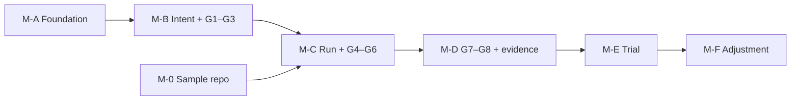

# D-08. MVP backlog

| Item | Value |
|---|---|
| Version | 1.0 |
| Date | 2026-09-24 |
| Status | **Approved** (Harry, 2026-09-24) — version 1.0, aligned with the handbook (tag `design-v1.0`) |
| Readers | Tech lead, developers, Claude Code |
| Related documents | D-02 (FR/NFR), D-03 (architecture), D-05 (data), D-07 (tokens), D-09 (sample repo) |
| Attachment | [D-08-backlog.csv](D-08-backlog.csv) (for creating GitHub issues with `scripts/create-issues.py`) |

> Generated from a single data source. Edit the data, then regenerate this file and the CSV together.

---

## 1. Purpose

- Split the MVP into **small tasks, each fitting one Claude Code session**.
- Each task has: dependencies, related requirements (FR/NFR), code area, **acceptance criteria**.
- Serves as the list for GitHub issues and assignments.

## 2. Conventions

| Field | Meaning |
|---|---|
| ID | `A` = M-A, `B` = M-B, `R` = M-0 (sample repo), `C` = M-C, `E` = M-D (`E` avoids confusion with document codes `D-xx`) |
| Size | **S** ≈ 1 session · **M** ≈ 1–2 sessions · **L** ≈ split into 2–3 sessions. [Proposal] Relative estimate, not person-hours |
| Depends on | Tasks that must be finished first |
| Acceptance criteria | Conditions for the PR to be approved. Claude Code writes tests for them |

[Proposal] No dates or assignees here. Assignment and deadlines are decided by Harry.

---

## 3. Overview


| Milestone | Content | Tasks | Sizes |
|---|---|---|---|
| M-A | Foundation: infrastructure, security, audit | 11 | S×6 · M×5 |
| M-B | Intent + G1–G3 | 13 | S×4 · M×8 · L×1 |
| M-0 | Sample pilot repo (separate repo, right before M-C) | 4 | S×1 · M×2 · L×1 |
| M-C | Run + G4–G6 | 11 | S×2 · M×8 · L×1 |
| M-D | G7–G8 + evidence + cost | 7 | S×4 · M×3 |
| **Total** | | **46** | |

### Order and dependencies between milestones



- M-0 lives in a **separate repo** (`pilot-order-inventory`). Done at the end of M-B, before C09.
- C01 (OpenHands PoC) can start early, right after A02, to reduce risk.

### Critical path (longest chain) [Proposal]

`A01 → A02 → A06 → A07 → B02 → C02 → C04 → C05 → C06 → C07 → C08 → E01 → E02 → E03 → E07`

- Computed from dependencies and task size (S=1, M=2, L=3). To finish sooner: prioritise tasks on this path and run the others in parallel.

---

## 4. Tasks


### M-A — Foundation: infrastructure, security, audit

#### A01. Initialise the TypeScript monorepo

| Size | Depends on | Requirements | Code area |
|---|---|---|---|
| S | — | NFR-05, NFR-07 | package.json, pnpm-workspace.yaml, tsconfig*, platform/apps/*, platform/packages/*, lint config |

**Acceptance criteria**

- [ ] AC1: `pnpm install`, `pnpm build`, `pnpm lint`, `pnpm test` pass on the empty repo
- [ ] AC2: Structure apps/ (api, worker, runner, cli) and packages/ (core, contracts, adapters/*, config) as in D-03 section 11
- [ ] AC3: Lint fails when `packages/core` imports `packages/adapters/*` directly

#### A02. Docker Compose: core + observability infrastructure

| Size | Depends on | Requirements | Code area |
|---|---|---|---|
| M | A01 | NFR-01 | platform/deploy/docker-compose.yml, platform/deploy/*.env.example, README |

**Acceptance criteria**

- [ ] AC1: Profile `core`: postgres (separate DBs for platform, temporal, litellm), temporal + temporal-ui, litellm + valkey, seaweedfs (S3 API), openbao
- [ ] AC2: Profile `observability`: langfuse web/worker + clickhouse (+ langfuse DB); Langfuse shares seaweedfs and valkey
- [ ] AC3: Every container has a healthcheck; `docker compose --profile core up` becomes healthy
- [ ] AC4: No real secrets in the repo; only `.env.example` files

> Note: Temporal uses PostgreSQL; no Elasticsearch (D-03 10.1)

#### A03. OpenBao bootstrap script

| Size | Depends on | Requirements | Code area |
|---|---|---|---|
| M | A02 | NFR-03 | platform/deploy/openbao/* |

**Acceptance criteria**

- [ ] AC1: Initialise with Shamir 3-of-2; print the key shares **once** to the screen, never to a file
- [ ] AC2: Enable KV v2, Transit with Ed25519 key `run-contract`, AppRoles for api / worker / runner / cost-controller
- [ ] AC3: Policies: each AppRole reads only its own secrets (test: runner cannot read the LiteLLM master key)
- [ ] AC4: Re-running the script does not break existing configuration

> Note: Per D-03 sections 8.1, 8.2, 10.2

#### A04. Secrets package: OpenBao client

| Size | Depends on | Requirements | Code area |
|---|---|---|---|
| S | A03 | NFR-03 | platform/packages/secrets/* |

**Acceptance criteria**

- [ ] AC1: AppRole login, automatic token renewal, KV read, Transit sign and verify
- [ ] AC2: Integration test against OpenBao in Compose
- [ ] AC3: Never log secret values

#### A05. Config package: project configuration

| Size | Depends on | Requirements | Code area |
|---|---|---|---|
| S | A01 | FR-14, NFR-08 | platform/packages/config/* |

**Acceptance criteria**

- [ ] AC1: Read YAML config for: the gate × risk oversight matrix, SLA table, forced-HITL (G3) and dual-approval (G7) change flags, retry counts, default budgets, loop threshold, `evidence_retention_days` (default 180), policy rules
- [ ] AC2: Validate the schema; reject configs that loosen mandatory rules (G1, G7, production G8 must stay HITL); clear error messages from the message catalog
- [ ] AC3: Compute a stable `config_hash` (SHA-256) for the same content

#### A06. Database: migration tool + tenant tables

| Size | Depends on | Requirements | Code area |
|---|---|---|---|
| M | A02 | NFR-02, FR-19 | platform/packages/core/db/*, migrations |

**Acceptance criteria**

- [ ] AC1: Choose the ORM / migration tool; record the decision in `design/ADR-M09.md` (requirement: raw SQL supported)
- [ ] AC2: Migrations for: tenants, projects, project_configs, project_ai_records, users, user_identities, role_bindings (2+N roles), api_tokens, git_event_cursors (D-05)
- [ ] AC3: The data access layer **requires** a tenant
- [ ] AC4: Cross-tenant test: tenant A cannot read tenant B data

#### A07. Append-only audit log + hash chain

| Size | Depends on | Requirements | Code area |
|---|---|---|---|
| M | A06 | FR-41 | platform/packages/core/audit/*, migrations, platform/apps/cli (verify command) |

**Acceptance criteria**

- [ ] AC1: Triggers block UPDATE/DELETE; the application DB user has no update/delete privilege
- [ ] AC2: Per-tenant hash chain: JCS (RFC 8785) + SHA-256; per-tenant advisory lock
- [ ] AC3: Two concurrent writers never corrupt `seq` / `prev_hash` (test)
- [ ] AC4: `sdlc audit verify` detects a modified record (test by editing directly as an admin user)

> Note: Per D-05 section 7

#### A08. Structured logging + OpenTelemetry

| Size | Depends on | Requirements | Code area |
|---|---|---|---|
| S | A01, A02 | NFR-06 | platform/packages/core/observability/*, LiteLLM config |

**Acceptance criteria**

- [ ] AC1: JSON logs include `tenant_id`, `intent_id`, `run_id` when available
- [ ] AC2: OpenTelemetry traces for api and worker
- [ ] AC3: LiteLLM sends traces to Langfuse when the observability profile is on

#### A09. CI for the platform repo

| Size | Depends on | Requirements | Code area |
|---|---|---|---|
| S | A01 | NFR-07 | .github/workflows/* |

**Acceptance criteria**

- [ ] AC1: Lint, type check and unit tests on every PR
- [ ] AC2: Integration test job running the Compose core profile
- [ ] AC3: Gitleaks, Semgrep, Trivy run and block critical findings

#### A10. Resource measurement + backup / restore drill + internal CA / TLS

| Size | Depends on | Requirements | Code area |
|---|---|---|---|
| M | A03, A07, A11 | — | platform/deploy/backup/*, platform/deploy/tls/*, handbook/03-templates/T11-openbao-runbook.md |

**Acceptance criteria**

- [ ] AC1: Internal CA + TLS on OpenBao 8200 (QUESTIONS #20): script creates the CA (5 years) and the server certificate (1 year); the CA key is kept offline; renewal steps and a 30-day reminder in T11; clients verify the CA
- [ ] AC2: Backup script: OpenBao snapshot (Raft), PostgreSQL dump, to storage off the server
- [ ] AC3: Restore drill succeeds on a test machine; OpenBao unsealed with 2 shares
- [ ] AC4: Record RAM/CPU/disk usage for the core and observability profiles
- [ ] AC5: Runbook T11 written in full

> Note: Done together with the infrastructure operator

#### A11. Stop publishing the OpenBao port on the host

| Size | Depends on | Requirements | Code area |
|---|---|---|---|
| S | A04 | — | platform/deploy/docker-compose.yml, platform/deploy/.env.example, platform/deploy/README.md, platform/tests/integration/*, design/ADR-M19 |

**Acceptance criteria**

- [ ] AC1: The openbao service publishes no port on the host (QUESTIONS #27, option A); OPENBAO_HOST_PORT removed
- [ ] AC2: The live tests (compose-up, openbao bootstrap, secrets-client) reach OpenBao through a container on the Compose network
- [ ] AC3: The "KNOWN GAP" live test becomes: an AppRole login from the host is not possible (no listener on the host)
- [ ] AC4: A static test fails if any compose file publishes 8200 or 8210 again
- [ ] AC5: ADR-M19 §2.5 and the deploy README describe the real behaviour; runbook T11 shows `docker compose exec` for admin work

> Note: Small. Must be merged before A10 (TLS on the same listener)


### M-B — Intent + G1–G3

#### B01. Policy engine: autonomy, oversight, approvers

| Size | Depends on | Requirements | Code area |
|---|---|---|---|
| M | A05 | FR-03, FR-11, FR-14, FR-15, FR-16 | platform/packages/contracts (interface), platform/packages/adapters/policy-simple/* |

**Acceptance criteria**

- [ ] AC1: `maxAutonomy`: critical→L0, high→L1, medium/low→L2 (configurable, never above L2 in the MVP); `client_restricted` only allows self-hosted models
- [ ] AC2: `oversightMode`: resolves HITL/HOTL/AUDIT from the matrix; forced HITL at G3 for flagged changes; G7 always HITL with 2 approvals when flagged or Critical; G8 production always HITL
- [ ] AC3: `canApprove`: approver must hold the gate's role; producers (commit authors, run starter) and agents never count; dual approval needs two different people
- [ ] AC4: `checkScope` (changed files vs plan patterns) and `isForbidden` (handbook Ch.4 §4.7 actions)
- [ ] AC5: Unit tests for every rule, including the matrix edge cases

#### B02. Registry: intents, spec_refs, plans, gate_decisions

| Size | Depends on | Requirements | Code area |
|---|---|---|---|
| M | A06, A07, B01 | FR-01, FR-03, FR-10, FR-17 | platform/packages/core/registry/*, migrations |

**Acceptance criteria**

- [ ] AC1: Create intents with code `INT-YYYY-NNNN`, unique per tenant, status `draft`
- [ ] AC2: `max_autonomy` computed by policy at creation; `plans.change_flags` stored
- [ ] AC3: `gate_decisions` append-only, with `oversight_mode`, `approver_role`, bound `input_sha256`, `scope`, `expires_at`; `void` decisions for invalid approvals
- [ ] AC4: Every change is written to the audit log

#### B03. API app (NestJS) + authentication

| Size | Depends on | Requirements | Code area |
|---|---|---|---|
| M | A04, A06 | FR-20, NFR-08 | platform/apps/api/* |

**Acceptance criteria**

- [ ] AC1: Authentication with personal API tokens (stored as hashes) issued by an admin
- [ ] AC2: Tenant resolved from the token; every request carries the tenant
- [ ] AC3: Endpoints: intents (create, show, list), gates (approve, reject, request_changes)
- [ ] AC4: Error messages come from the message catalog (English by default)

#### B04. CLI `sdlc`

| Size | Depends on | Requirements | Code area |
|---|---|---|---|
| S | B03 | FR-20, NFR-08 | platform/apps/cli/* |

**Acceptance criteria**

- [ ] AC1: `sdlc login`, `sdlc intent create|show|list`, `sdlc gate approve|reject <G> <INT>`
- [ ] AC2: Human-readable output from the message catalog; `--json` mode
- [ ] AC3: Command tests against a mocked API
- [ ] AC4: `sdlc escalation list|show|ack|decide` against the B11 API endpoints (QUESTIONS #77, ADR-M28 §2.7)

> Note: The escalation commands need the B11 API (B11 PR 2)

#### B05. GitHub adapter (part 1): App, events, comments

| Size | Depends on | Requirements | Code area |
|---|---|---|---|
| M | A04 | — | platform/packages/adapters/git-github/* |

**Acceptance criteria**

- [ ] AC1: GitHub App authentication with the private key from OpenBao; short-lived installation tokens
- [ ] AC2: Read new events (comments, reviews, CI status) by **polling** the GitHub API, with a `since` cursor stored in the DB; webhook signature check kept ready for later
- [ ] AC3: Comment on issues/PRs; read a file at a commit
- [ ] AC4: Implements the `GitHostAdapter` interface exactly (D-03 section 7.1)

#### B06. Event receiver (polling) + comment commands

| Size | Depends on | Requirements | Code area |
|---|---|---|---|
| M | B03, B05 | FR-21 | platform/apps/worker (poller), platform/packages/core/commands/* |

**Acceptance criteria**

- [ ] AC1: The poller runs on a schedule (configurable, default 30 seconds) per project; no event processed twice
- [ ] AC2: Accepts `/approve G3`, `/reject G3 <reason>`, `/request-changes G3 <reason>`
- [ ] AC3: Maps the GitHub account (numeric ID) → platform user; checks roles
- [ ] AC4: Bad syntax or missing permission → a reply comment with the reason

> Note: Webhooks are enabled once public infrastructure exists (ADR-M11). One command handler for both polling and webhooks

#### B07. Temporal worker + workflow G1–G3

| Size | Depends on | Requirements | Code area |
|---|---|---|---|
| L | B02, B06, B11 | FR-10, FR-12, FR-14, FR-17, FR-22 | platform/apps/worker/* |

**Acceptance criteria**

- [ ] AC1: Workflow follows the D-03 state machine: Draft → G1 → G2 → G3
- [ ] AC2: Oversight resolved per gate (B01); HOTL gates pass only when conditions hold and notify the owner; no gate passes by silence
- [ ] AC3: Approvals bound to version, scope and expiry; re-checked before moving on; mismatch or expiry → `void` and re-evaluate
- [ ] AC4: Overdue gates raise escalations (B11); waiting time recorded
- [ ] AC5: Worker restart mid-way → the workflow continues in the right state (test)

> Note: Can be split into 2 sessions: workflow skeleton, then oversight and binding

#### B08. Spec linking + hash check

| Size | Depends on | Requirements | Code area |
|---|---|---|---|
| S | B05, B07 | FR-02 | platform/packages/core/registry/spec* |

**Acceptance criteria**

- [ ] AC1: Link a spec by path + commit; fetch content from GitHub; store SHA-256
- [ ] AC2: Before G3 and before running the agent: re-check the hash; different → back to G2 (scenario N4)

#### B09. Plan submission + G3 approval

| Size | Depends on | Requirements | Code area |
|---|---|---|---|
| S | B07 | — | platform/packages/core/registry/plan*, CLI |

**Acceptance criteria**

- [ ] AC1: The plan is a file `.sdlc/plans/INT-....yaml` in the repo (files / path patterns, summary)
- [ ] AC2: The platform reads it, hashes it, stores `plans`; the tech lead approves G3
- [ ] AC3: Plan changed after approval → G3 must be approved again

#### B11. Escalation module

| Size | Depends on | Requirements | Code area |
|---|---|---|---|
| M | B02, B05 | FR-18 | platform/packages/core/escalation/*, platform/apps/worker (clock loop), platform/apps/api, comment commands |

**Acceptance criteria**

- [ ] AC1: `escalations` table (D-05); create from triggers with severity, response level and decision packet
- [ ] AC2: Routing: owner by type (intent → Person A; technical/security → Person B; policy → governance) and a backup owner
- [ ] AC3: Acknowledge and resolve clocks from the SLA table, stored in the database and advanced by the worker loop (QUESTIONS #73, ADR-M28); no ack → remind → backup → governance
- [ ] AC4: While open: only safe-list actions continue; everything else frozen; authority never passes back to the producer
- [ ] AC5: Acknowledge and decide via the API or `/ack`, `/decide` comments (CLI in B04); decisions bound to version, scope, expiry; every step audited

> Note: Two PRs: PR 1 = table, config, routing, clocks, freeze; PR 2 = comment commands, API, notices. Supersedes ADR-M14 in part: B07 adds no second timer

#### B12. Project AI record + G1 check

| Size | Depends on | Requirements | Code area |
|---|---|---|---|
| S | A06, B03 | FR-19 | platform/packages/core/ai-record/*, platform/apps/cli |

**Acceptance criteria**

- [ ] AC1: CLI to create and update the project AI record (versioned, audited)
- [ ] AC2: G1 fails when the record is missing or the intent's data class is not allowed; unknown consent → only `client_restricted` handling
- [ ] AC3: `prod_logs_allowed` exposed to policy for operations tasks

#### B13. Admin onboarding: projects, users, identities, roles, config

| Size | Depends on | Requirements | Code area |
|---|---|---|---|
| M | B03, B12 | FR-11, FR-19 | platform/apps/api (admin), platform/apps/cli (sdlc admin …), platform/packages/core (admin services), design/ADR (next free number) |

**Acceptance criteria**

- [ ] AC1: Decide the tenant-admin model (QUESTIONS from B03, D3: A = new tenant-level role table, B = project `admin` counts as tenant admin); record it in an ADR and D-05
- [ ] AC2: Admin API endpoints and `sdlc admin project|user|identity|role|config`, all through TenantScope; every change audited (IDs, codes, hashes only); roles revoked through revoked_at
- [ ] AC3: GitHub identities in user_identities are linked by the numeric GitHub account ID, never by login (QUESTIONS #45)
- [ ] AC4: Project config upload: validated and hashed by @sdlc/config (mandatory rules; warnings recorded in the config.changed audit event)
- [ ] AC5: Token issuing moves behind the API; `sdlc audit verify` moves behind the API once a tenant admin exists (update CLAUDE.md)
- [ ] AC6: Integration tests: cross-tenant isolation, wrong role refused, audit chain intact
- [ ] AC7: Admin API endpoints for the agent register (C10 has operator commands only, ADR-M31 §2.2), enforcing handbook Ch.20: who approves an agent for use (§20.7) and a change (§20.11), and that Person B or leadership may suspend or quarantine at any time (§20.9)
- [ ] AC8: Before any real project stores a configuration (QUESTIONS #95): a stored configuration whose hash differs only because platform defaults changed is recomputed, saved as a new configuration version with `config.changed` (actor `system`), and used; only a change of the stored YAML itself is refused

> Note: Follows B03 (decision D1). Needed before E07: a real tenant must be set up without direct database access

#### B10. Integration tests G1–G3

| Size | Depends on | Requirements | Code area |
|---|---|---|---|
| M | B08, B09, B11, B12 | FR-01…03, FR-10…19 | platform/tests/integration/* |

**Acceptance criteria**

- [ ] AC1: Happy path: create intent → G1 → G2 → G3 (Low risk: G2/G3 HOTL pass; Medium: HITL)
- [ ] AC2: N4: spec edited after G2 → back to G2; approval expired → `void` and re-evaluation
- [ ] AC3: N5: a producer's approval is ignored; wrong role cannot approve
- [ ] AC4: N7: escalation not acknowledged → backup → governance; work stays frozen
- [ ] AC5: N8: Low-risk plan flagged `migration` → G3 is HITL
- [ ] AC6: Missing AI record → G1 fails


### M-0 — Sample pilot repo (separate repo, right before M-C)

#### R01. Sample repo: Vue + NestJS + PostgreSQL skeleton

| Size | Depends on | Requirements | Code area |
|---|---|---|---|
| M | — | D-09 | repo pilot-order-inventory |

**Acceptance criteria**

- [ ] AC1: Structure per D-09 section 5; `docker compose up` works
- [ ] AC2: Sample tests for web and api

> Note: Separate repo, not part of the platform monorepo

#### R02. Sample repo: baseline features F1–F6

| Size | Depends on | Requirements | Code area |
|---|---|---|---|
| L | R01 | D-09 | repo pilot-order-inventory |

**Acceptance criteria**

- [ ] AC1: F1–F6 per D-09 section 4; fake data
- [ ] AC2: Tests for the stock deduction logic when creating an order

#### R03. Sample repo: CI, security scans, branch protection

| Size | Depends on | Requirements | Code area |
|---|---|---|---|
| S | R01 | D-09 | repo pilot-order-inventory/.github/* |

**Acceptance criteria**

- [ ] AC1: CI: lint, type check, tests, build; Gitleaks, Semgrep, Trivy
- [ ] AC2: Branch protection on `main`, CODEOWNERS, PR template per T2

#### R04. Sample repo: specs T01–T10 + AGENTS.md

| Size | Depends on | Requirements | Code area |
|---|---|---|---|
| M | R02 | D-09 | repo pilot-order-inventory/docs/specs/*, AGENTS.md |

**Acceptance criteria**

- [ ] AC1: 10 bilingual Japanese–English specs with acceptance criteria
- [ ] AC2: AGENTS.md: build/test commands, conventions; format checked against OpenHands

> Note: PM/BrSE writes the specs; AI may draft them


### M-C — Run + G4–G6

#### C01. PoC: control the OpenHands Agent Server from Node.js

| Size | Depends on | Requirements | Code area |
|---|---|---|---|
| S | A02 | — | platform/spikes/openhands/*, design/ADR-M10.md |

**Acceptance criteria**

- [ ] AC1: Run the Agent Server in a container; call REST from Node.js: start, status, stop, fetch logs
- [ ] AC2: Model points at LiteLLM with a virtual key
- [ ] AC3: Record the usable API, the pinned version and limitations in ADR-M10

> Note: Spike: the code may be thrown away; the result is the ADR

#### C02. Run Contract: schema, signing, verification

| Size | Depends on | Requirements | Code area |
|---|---|---|---|
| M | A04, B02 | — | platform/packages/contracts/run-contract*, migrations (runs, run_contracts, run_events) |

**Acceptance criteria**

- [ ] AC1: Schema per D-03 section 8; signed via OpenBao Transit
- [ ] AC2: The runner rejects: expired, bad signature, not in the DB
- [ ] AC3: `run_events` is append-only

#### C03. LiteLLM adapter + Cost Controller (part 1)

| Size | Depends on | Requirements | Code area |
|---|---|---|---|
| M | A04, A06 | FR-50, FR-51 | platform/packages/adapters/model-litellm/*, platform/packages/core/cost/*, migration cost_records |

**Acceptance criteria**

- [ ] AC1: LiteLLM gets provider keys from OpenBao through an OpenBao Agent sidecar (AppRole `litellm`, read-only kv/litellm/providers/*) rendered to tmpfs; no provider key in .env, the repo or an image on the server; rotation = re-render + restart (QUESTIONS #1)
- [ ] AC2: Create a virtual key per run: cost cap, model list, labels tenant/project/intent/run/gate/agent/data_class
- [ ] AC3: Revoke the key when the run ends
- [ ] AC4: Job syncing spend from LiteLLM → `cost_records` (no duplicates)
- [ ] AC5: Test: over budget → the request is blocked

> Note: LiteLLM requires a database (D-07)

#### C04. Runner: provision and clean up sandboxes

| Size | Depends on | Requirements | Code area |
|---|---|---|---|
| L | C02, B05 | FR-30, FR-33 | platform/apps/runner/* |

**Acceptance criteria**

- [ ] AC1: One container per run on its own internal network; sandbox egress to LiteLLM and the package proxy only; GitHub is reached by the runner, never by the sandbox (QUESTIONS #52, ADR-M25)
- [ ] AC2: Clone with a short-lived GitHub token; create branch `agent/INT-...`
- [ ] AC3: Limit concurrent runs (default 1–2, configurable); extra runs wait in a queue
- [ ] AC4: The sandbox has no real model-provider key and no OpenBao access (test)
- [ ] AC5: Remove the container and worktree on success or failure

#### C05. OpenHands adapter

| Size | Depends on | Requirements | Code area |
|---|---|---|---|
| M | C01, C04, C03 | FR-31, FR-32 | platform/packages/adapters/agent-openhands/* |

**Acceptance criteria**

- [ ] AC1: Implement `AgentAdapter` (D-03 section 7.2) based on the C01 result
- [ ] AC2: Pass spec, plan and AGENTS.md to the agent
- [ ] AC3: Iteration and time caps; exceeded → stop, record `stop_reason`
- [ ] AC4: Collect changed files, logs and the last commit

#### C06. Automatic gate G4

| Size | Depends on | Requirements | Code area |
|---|---|---|---|
| M | C05, C10, B07 | FR-36 | platform/apps/worker (G4), platform/apps/runner (Temporal activity) |

**Acceptance criteria**

- [ ] AC1: Checks: agent registered and active, pinned model, instructions hash matches; autonomy within max; contract valid; key capped; sandbox correct; AI record allows the data class
- [ ] AC2: Critical → `blocked`, the agent does not run (T10)
- [ ] AC3: High (L1) → the agent only submits a proposal, pushes no code; stored as evidence `proposal`, the run ends `succeeded_proposal_only` (T09); G4 is HITL for High
- [ ] AC4: Worker → runner handoff (QUESTIONS #53, #55; ADR-M25 §2.7): Temporal task queue `sdlc-runner`, one long-running activity per run with heartbeats; the runner worker's activity slots = `SDLC_RUNNER_MAX_SANDBOXES`, so extra runs wait in Temporal; a contract that expires while waiting → run `cancelled` (`contract_expired`) and a new attempt; a lost heartbeat → the workflow ends the run (test with a worker restart)

> Note: Moved from C04 session 3 (QUESTIONS #55): the runner process, slot pool, restart clean-up and sweep exist; C06 adds the Temporal side. Agent check: call `checkAgentForRun` (C10, ADR-M31 §2.6) with the SHA-256 of the agent's instructions file read at `base_sha` outside the sandbox, and pass its `modelRef` to the adapter (QUESTIONS #79); on the warning `recertification_overdue`, append the audit event `agent.recertification_overdue` and post a notice to the owner on the intent's issue (ADR-M31 §2.7)

#### C07. Gate G5: file scope + budget

| Size | Depends on | Requirements | Code area |
|---|---|---|---|
| M | C06, C03, B11 | FR-13, FR-52 | platform/apps/worker (G5), platform/packages/core/cost/* |

**Acceptance criteria**

- [ ] AC1: Files changed outside the plan → stop, back to G3 (N1)
- [ ] AC2: Spend at 80% → warning comment; at 100% → stop and raise an escalation (N3)
- [ ] AC3: Owner decision `resume` with more budget → the run continues (bound, not expired)

> Note: Sandbox outputs are untrusted (ADR-M29 §2.5): recompute the changed files and `head_sha` from the pushed branch outside the sandbox before G5 relies on them. A cost cap and an iteration cap both end as `stopped_budget`; tell them apart by `stop_reason` (`max_iterations`); both need a human decision to resume (QUESTIONS #21, #82). Decide whether uncommitted edits of a stopped run are kept as evidence

#### C08. Open PR + gate G6 (CI)

| Size | Depends on | Requirements | Code area |
|---|---|---|---|
| M | C07, B05 | — | platform/packages/adapters/git-github (PR, checks), platform/apps/worker (G6) |

**Acceptance criteria**

- [ ] AC1: Open a PR from the agent branch, filling template T2 (intent_id, run_id, AI-written parts)
- [ ] AC2: Read CI status by polling (checks API); fail → rerun the agent within the retry limit; no retries left → back to G3 (N2)
- [ ] AC3: An agent push to `main` is blocked by branch protection (N6)

> Note: The runner, not the sandbox, pushes `agent/INT-...` (QUESTIONS #52, ADR-M25): update the D-03 §4 flow and diagram D11 (and the D-02 §5 flow) in this task. Sandbox outputs are untrusted (ADR-M29 §2.5): the changed files and `head_sha` are recomputed from the pushed branch outside the sandbox

#### C09. Integration tests G4–G6 on the sample repo

| Size | Depends on | Requirements | Code area |
|---|---|---|---|
| M | C08, R04, B10, C11 | — | platform/tests/integration/* |

**Acceptance criteria**

- [ ] AC1: T01 runs from G1 to G6 successfully
- [ ] AC2: N1, N2, N3, N6 are blocked correctly
- [ ] AC3: T09 only produces a proposal; T10 is refused
- [ ] AC4: Kill switch and loop detection work on a live run
- [ ] AC5: Unregistered or suspended agent cannot run

#### C10. Agent register

| Size | Depends on | Requirements | Code area |
|---|---|---|---|
| S | A06 | FR-36 | platform/packages/core/agents/*, migration agents, platform/apps/cli |

**Acceptance criteria**

- [ ] AC1: `agents` table (D-05); CLI to register, activate, suspend, quarantine, retire
- [ ] AC2: Runs refer to a registered agent; runs blocked for non-active agents
- [ ] AC3: Instructions hash stored and checked before each run
- [ ] AC4: Warning to the owner when the last recertification is older than 3 months

#### C11. Kill switch and loop detection

| Size | Depends on | Requirements | Code area |
|---|---|---|---|
| M | C04, C05, C03, B11 | FR-34, FR-35 | platform/apps/runner/*, platform/apps/cli, platform/apps/worker |

**Acceptance criteria**

- [ ] AC1: `sdlc run kill <run>` and a comment command; allowed for Person A, Person B, governance
- [ ] AC2: Stops the sandbox, revokes the GitHub token and the LiteLLM virtual key; run ends `stopped_killed`; opens an escalation; under 5 minutes end to end (test)
- [ ] AC3: Loop detection: more than 3 identical consecutive tool calls, or no progress in the window → `stopped_stalled`


### M-D — G7–G8 + evidence + cost

#### E01. Gate G7: review + merge

| Size | Depends on | Requirements | Code area |
|---|---|---|---|
| M | C08 | FR-11, FR-16, FR-17 | platform/apps/worker (G7), PR review poller |

**Acceptance criteria**

- [ ] AC1: G7 passes when the PR has valid approvals under branch protection, bound to the reviewed commit
- [ ] AC2: Producers and agents never count as approvers (FR-11)
- [ ] AC3: Dual approval (Person B + second approver) for flagged change types or Critical risk (N9)
- [ ] AC4: `request changes` → back to running the agent
- [ ] AC5: A person merges the PR (MVP: a human, not the platform); the platform records the merge event

#### E02. Evidence Builder + Markdown export

| Size | Depends on | Requirements | Code area |
|---|---|---|---|
| M | E01 | FR-40, FR-42, FR-43 | platform/packages/core/evidence/*, platform/packages/adapters/evidence-s3/* |

**Acceptance criteria**

- [ ] AC1: Collects: spec + hash, plan, diff, CI/test/scan results, the 8 gate decisions with oversight modes, escalations, cost summary
- [ ] AC2: Includes the client AI disclosure note (`disclosure_note`) in the project's disclosure format
- [ ] AC3: Stored in SeaweedFS under a tenant prefix; manifest with a hash per item
- [ ] AC4: Exports one readable Markdown file (English by default, via the message catalog)

#### E03. Gate G8: release approval, close the intent

| Size | Depends on | Requirements | Code area |
|---|---|---|---|
| S | E02 | FR-43 | platform/apps/worker (G8) |

**Acceptance criteria**

- [ ] AC1: Person B approves G8 via CLI or comment (plus business/security owner for Critical); bound to the artifact digest
- [ ] AC2: G8 fails without the disclosure note
- [ ] AC3: Seal the Evidence Pack (`sealed_at`), close the intent, record metrics

#### E04. Cost report

| Size | Depends on | Requirements | Code area |
|---|---|---|---|
| S | C03 | FR-53 | platform/apps/cli, platform/packages/core/cost/* |

**Acceptance criteria**

- [ ] AC1: `sdlc cost report` by tenant / project / intent / time range
- [ ] AC2: Shows tokens in/out, cached tokens, cost, wasted tokens (failed runs)

#### E05. Retention jobs + audit anchoring

| Size | Depends on | Requirements | Code area |
|---|---|---|---|
| S | E02, A07 | FR-44 | platform/apps/worker (schedules) |

**Acceptance criteria**

- [ ] AC1: Delete Evidence Pack files older than `evidence_retention_days` (default 180); skip when `retention_hold`
- [ ] AC2: Audit log, gate decisions and escalations kept at least 2 years (no deletion path in the MVP)
- [ ] AC3: Project archive → purge its evidence files and stored client material unless on hold; keep hashes; audit `project.purged`
- [ ] AC4: Daily: write each tenant's latest audit hash to SeaweedFS

#### E06. Gate waiting-time metrics

| Size | Depends on | Requirements | Code area |
|---|---|---|---|
| S | B07 | FR-12 | platform/apps/cli |

**Acceptance criteria**

- [ ] AC1: `sdlc metrics gates`: average / maximum waiting time per gate, per project

#### E07. MVP definition-of-done check

| Size | Depends on | Requirements | Code area |
|---|---|---|---|
| M | E03, E04, E05, C09, B13 | D-02 section 10 | platform/tests/integration/*, README |

**Acceptance criteria**

- [ ] AC1: One intent goes through G1 → G8 on the sample repo
- [ ] AC2: All criteria in D-02 section 10 (including 5b–5d) are met
- [ ] AC3: README explains a fresh deployment with Docker Compose
- [ ] AC4: QUESTIONS #81 is resolved: one real run with an API model has passed before the trial M-E

---

## 5. Handing tasks to Claude Code

### 5.1. Rules for each session [Proposal]

1. **One session = one task** (L tasks are split into 2–3 sessions).
2. Claude Code **reads the task and related docs**, then **proposes a plan**: files to change, tests to add. A human approves the plan before coding.
3. Only change files in the approved plan. Need more → stop and ask.
4. Run lint + tests. Open a PR using template T2, with the task ID (e.g. `A07`).
5. If a design doc is **missing or contradictory** → do not guess. Add the question to `design/QUESTIONS.md` and stop.
6. New technical decisions (library choice…) → write a short ADR in `design/`.

### 5.2. Session opening prompt

```text
Task: A07 — Append-only audit log + hash chain
Read: design/D-08 (task A07), design/D-05 section 7, CLAUDE.md.
Step 1: propose a plan (files to create/change, tests to write, risks). Do not code yet.
Step 2: after I approve, code + tests matching acceptance criteria AC1–AC4.
Step 3: run lint + tests, summarise the results, open a PR with the T2 template.
If a doc is missing or contradictory: add the question to design/QUESTIONS.md and stop.
```

### 5.3. Creating GitHub issues from the CSV

- `D-08-backlog.csv` columns: `id, milestone, title, size, depends_on, requirements, area, acceptance_criteria, note`.
- Use `scripts/create-issues.py` (see `platform/GETTING-STARTED.md`): creates milestones, labels and issues; supports `--dry-run`; never creates duplicates.

---

## 6. Risks

| Risk | Mitigation |
|---|---|
| A task is bigger than one session; Claude Code leaves it half done | Split as noted. Re-assess sizes after M-A |
| The OpenHands Agent Server does not behave as expected | Do C01 early. If it fails → reconsider the agent (the interface allows replacing it) |
| Gaps in the design docs | `design/QUESTIONS.md` + review after every milestone |
| Size estimates are wrong | Record actual time per task; adjust for the next milestone |

---

## Version history

| Version | Date | Author | Notes |
|---|---|---|---|
| 0.1 | 2026-09-24 | Claude (draft) | First version: 40 tasks, 5 milestones |
| 0.2 | 2026-09-24 | Claude (draft) | After review: SeaweedFS, Valkey, GitHub polling, G7 rule, M-D tasks renamed `E01…E07` |
| 1.0 | 2026-09-24 | Claude, approved by Harry | Handbook alignment: B01 oversight/approvers, B07 binding, new B11 escalation, B12 AI record, C10 agent register, C11 kill switch; E01 dual approval; E02/E03 disclosure; E05 retention; tests N7–N9 |
| 1.1 | 2026-09-25 | Claude, approved by Harry | C03: provider keys via an OpenBao Agent sidecar (QUESTIONS #1). A10: internal CA and TLS on OpenBao 8200, size S → M (QUESTIONS #20) |
| 1.2 | 2026-09-25 | Claude, approved by Harry | New task A11: stop publishing the OpenBao port on the host (QUESTIONS #27); A10 now depends on A11 |
| 1.3 | 2026-09-27 | Claude (task C04), approved by Harry | C04 AC1: sandbox egress to LiteLLM and the package proxy only, GitHub through the runner; C08 note: the runner pushes, update the D-03 §4 flow and D11 (QUESTIONS #52, #59, ADR-M25) |
| 1.4 | 2026-09-27 | Claude, approved by Harry | New task B13 (admin onboarding, B03 decision D1); E07 depends on B13 |
| 1.5 | 2026-09-27 | Claude (task C04), approved by Harry | C06 AC4: the `sdlc-runner` task queue and heartbeat activity move from C04 to C06; size S → M (QUESTIONS #55, ADR-M25 §2.7) |
| 1.6 | 2026-09-27 | Claude (task B11), approved by Harry | B11 AC3: clocks in the database, advanced by the worker (QUESTIONS #73, ADR-M28); B11 AC5 and B04 AC4: the escalation CLI moves to B04 (QUESTIONS #77) |
| 1.7 | 2026-09-27 | Claude (task C05), approved by Harry | C07 and C08 notes: sandbox outputs are untrusted, changed files and `head_sha` recomputed from the pushed branch outside the sandbox (ADR-M29 §2.5); C07: iteration cap vs cost cap by `stop_reason`, uncommitted edits of a stopped run (QUESTIONS #82) |
| 1.8 | 2026-09-27 | Claude (task C10), approved by Harry | E07 AC4: QUESTIONS #81 (a real run with an API model before M-E); B13 AC7: admin endpoints for the agent register with the Ch.20 approval rules; B13 AC8: stored configurations after a change of platform defaults (QUESTIONS #95); C06 note: the agent check and the recertification notice (ADR-M31) |
| 0.3 | 2026-09-24 | Claude | Translated into English. User-facing messages via a message catalog (NFR-08). E02 adapter name fixed to `evidence-s3` (matches D-03). A06 includes `git_event_cursors` |
