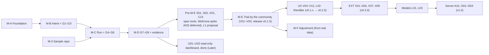

# D-08. Platform backlog

| Item | Value |
|---|---|
| Version | 1.0 |
| Date | 2026-09-24 |
| Status | **Approved** (Harry, 2026-09-24) — version 1.0, aligned with the handbook (tag `design-v1.0`) |
| Readers | Tech lead, developers, Claude Code |
| Related documents | D-02 (FR/NFR), D-03 (architecture), D-05 (data), D-07 (tokens), D-09 (sample repo) |
| Attachment | [D-08-backlog.csv](D-08-backlog.csv) (for creating GitHub issues with `scripts/create-issues.py`) |

> Generated from a single data source. Edit the data, then regenerate this file and the CSV together.

---

## 1. Purpose

- Split the platform's work into **small tasks, each fitting one Claude Code session**, release after release (v0.1.0 is the baseline; QUESTIONS #360).
- Each task has: dependencies, related requirements (FR/NFR), code area, **acceptance criteria**.
- Serves as the list for GitHub issues and assignments.

## 2. Conventions

| Field | Meaning |
|---|---|
| ID | `A` = M-A, `B` = M-B, `R` = M-0 (sample repo), `C` = M-C, `E` = M-D (`E` avoids confusion with document codes `D-xx`), `U` = user interface (MVP+1, started early), `S` = spec tools and `K` = document knowledge (before the trial M-E), `V` = the trial M-E (validation by the community) and its usability round UX, `X` = extensions (agents, tools, knowledge, Git hosts), `L` = models, `O` = operations on a server |
| Size | **S** ≈ 1 session · **M** ≈ 1–2 sessions · **L** ≈ split into 2–3 sessions. [Proposal] Relative estimate, not person-hours |
| Depends on | Tasks that must be finished first |
| Acceptance criteria | Conditions for the PR to be approved. Claude Code writes tests for them |

[Proposal] No dates or assignees here. Assignment and deadlines are decided by Harry.

---

## 3. Overview


| Milestone | Content | Tasks | Sizes |
|---|---|---|---|
| M-A | Foundation: infrastructure, security, audit | 11 | S×7 · M×4 |
| M-B | Intent + G1–G3 | 13 | S×4 · M×8 · L×1 |
| M-0 | Sample pilot repo (separate repo, right before M-C) | 4 | S×1 · M×2 · L×1 |
| M-C | Run + G4–G6 | 12 | S×3 · M×8 · L×1 |
| M-D | G7–G8 + evidence + cost | 8 | S×5 · M×3 |
| Pre-M-E | Before the trial M-E: spec tools and document knowledge (QUESTIONS #285) | 4 | S×2 · M×2 |
| M-E | The trial, run by the community (QUESTIONS #340) | 3 | S×1 · M×2 |
| UX | Friendlier for users and deployers: v0.1.x releases toward v0.2.0 (QUESTIONS #355, #364) | 13 | S×3 · M×9 · L×1 |
| EXT | Other agents, tools for agents, document knowledge, other Git hosts: toward v0.3.0 (QUESTIONS #361) | 6 | S×3 · M×1 · L×2 |
| Models | Self-hosted models (QUESTIONS #362) | 2 | S×1 · M×1 |
| Server | A team on a server: toward v1.0 (QUESTIONS #363) | 4 | M×4 |
| Later | Not scheduled yet (was "MVP+1"; U01–U03 were started early there and are done) | 10 | S×3 · M×2 · L×5 |
| **Total** | | **90** | |

### Order and dependencies between milestones



- M-0 lives in a **separate repo** (`pilot-order-inventory`). Done at the end of M-B, before C09.
- C01 (OpenHands PoC) can start early, right after A02, to reduce risk.

### Critical path (longest chain) [Proposal]

`A01 → A02 → A06 → A07 → B02 → C02 → C04 → C05 → C06 → C07 → C08 → E01 → E02 → E03 → E07 → V01 → V03 → U05 → U06 → U07 → U09`

- Computed from dependencies and task size (S=1, M=2, L=3). To finish sooner: prioritise tasks on this path and run the others in parallel.

---

## 4. Tasks


### M-A — Foundation: infrastructure, security, audit

#### A01. Initialise the TypeScript monorepo

| Size | Depends on | Requirements | Code area |
|---|---|---|---|
| S | — | NFR-05, NFR-07 | package.json, pnpm-workspace.yaml, tsconfig*, platform/apps/*, platform/packages/*, lint config |

**Acceptance criteria**

- [ ] AC1: `pnpm install`, `pnpm build`, `pnpm lint`, `pnpm test` pass on the empty repo
- [ ] AC2: Structure apps/ (api, worker, runner, cli) and packages/ (core, contracts, adapters/*, config) as in D-03 section 11
- [ ] AC3: Lint fails when `packages/core` imports `packages/adapters/*` directly

#### A02. Docker Compose: core + observability infrastructure

| Size | Depends on | Requirements | Code area |
|---|---|---|---|
| M | A01 | NFR-01 | platform/deploy/docker-compose.yml, platform/deploy/*.env.example, README |

**Acceptance criteria**

- [ ] AC1: Profile `core`: postgres (separate DBs for platform, temporal, litellm), temporal + temporal-ui, litellm + valkey, seaweedfs (S3 API), openbao
- [ ] AC2: Profile `observability`: langfuse web/worker + clickhouse (+ langfuse DB); Langfuse shares seaweedfs and valkey
- [ ] AC3: Every container has a healthcheck; `docker compose --profile core up` becomes healthy
- [ ] AC4: No real secrets in the repo; only `.env.example` files

> Note: Temporal uses PostgreSQL; no Elasticsearch (D-03 10.1)

#### A03. OpenBao bootstrap script

| Size | Depends on | Requirements | Code area |
|---|---|---|---|
| M | A02 | NFR-03 | platform/deploy/openbao/* |

**Acceptance criteria**

- [ ] AC1: Initialise with Shamir 3-of-2; print the key shares **once** to the screen, never to a file
- [ ] AC2: Enable KV v2, Transit with Ed25519 key `run-contract`, AppRoles for api / worker / runner / cost-controller
- [ ] AC3: Policies: each AppRole reads only its own secrets (test: runner cannot read the LiteLLM master key)
- [ ] AC4: Re-running the script does not break existing configuration

> Note: Per D-03 sections 8.1, 8.2, 10.2

#### A04. Secrets package: OpenBao client

| Size | Depends on | Requirements | Code area |
|---|---|---|---|
| S | A03 | NFR-03 | platform/packages/secrets/* |

**Acceptance criteria**

- [ ] AC1: AppRole login, automatic token renewal, KV read, Transit sign and verify
- [ ] AC2: Integration test against OpenBao in Compose
- [ ] AC3: Never log secret values

#### A05. Config package: project configuration

| Size | Depends on | Requirements | Code area |
|---|---|---|---|
| S | A01 | FR-14, NFR-08 | platform/packages/config/* |

**Acceptance criteria**

- [ ] AC1: Read YAML config for: the gate × risk oversight matrix, SLA table, forced-HITL (G3) and dual-approval (G7) change flags, retry counts, default budgets, loop threshold, `evidence_retention_days` (default 180), policy rules
- [ ] AC2: Validate the schema; reject configs that loosen mandatory rules (G1, G7, production G8 must stay HITL); clear error messages from the message catalog
- [ ] AC3: Compute a stable `config_hash` (SHA-256) for the same content

#### A06. Database: migration tool + tenant tables

| Size | Depends on | Requirements | Code area |
|---|---|---|---|
| M | A02 | NFR-02, FR-19 | platform/packages/core/db/*, migrations |

**Acceptance criteria**

- [ ] AC1: Choose the ORM / migration tool; record the decision in `design/ADR-M09.md` (requirement: raw SQL supported)
- [ ] AC2: Migrations for: tenants, projects, project_configs, project_ai_records, users, user_identities, role_bindings (2+N roles), api_tokens, git_event_cursors (D-05)
- [ ] AC3: The data access layer **requires** a tenant
- [ ] AC4: Cross-tenant test: tenant A cannot read tenant B data

#### A07. Append-only audit log + hash chain

| Size | Depends on | Requirements | Code area |
|---|---|---|---|
| M | A06 | FR-41 | platform/packages/core/audit/*, migrations, platform/apps/cli (verify command) |

**Acceptance criteria**

- [ ] AC1: Triggers block UPDATE/DELETE; the application DB user has no update/delete privilege
- [ ] AC2: Per-tenant hash chain: JCS (RFC 8785) + SHA-256; per-tenant advisory lock
- [ ] AC3: Two concurrent writers never corrupt `seq` / `prev_hash` (test)
- [ ] AC4: `sdlc audit verify` detects a modified record (test by editing directly as an admin user)

> Note: Per D-05 section 7

#### A08. Structured logging + OpenTelemetry

| Size | Depends on | Requirements | Code area |
|---|---|---|---|
| S | A01, A02 | NFR-06 | platform/packages/core/observability/*, LiteLLM config |

**Acceptance criteria**

- [ ] AC1: JSON logs include `tenant_id`, `intent_id`, `run_id` when available
- [ ] AC2: OpenTelemetry traces for api and worker
- [ ] AC3: LiteLLM sends traces to Langfuse when the observability profile is on

#### A09. CI for the platform repo

| Size | Depends on | Requirements | Code area |
|---|---|---|---|
| S | A01 | NFR-07 | .github/workflows/* |

**Acceptance criteria**

- [ ] AC1: Lint, type check and unit tests on every PR
- [ ] AC2: Integration test job running the Compose core profile
- [ ] AC3: Gitleaks, Semgrep, Trivy run and block critical findings

#### A11. Stop publishing the OpenBao port on the host

| Size | Depends on | Requirements | Code area |
|---|---|---|---|
| S | A04 | — | platform/deploy/docker-compose.yml, platform/deploy/.env.example, platform/deploy/README.md, platform/tests/integration/*, design/ADR-M19 |

**Acceptance criteria**

- [ ] AC1: The openbao service publishes no port on the host (QUESTIONS #27, option A); OPENBAO_HOST_PORT removed
- [ ] AC2: The live tests (compose-up, openbao bootstrap, secrets-client) reach OpenBao through a container on the Compose network
- [ ] AC3: The "KNOWN GAP" live test becomes: an AppRole login from the host is not possible (no listener on the host)
- [ ] AC4: A static test fails if any compose file publishes 8200 or 8210 again
- [ ] AC5: ADR-M19 §2.5 and the deploy README describe the real behaviour; runbook T11 shows `docker compose exec` for admin work

> Note: Small. Must be merged before A10 (TLS on the same listener)

#### A12. Close the unauthenticated SeaweedFS filer and volume access

| Size | Depends on | Requirements | Code area |
|---|---|---|---|
| S | A02 | NFR-03 | platform/deploy/docker-compose.yml, platform/deploy/seaweedfs/*, platform/tests/integration/*, handbook/03-templates/T11-openbao-runbook.md |

**Acceptance criteria**

- [ ] AC1: No process other than SeaweedFS itself can read, write or delete evidence through the filer API (port 8888), the volume servers or the master without authentication (for example filer and volume JWT signing in `security.toml`, or ports bound to the container only); the S3 API with the per-process identities keeps working
- [ ] AC2: Live test on the pinned SeaweedFS: from another container on the `sdlc` network, a filer GET, an HTTP DELETE and a direct volume read of an evidence object are refused, and a locked version (E05 object lock, legal hold) cannot be deleted by any path except the purge identity's S3 bypass
- [ ] AC3: Admin work (`weed shell`) runs only inside the seaweedfs container (`docker compose exec`); runbook T11 updated; no secret is printed
- [ ] AC4: A static test fails if a compose change makes the filer, volume or master ports reachable without authentication again

> Note: Found by E05 (QUESTIONS #239, ADR-M51 gap 5): today every container on the `sdlc` network (api, worker, runner, LiteLLM, Langfuse, Temporal) can read or delete all evidence through the filer at seaweedfs:8888 with no authentication, bypassing object lock and legal hold; sandboxes are not on that network. Must be done before the trial M-E, before any real client data, so E07 depends on it


### M-B — Intent + G1–G3

#### B01. Policy engine: autonomy, oversight, approvers

| Size | Depends on | Requirements | Code area |
|---|---|---|---|
| M | A05 | FR-03, FR-11, FR-14, FR-15, FR-16 | platform/packages/contracts (interface), platform/packages/adapters/policy-simple/* |

**Acceptance criteria**

- [ ] AC1: `maxAutonomy`: critical→L0, high→L1, medium/low→L2 (configurable, never above L2 in the MVP); `client_restricted` only allows self-hosted models
- [ ] AC2: `oversightMode`: resolves HITL/HOTL/AUDIT from the matrix; forced HITL at G3 for flagged changes; G7 always HITL with 2 approvals when flagged or Critical; G8 production always HITL
- [ ] AC3: `canApprove`: approver must hold the gate's role; producers (commit authors, run starter) and agents never count; dual approval needs two different people
- [ ] AC4: `checkScope` (changed files vs plan patterns) and `isForbidden` (handbook Ch.4 §4.7 actions)
- [ ] AC5: Unit tests for every rule, including the matrix edge cases

#### B02. Registry: intents, spec_refs, plans, gate_decisions

| Size | Depends on | Requirements | Code area |
|---|---|---|---|
| M | A06, A07, B01 | FR-01, FR-03, FR-10, FR-17 | platform/packages/core/registry/*, migrations |

**Acceptance criteria**

- [ ] AC1: Create intents with code `INT-YYYY-NNNN`, unique per tenant, status `draft`
- [ ] AC2: `max_autonomy` computed by policy at creation; `plans.change_flags` stored
- [ ] AC3: `gate_decisions` append-only, with `oversight_mode`, `approver_role`, bound `input_sha256`, `scope`, `expires_at`; `void` decisions for invalid approvals
- [ ] AC4: Every change is written to the audit log

#### B03. API app (NestJS) + authentication

| Size | Depends on | Requirements | Code area |
|---|---|---|---|
| M | A04, A06 | FR-20, NFR-08 | platform/apps/api/* |

**Acceptance criteria**

- [ ] AC1: Authentication with personal API tokens (stored as hashes) issued by an admin
- [ ] AC2: Tenant resolved from the token; every request carries the tenant
- [ ] AC3: Endpoints: intents (create, show, list), gates (approve, reject, request_changes)
- [ ] AC4: Error messages come from the message catalog (English by default)

#### B04. CLI `sdlc`

| Size | Depends on | Requirements | Code area |
|---|---|---|---|
| S | B03 | FR-20, NFR-08 | platform/apps/cli/* |

**Acceptance criteria**

- [ ] AC1: `sdlc login`, `sdlc intent create|show|list`, `sdlc gate approve|reject <G> <INT>`
- [ ] AC2: Human-readable output from the message catalog; `--json` mode
- [ ] AC3: Command tests against a mocked API
- [ ] AC4: `sdlc escalation list|show|ack|decide` against the B11 API endpoints (QUESTIONS #77, ADR-M28 §2.7)
- [ ] AC5: `sdlc ai-record show|set` against `GET` / `PUT /v1/projects/:project/ai-record` (B12, QUESTIONS #103, ADR-M32 §2.4)

> Note: The escalation commands need the B11 API (B11 PR 2); the AI record commands need the B12 API

#### B05. GitHub adapter (part 1): App, events, comments

| Size | Depends on | Requirements | Code area |
|---|---|---|---|
| M | A04 | — | platform/packages/adapters/git-github/* |

**Acceptance criteria**

- [ ] AC1: GitHub App authentication with the private key from OpenBao; short-lived installation tokens
- [ ] AC2: Read new events (comments, reviews, CI status) by **polling** the GitHub API, with a `since` cursor stored in the DB; webhook signature check kept ready for later
- [ ] AC3: Comment on issues/PRs; read a file at a commit
- [ ] AC4: Implements the `GitHostAdapter` interface exactly (D-03 section 7.1)

#### B06. Event receiver (polling) + comment commands

| Size | Depends on | Requirements | Code area |
|---|---|---|---|
| M | B03, B05 | FR-21 | platform/apps/worker (poller), platform/packages/core/commands/* |

**Acceptance criteria**

- [ ] AC1: The poller runs on a schedule (configurable, default 30 seconds) per project; no event processed twice
- [ ] AC2: Accepts `/approve G3`, `/reject G3 <reason>`, `/request-changes G3 <reason>`
- [ ] AC3: Maps the GitHub account (numeric ID) → platform user; checks roles
- [ ] AC4: Bad syntax or missing permission → a reply comment with the reason

> Note: Webhooks are enabled once public infrastructure exists (ADR-M11). One command handler for both polling and webhooks

#### B07. Temporal worker + workflow G1–G3

| Size | Depends on | Requirements | Code area |
|---|---|---|---|
| L | B02, B06, B11 | FR-10, FR-12, FR-14, FR-17, FR-22 | platform/apps/worker/* |

**Acceptance criteria**

- [ ] AC1: Workflow follows the D-03 state machine: Draft → G1 → G2 → G3
- [ ] AC2: Oversight resolved per gate (B01); HOTL gates pass only when conditions hold and notify the owner; no gate passes by silence
- [ ] AC3: Approvals bound to version, scope and expiry; re-checked before moving on; mismatch or expiry → `void` and re-evaluate
- [ ] AC4: Overdue gates raise escalations (B11); waiting time recorded
- [ ] AC5: Worker restart mid-way → the workflow continues in the right state (test)

> Note: Can be split into 2 sessions: workflow skeleton, then oversight and binding

#### B08. Spec linking + hash check

| Size | Depends on | Requirements | Code area |
|---|---|---|---|
| S | B05, B07 | FR-02 | platform/packages/core/registry/spec* |

**Acceptance criteria**

- [ ] AC1: Link a spec by path + commit; fetch content from GitHub; store SHA-256
- [ ] AC2: Before G3 and before running the agent: re-check the hash; different → back to G2 (scenario N4)

#### B09. Plan submission + G3 approval

| Size | Depends on | Requirements | Code area |
|---|---|---|---|
| S | B07 | — | platform/packages/core/registry/plan*, CLI |

**Acceptance criteria**

- [ ] AC1: The plan is a file `.sdlc/plans/INT-....yaml` in the repo (files / path patterns, summary)
- [ ] AC2: The platform reads it, hashes it, stores `plans`; the tech lead approves G3
- [ ] AC3: Plan changed after approval → G3 must be approved again

> Note: Two PRs (ADR-M40, QUESTIONS #165–#169): PR 1 = plan file schema, submission (API, `sdlc plan`, config `access.plan_submit_roles`, rule M24), the re-check at G3 and G4 (a changed file holds the gate until a person submits it again), the submitter never approves G3, the run's tools from the plan; PR 2 (after C08) = the runner reads the plan file at the plan's commit for the agent's prompt and checks its hash

#### B11. Escalation module

| Size | Depends on | Requirements | Code area |
|---|---|---|---|
| M | B02, B05 | FR-18 | platform/packages/core/escalation/*, platform/apps/worker (clock loop), platform/apps/api, comment commands |

**Acceptance criteria**

- [ ] AC1: `escalations` table (D-05); create from triggers with severity, response level and decision packet
- [ ] AC2: Routing: owner by type (intent → Person A; technical/security → Person B; policy → governance) and a backup owner
- [ ] AC3: Acknowledge and resolve clocks from the SLA table, stored in the database and advanced by the worker loop (QUESTIONS #73, ADR-M28); no ack → remind → backup → governance
- [ ] AC4: While open: only safe-list actions continue; everything else frozen; authority never passes back to the producer
- [ ] AC5: Acknowledge and decide via the API or `/ack`, `/decide` comments (CLI in B04); decisions bound to version, scope, expiry; every step audited

> Note: Two PRs: PR 1 = table, config, routing, clocks, freeze; PR 2 = comment commands, API, notices. Supersedes ADR-M14 in part: B07 adds no second timer

#### B12. Project AI record + G1 check

| Size | Depends on | Requirements | Code area |
|---|---|---|---|
| S | A06, B03 | FR-19 | platform/packages/core/ai-record/*, platform/apps/cli |

**Acceptance criteria**

- [ ] AC1: CLI to create and update the project AI record (versioned, audited)
- [ ] AC2: G1 fails when the record is missing or the intent's data class is not allowed; unknown consent → only `client_restricted` handling
- [ ] AC3: `prod_logs_allowed` exposed to policy for operations tasks

> Note: Codes only, version history, write roles in config (QUESTIONS #103–#106, ADR-M32). AC1: API endpoints and the operator command `sdlc admin ai-record`; the user CLI over the API comes with B04 (AC5)

#### B13. Admin onboarding: projects, users, identities, roles, config

| Size | Depends on | Requirements | Code area |
|---|---|---|---|
| M | B03, B12 | FR-11, FR-19 | platform/apps/api (admin), platform/apps/cli (sdlc admin …), platform/packages/core (admin services), design/ADR (next free number) |

**Acceptance criteria**

- [ ] AC1: Decide the tenant-admin model (QUESTIONS from B03, D3: A = new tenant-level role table, B = project `admin` counts as tenant admin); record it in an ADR and D-05
- [ ] AC2: Admin API endpoints and `sdlc admin project|user|identity|role|config`, all through TenantScope; every change audited (IDs, codes, hashes only); roles revoked through revoked_at
- [ ] AC3: GitHub identities in user_identities are linked by the numeric GitHub account ID, never by login (QUESTIONS #45)
- [ ] AC4: Project config upload: validated and hashed by @sdlc/config (mandatory rules; warnings recorded in the config.changed audit event)
- [ ] AC5: Token issuing moves behind the API; `sdlc audit verify` moves behind the API once a tenant admin exists (update CLAUDE.md)
- [ ] AC6: Integration tests: cross-tenant isolation, wrong role refused, audit chain intact
- [ ] AC7: Admin API endpoints for the agent register (C10 has operator commands only, ADR-M31 §2.2), enforcing handbook Ch.20: who approves an agent for use (§20.7) and a change (§20.11), and that Person B or leadership may suspend or quarantine at any time (§20.9)
- [ ] AC8: Before any real project stores a configuration (QUESTIONS #95): a stored configuration whose hash differs only because platform defaults changed is recomputed, saved as a new configuration version with `config.changed` (actor `system`), and used; only a change of the stored YAML itself is refused

> Note: Follows B03 (decision D1). Needed before E07: a real tenant must be set up without direct database access

#### B10. Integration tests G1–G3

| Size | Depends on | Requirements | Code area |
|---|---|---|---|
| M | B08, B09, B11, B12 | FR-01…03, FR-10…19 | platform/tests/integration/* |

**Acceptance criteria**

- [ ] AC1: Happy path: create intent → G1 → G2 → G3 (Low risk: G2/G3 HOTL pass; Medium: HITL)
- [ ] AC2: N4: spec edited after G2 → back to G2; approval expired → `void` and re-evaluation
- [ ] AC3: N5: a producer's approval is ignored; wrong role cannot approve
- [ ] AC4: N7: escalation not acknowledged → backup → governance; work stays frozen
- [ ] AC5: N8: Low-risk plan flagged `migration` → G3 is HITL
- [ ] AC6: Missing AI record → G1 fails


### M-0 — Sample pilot repo (separate repo, right before M-C)

#### R01. Sample repo: Vue + NestJS + PostgreSQL skeleton

| Size | Depends on | Requirements | Code area |
|---|---|---|---|
| M | — | D-09 | repo pilot-order-inventory |

**Acceptance criteria**

- [ ] AC1: Structure per D-09 section 5; `docker compose up` works
- [ ] AC2: Sample tests for web and api

> Note: Separate repo, not part of the platform monorepo

#### R02. Sample repo: baseline features F1–F6

| Size | Depends on | Requirements | Code area |
|---|---|---|---|
| L | R01 | D-09 | repo pilot-order-inventory |

**Acceptance criteria**

- [ ] AC1: F1–F6 per D-09 section 4; fake data
- [ ] AC2: Tests for the stock deduction logic when creating an order

#### R03. Sample repo: CI, security scans, branch protection

| Size | Depends on | Requirements | Code area |
|---|---|---|---|
| S | R01 | D-09 | repo pilot-order-inventory/.github/* |

**Acceptance criteria**

- [ ] AC1: CI: lint, type check, tests, build; Gitleaks, Semgrep, Trivy
- [ ] AC2: Branch protection on `main`, CODEOWNERS, PR template per T2

#### R04. Sample repo: specs T01–T10 + AGENTS.md

| Size | Depends on | Requirements | Code area |
|---|---|---|---|
| M | R02 | D-09 | repo pilot-order-inventory/docs/specs/*, AGENTS.md |

**Acceptance criteria**

- [ ] AC1: 10 bilingual Japanese–English specs with acceptance criteria
- [ ] AC2: AGENTS.md: build/test commands, conventions; format checked against OpenHands

> Note: PM/BrSE writes the specs; AI may draft them


### M-C — Run + G4–G6

#### C01. PoC: control the OpenHands Agent Server from Node.js

| Size | Depends on | Requirements | Code area |
|---|---|---|---|
| S | A02 | — | platform/spikes/openhands/*, design/ADR-M10.md |

**Acceptance criteria**

- [ ] AC1: Run the Agent Server in a container; call REST from Node.js: start, status, stop, fetch logs
- [ ] AC2: Model points at LiteLLM with a virtual key
- [ ] AC3: Record the usable API, the pinned version and limitations in ADR-M10

> Note: Spike: the code may be thrown away; the result is the ADR

#### C02. Run Contract: schema, signing, verification

| Size | Depends on | Requirements | Code area |
|---|---|---|---|
| M | A04, B02 | — | platform/packages/contracts/run-contract*, migrations (runs, run_contracts, run_events) |

**Acceptance criteria**

- [ ] AC1: Schema per D-03 section 8; signed via OpenBao Transit
- [ ] AC2: The runner rejects: expired, bad signature, not in the DB
- [ ] AC3: `run_events` is append-only

#### C03. LiteLLM adapter + Cost Controller (part 1)

| Size | Depends on | Requirements | Code area |
|---|---|---|---|
| M | A04, A06 | FR-50, FR-51 | platform/packages/adapters/model-litellm/*, platform/packages/core/cost/*, migration cost_records |

**Acceptance criteria**

- [ ] AC1: LiteLLM gets provider keys from OpenBao through an OpenBao Agent sidecar (AppRole `litellm`, read-only kv/litellm/providers/*) rendered to tmpfs; no provider key in .env, the repo or an image on the server; rotation = re-render + restart (QUESTIONS #1)
- [ ] AC2: Create a virtual key per run: cost cap, model list, labels tenant/project/intent/run/gate/agent/data_class
- [ ] AC3: Revoke the key when the run ends
- [ ] AC4: Job syncing spend from LiteLLM → `cost_records` (no duplicates)
- [ ] AC5: Test: over budget → the request is blocked

> Note: LiteLLM requires a database (D-07)

#### C04. Runner: provision and clean up sandboxes

| Size | Depends on | Requirements | Code area |
|---|---|---|---|
| L | C02, B05 | FR-30, FR-33 | platform/apps/runner/* |

**Acceptance criteria**

- [ ] AC1: One container per run on its own internal network; sandbox egress to LiteLLM and the package proxy only; GitHub is reached by the runner, never by the sandbox (QUESTIONS #52, ADR-M25)
- [ ] AC2: Clone with a short-lived GitHub token; create branch `agent/INT-...`
- [ ] AC3: Limit concurrent runs (default 1–2, configurable); extra runs wait in a queue
- [ ] AC4: The sandbox has no real model-provider key and no OpenBao access (test)
- [ ] AC5: Remove the container and worktree on success or failure

#### C05. OpenHands adapter

| Size | Depends on | Requirements | Code area |
|---|---|---|---|
| M | C01, C04, C03 | FR-31, FR-32 | platform/packages/adapters/agent-openhands/* |

**Acceptance criteria**

- [ ] AC1: Implement `AgentAdapter` (D-03 section 7.2) based on the C01 result
- [ ] AC2: Pass spec, plan and AGENTS.md to the agent
- [ ] AC3: Iteration and time caps; exceeded → stop, record `stop_reason`
- [ ] AC4: Collect changed files, logs and the last commit

#### C06. Automatic gate G4

| Size | Depends on | Requirements | Code area |
|---|---|---|---|
| M | C05, C10, B07 | FR-36 | platform/apps/worker (G4), platform/apps/runner (Temporal activity) |

**Acceptance criteria**

- [ ] AC1: Checks: agent registered and active, pinned model, instructions hash matches; autonomy within max; contract valid; key capped; sandbox correct; AI record allows the data class
- [ ] AC2: Critical → `blocked`, the agent does not run (T10)
- [ ] AC3: High (L1) → the agent only submits a proposal, pushes no code; stored as evidence `proposal`, the run ends `succeeded_proposal_only` (T09); G4 is HITL for High
- [ ] AC4: Worker → runner handoff (QUESTIONS #53, #55; ADR-M25 §2.7): Temporal task queue `sdlc-runner`, one long-running activity per run with heartbeats; the runner worker's activity slots = `SDLC_RUNNER_MAX_SANDBOXES`, so extra runs wait in Temporal; a contract that expires while waiting → run `cancelled` (`contract_expired`) and a new attempt; a lost heartbeat → the workflow ends the run (test with a worker restart)

> Note: Moved from C04 session 3 (QUESTIONS #55): the runner process, slot pool, restart clean-up and sweep exist; C06 adds the Temporal side. Agent check: call `checkAgentForRun` (C10, ADR-M31 §2.6) with the SHA-256 of the agent's instructions file read at `base_sha` outside the sandbox, and pass its `modelRef` to the adapter (QUESTIONS #79); on the warning `recertification_overdue`, append the audit event `agent.recertification_overdue` and post a notice to the owner on the intent's issue (ADR-M31 §2.7). HOTL block window (B07, QUESTIONS #88, ADR-M30 §2.4b): never start a run while `hotlBlockWindowOpenUntil` (core) returns a time; the workflow wakes the intent when the last window closes

#### C07. Gate G5: file scope + budget

| Size | Depends on | Requirements | Code area |
|---|---|---|---|
| M | C06, C03, B11 | FR-13, FR-52 | platform/apps/worker (G5), platform/packages/core/cost/* |

**Acceptance criteria**

- [ ] AC1: Files changed outside the plan → stop, back to G3 (N1)
- [ ] AC2: Spend at 80% → warning comment; at 100% → stop and raise an escalation (N3)
- [ ] AC3: Owner decision `resume` with more budget → the run continues (bound, not expired)

> Note: Sandbox outputs are untrusted (ADR-M29 §2.5): recompute the changed files and `head_sha` from the pushed branch outside the sandbox before G5 relies on them; C06 session 2b built the pieces (`exportWorkspace`, `mirrorWorkspace`, `computeProposal` in the runner, ADR-M33 §2.9). A cost cap and an iteration cap both end as `stopped_budget`; tell them apart by `stop_reason` (`max_iterations`); both need a human decision to resume (QUESTIONS #21, #82). Decide whether uncommitted edits of a stopped run are kept as evidence

#### C08. Open PR + gate G6 (CI)

| Size | Depends on | Requirements | Code area |
|---|---|---|---|
| M | C07, B05 | — | platform/packages/adapters/git-github (PR, checks), platform/apps/worker (G6) |

**Acceptance criteria**

- [ ] AC1: Open a PR from the agent branch, filling template T2 (intent_id, run_id, AI-written parts)
- [ ] AC2: Read CI status by polling (checks API); fail → rerun the agent within the retry limit; no retries left → back to G3 (N2)
- [ ] AC3: An agent push to `main` is blocked by branch protection (N6)

> Note: The runner, not the sandbox, pushes `agent/INT-...` (QUESTIONS #52, ADR-M25): update the D-03 §4 flow and diagram D11 (and the D-02 §5 flow) in this task. Sandbox outputs are untrusted (ADR-M29 §2.5): the changed files and `head_sha` are recomputed from the pushed branch outside the sandbox (reuse the runner's `exportWorkspace` and hardened git of C06, ADR-M33 §2.9). G5 (C07 PR 2, ADR-M34 §2.8–§2.9, QUESTIONS #134): a run after a G5 `resume` starts from the head of the default branch today; once the runner pushes `agent/INT-...`, the next run of the intent continues from that branch. Wait for the G5 HOTL block window before G6 acts (G5 is a passable gate)

#### C09. Integration tests G4–G6 on the sample repo

| Size | Depends on | Requirements | Code area |
|---|---|---|---|
| M | C08, R04, B10, C11 | — | platform/tests/integration/* |

**Acceptance criteria**

- [ ] AC1: T01 runs from G1 to G6 successfully
- [ ] AC2: N1, N2, N3, N6 are blocked correctly
- [ ] AC3: T09 only produces a proposal; T10 is refused
- [ ] AC4: Kill switch and loop detection work on a live run
- [ ] AC5: Unregistered or suspended agent cannot run

#### C10. Agent register

| Size | Depends on | Requirements | Code area |
|---|---|---|---|
| S | A06 | FR-36 | platform/packages/core/agents/*, migration agents, platform/apps/cli |

**Acceptance criteria**

- [ ] AC1: `agents` table (D-05); CLI to register, activate, suspend, quarantine, retire
- [ ] AC2: Runs refer to a registered agent; runs blocked for non-active agents
- [ ] AC3: Instructions hash stored and checked before each run
- [ ] AC4: Warning to the owner when the last recertification is older than 3 months

#### C11. Kill switch and loop detection

| Size | Depends on | Requirements | Code area |
|---|---|---|---|
| M | C04, C05, C03, B11 | FR-34, FR-35 | platform/apps/runner/*, platform/apps/cli, platform/apps/worker |

**Acceptance criteria**

- [ ] AC1: `sdlc run kill <run>` and a comment command; allowed for Person A, Person B, governance
- [ ] AC2: Stops the sandbox, revokes the GitHub token and the LiteLLM virtual key; run ends `stopped_killed`; opens an escalation; under 5 minutes end to end (test)
- [ ] AC3: Loop detection: more than 3 identical consecutive tool calls, or no progress in the window → `stopped_stalled`

#### C12. Scheduled spend sync

| Size | Depends on | Requirements | Code area |
|---|---|---|---|
| S | C03, C06 | FR-51, FR-52, FR-53 | platform/apps/worker (schedule), platform/packages/core/cost/* |

**Acceptance criteria**

- [ ] AC1: The worker calls `CostController.syncSpend` on a schedule (settings `SDLC_WORKER_COST_SYNC_*`: interval, look-back window) and once more shortly after each run ends, as ADR-M24 §2.5 says; nothing is double-counted (`ON CONFLICT (tenant_id, source_ref) DO NOTHING`)
- [ ] AC2: Calls LiteLLM writes to its spend log after a run ended are recorded; a run in progress shows its spend in `sdlc cost report` within one interval
- [ ] AC3: A failed or partial sync is logged with its reason counts and retried on the next pass; it never stops the worker or a run
- [ ] AC4: Tests: `pnpm test` (schedule, window, settings), `pnpm test:db` (late spend log rows recorded once, a running run's spend appears), `pnpm test:litellm` if the gateway path changes

> Note: Found by E04 (QUESTIONS #197, ADR-M45 §2.5): `syncSpend` runs only once, when a run ends (`endRunKey`), so late spend logs are lost and running runs show no cost. Needed for D-02 §10 item 6 (every model call has a cost), so E07 depends on it. Changes the worker: one runner/worker session at a time. E03 (ADR-M49 §4): a cost record synced while an intent waits at G8 changes its pack's release hash and voids its G8 approvals; keep late syncs of a run short after it ends, or exclude records synced after the merge from the release hash (decide in C12)


### M-D — G7–G8 + evidence + cost

#### E01. Gate G7: review + merge

| Size | Depends on | Requirements | Code area |
|---|---|---|---|
| M | C08 | FR-11, FR-16, FR-17 | platform/apps/worker (G7), PR review poller |

**Acceptance criteria**

- [ ] AC1: G7 passes when the PR has valid approvals under branch protection, bound to the reviewed commit
- [ ] AC2: Producers and agents never count as approvers (FR-11)
- [ ] AC3: Dual approval (Person B + second approver) for flagged change types or Critical risk (N9)
- [ ] AC4: `request changes` → back to running the agent
- [ ] AC5: A person merges the PR (MVP: a human, not the platform); the platform records the merge event

> Note: Change flags (B09, ADR-M40 §2.2, QUESTIONS #166): read them from the plan G3 approved or passed (`plans.change_flags` of the plan whose hash G3 passed), never from a later plan; they are declared in the plan file and approved with it at G3

#### E02. Evidence Builder + Markdown export

| Size | Depends on | Requirements | Code area |
|---|---|---|---|
| M | E01 | FR-40, FR-42, FR-43 | platform/packages/core/evidence/*, platform/packages/adapters/evidence-s3/* |

**Acceptance criteria**

- [ ] AC1: Collects: spec + hash, plan, diff, CI/test/scan results, the 8 gate decisions with oversight modes, escalations, cost summary
- [ ] AC2: Includes the client AI disclosure note (`disclosure_note`) in the project's disclosure format
- [ ] AC3: Stored in SeaweedFS under a tenant prefix; manifest with a hash per item
- [ ] AC4: Exports one readable Markdown file (English by default, via the message catalog)

> Note: Builds on C06 session 2b (ADR-M33 §2.9): `EvidenceStore` (`@sdlc/contracts`), `S3EvidenceStore` and the table `evidence_items` exist; L1 proposals are at `s3://evidence/proposals/…`. Re-check the SHA-256 of every item when the pack is built (the runner's identity can delete under `proposals/`; versioning keeps the content). Packs need their own write identity and prefix; decide object lock with E05 (ADR-M33 §2.9 gap 1)

#### E03. Gate G8: release approval, close the intent

| Size | Depends on | Requirements | Code area |
|---|---|---|---|
| S | E02 | FR-43 | platform/apps/worker (G8) |

**Acceptance criteria**

- [ ] AC1: Person B approves G8 via CLI or comment (plus business/security owner for Critical); bound to the artifact digest
- [ ] AC2: G8 fails without the disclosure note
- [ ] AC3: Seal the Evidence Pack (`sealed_at`), close the intent, record metrics

> Note: Builds on E02 (ADR-M48, QUESTIONS #215, #217): call `buildEvidencePack` (core) with actor `system` and seal ONE version (`evidence_packs.sealed_at`; at most one sealed version per intent; no build after that; add the UPDATE grant on `sealed_at`); bind the G8 approval to that version's `content_sha256`. FR-43: the manifest's `disclosure`; decide whether G8 needs a person to confirm the client note when `client_text_required` is true (`client_format`). Open (ADR-M48 §2.2): how the worker builds the pack at G8 (its own SeaweedFS identity, or another way); the api process holds `api-evidence` today. Done in E03 (ADR-M49): G8 approvals are bound to `release_sha256` (the pack without the G8 parts); the worker builds the release pack with its own identity `worker-evidence`. MVP+1 (QUESTIONS #220, #222): a per-project `release.environment` and the non-production HOTL path at G8 (every G8 is production in the MVP); an explicit PM/BrSE confirmation of the client's own disclosure note

#### E04. Cost report

| Size | Depends on | Requirements | Code area |
|---|---|---|---|
| S | C03 | FR-53 | platform/apps/cli, platform/packages/core/cost/* |

**Acceptance criteria**

- [ ] AC1: `sdlc cost report` by tenant / project / intent / time range
- [ ] AC2: Shows tokens in/out, cached tokens, cost, wasted tokens (failed runs)

#### E05. Retention jobs + audit anchoring

| Size | Depends on | Requirements | Code area |
|---|---|---|---|
| S | E02, A07 | FR-44 | platform/apps/worker (schedules) |

**Acceptance criteria**

- [ ] AC1: Delete Evidence Pack files older than `evidence_retention_days` (default 180); skip held evidence (`evidence_holds`, QUESTIONS #235; `evidence_packs.retention_hold` is not used)
- [ ] AC2: Audit log, gate decisions and escalations kept at least 2 years (no deletion path in the MVP)
- [ ] AC3: Project archive → purge its evidence files and stored client material unless on hold; keep hashes; audit `project.purged`
- [ ] AC4: Daily: write each tenant's latest audit hash to SeaweedFS

> Note: Two PRs (ADR-M51, QUESTIONS #235–#239): PR 1 = object lock on the bucket `evidence` (GOVERNANCE, 180 days, the existing bucket; checked live on SeaweedFS 4.48), the purge identity `worker-purge`, the worker's `RetentionLoop` (`report` by default, the 180-day code minimum, the guard, a re-check under the intent lock, every version deleted, `purged_at` and `evidence.purged` in one transaction), holds (`sdlc admin evidence hold|release`, config `access.evidence_hold_roles`, rule M32), rule M31 (180 ≤ days ≤ 3650), the lock moved for longer retention, the orphan sweep under `packs/`, an archive refused with open intents and purged after `SDLC_WORKER_RETENTION_ARCHIVE_GRACE_DAYS` (7), `sdlc ops retention report` (AC1–AC3); PR 2 = the daily audit anchor in a COMPLIANCE bucket `audit-anchors` with its own identity and the mismatch check (AC4). Not in E05: deleting a project's Langfuse traces (manual runbook step, QUESTIONS #238, task E08); the unauthenticated SeaweedFS filer API that bypasses the lock (gap 5, QUESTIONS #239, task A12 before M-E); an un-archive command (open item, ADR-M51 §2.6)

#### E06. Gate waiting-time metrics

| Size | Depends on | Requirements | Code area |
|---|---|---|---|
| S | B07 | FR-12 | platform/apps/cli |

**Acceptance criteria**

- [ ] AC1: `sdlc metrics gates`: average / maximum waiting time per gate, per project

#### E08. Purge a project's data from Langfuse

| Size | Depends on | Requirements | Code area |
|---|---|---|---|
| S | E05 | FR-44 | platform/apps/worker (retention), platform/deploy (Langfuse key in OpenBao), handbook/03-templates/T11-openbao-runbook.md |

**Acceptance criteria**

- [ ] AC1: Spike on the pinned Langfuse v4 (`events_only`): how to delete a project's traces and observations by their `tenant:` and `project:` labels; record the result in an ADR (the legacy traces API answers 404 in this mode)
- [ ] AC2: The Langfuse project key lives in OpenBao, readable only by the process that purges (today only the otel-collector holds it, in `.env`)
- [ ] AC3: When E05 purges an archived project, its Langfuse data is deleted too; `project.purged` records `langfuse: purged` instead of `manual`; Langfuse data past `evidence_retention_days` is deleted the same way
- [ ] AC4: Live test in `pnpm test:observability`: a project's traces are gone after the purge, another project's traces stay

> Note: Found by E05 (QUESTIONS #238): LiteLLM's traces in Langfuse carry prompts and responses (client data, ADR-M35); OSS self-hosted Langfuse has no automatic retention. Until E08, `project.purged` says `langfuse: manual` and runbook T11 lists the manual steps

#### E07. v0.1 definition-of-done check

| Size | Depends on | Requirements | Code area |
|---|---|---|---|
| M | E03, E04, E05, C09, B13, C12, A12 | D-02 section 10 | platform/tests/integration/*, README |

**Acceptance criteria**

- [ ] AC1: One intent goes through G1 → G8 on the sample repo
- [ ] AC2: All criteria in D-02 section 10 (including 5b–5d) are met
- [ ] AC3: README explains a fresh deployment with Docker Compose
- [ ] AC4: QUESTIONS #81 is resolved: one real run with an API model has passed before M-F (the trial M-E runs with the local Ollama model, Harry 2026-10-06)

> Note: The web UI scope (Harry, 2026-10-04: after the trial M-E, from its data) is superseded by V11 (QUESTIONS #358): the plan is written before the trial data and revised with it


### Pre-M-E — Before the trial M-E: spec tools and document knowledge (QUESTIONS #285)

#### S01. Read the structure of BMAD / Spec Kit specs; G2 needs acceptance criteria

| Size | Depends on | Requirements | Code area |
|---|---|---|---|
| M | B08 | FR-02, D-02 §6.2 G2, NFR-08 | platform/packages/core (specs, workflow G2), migrations (if needed), platform/apps/cli (spec), platform/tests/*, handbook Ch.19 §19.8c, design/ADR-M61 |

**Acceptance criteria**

- [ ] AC1: Recognise the structure of a spec by its `source_tool`: `spec-kit` and `bmad` (the formats of pinned versions, named in ADR-M61) and `manual` (a heading for acceptance criteria, also the bilingual `受入基準 / Acceptance criteria` of D-09 §8); an unknown structure falls back to the `manual` rule
- [ ] AC2: When a spec is linked and when the step re-reads it at the head (B08), count its acceptance criteria; store counts and codes only, never the text (a new column of `spec_refs` is a migration with a D-05 update)
- [ ] AC3: G2 passes, HOTL or HITL, only when the linked spec has at least one acceptance criterion; otherwise a system `fail spec_unclear` once per spec version and a notice, and the intent waits at G2 (D-02 §6.2: "Acceptance criteria present")
- [ ] AC4: `sdlc spec link` and `sdlc spec list` show the tool and the count; labels from the message catalog
- [ ] AC5: Tests: fixtures of each pinned tool's output, the pilot's specs T01–T10 (all pass), a spec without criteria (G2 waits), a spec whose criteria were removed at the head (back to G2)

> Note: QUESTIONS #285 (Harry, 2026-10-08): before the trial M-E. QUESTIONS #290–#294, ADR-M61. A full conversion into the platform's own spec format stays MVP+1

#### S02. `sdlc plan draft`: a plan file draft from Spec Kit tasks or BMAD stories

| Size | Depends on | Requirements | Code area |
|---|---|---|---|
| M | S01, B09 | FR-20, NFR-08 | platform/apps/cli (plan draft), platform/packages/core (plan schema reuse), platform/tests/cli/*, handbook Ch.19 §19.8c |

**Acceptance criteria**

- [ ] AC1: `sdlc plan draft <INT> --from <path> --tool spec-kit|bmad [--output <file>]` reads the tool's task list (Spec Kit `tasks.md`, BMAD story files) from the local working tree and writes `.sdlc/plans/<INT>.yaml` in schema version 1 (template T13): one task per item, with its summary and dependencies
- [ ] AC2: The draft never guesses what a person must decide: `allowed_paths`, `tools` and `change_flags` stay marked for the person to fill, so the draft fails submission until they are filled; it never submits, commits or pushes (QUESTIONS #167)
- [ ] AC3: The draft passes `parsePlanFile` once the marked fields are filled; refused input (platform fields, `**`, `.github/`, `.sdlc/`, agent instruction files) is reported with the same codes as submission
- [ ] AC4: Tests with fixtures of the pinned tools' output (S01's versions); handbook Ch.19 usage

> Note: QUESTIONS #285 (Harry, 2026-10-08): before the trial M-E, lighter plan writing (`design/POSITIONING.md` §6.1). QUESTIONS #295–#299; ADR-M62 only if a new decision is needed

#### K01. Spike: WeKnora on the pilot's documents (go / no-go)

| Size | Depends on | Requirements | Code area |
|---|---|---|---|
| S | A02 | D-01 §5.8b, NFR-01, NFR-04 | platform/spikes/weknora/* (thrown away), design/ADR-M59 |

**Acceptance criteria**

- [ ] AC1: Run a pinned WeKnora version self-hosted in a throw-away Compose project (never the dev stack), with its own agent, sandbox and memory features off; it calls models only through LiteLLM
- [ ] AC2: Load the pilot's fictional Japanese–English documents (D-09 specs T01–T10, README, AGENTS.md); ask at least 20 questions in Japanese and English and measure retrieval quality (the right passage in the top 5) and answer time
- [ ] AC3: Record resource use (RAM, CPU, disk), the licence and supply chain (images, dependencies, NFR-04), workspace isolation per tenant, and the MCP tools it offers with the ones an agent may use
- [ ] AC4: ADR-M59: the numbers, a go / no-go for K02 and, for go, the integration constraints (egress, tokens, data classes, what is recorded)

> Note: QUESTIONS #285 (Harry, 2026-10-08): before the trial M-E. No client data. QUESTIONS #300–#304, ADR-M59

#### C13. Take an L1 proposal forward: download the patch, end the intent with a G4 rejection

| Size | Depends on | Requirements | Code area |
|---|---|---|---|
| S | C06, E02 | FR-03, FR-10, FR-11, D-09 T09 | platform/apps/api (evidence), platform/apps/cli (evidence proposal), platform/packages/core (commands, workflow run-lifecycle, audit), platform/tests/*, handbook Ch.13 §13.10.4, Ch.19 §19.8c, design/ADR-M64 |

**Acceptance criteria**

- [ ] AC1: `GET /v1/intents/:intent/runs/:run/proposal` and `sdlc evidence proposal <INT> [--run <id>] --output <file> [--force]`: the roles in `access.evidence_read_roles` and tenant admins (404 / 403 as the other evidence reads); the api reads the patch with `api-evidence`, checks its SHA-256 and size against `evidence_items` first (fail closed, `evidence.check_failed`), audits every read (`evidence.proposal_read`: run, hash, size); the CLI checks the hash again and writes mode 600, never to standard output
- [ ] AC2: A `reject` at G4 is accepted while the intent is `paused` at G4 after an L1 proposal (`proposal_review`), from a holder of G4's role (the run's `triggered_by` included: a rejection is not an approval); the workflow ends the intent `rejected` with the gate decision, the audit event and the status comment; every other paused case keeps its escalation path, and `approve` / `request_changes` stay refused there
- [ ] AC3: Tests: `pnpm test` (CLI, the gate rule, the audit action), `pnpm test:db` (download, a tampered patch refused, roles, tenants, the rejection ends the intent, other paused cases refused), `pnpm test:openbao` (the read on real SeaweedFS), `test:pilot` T09 to `rejected`
- [ ] AC4: Handbook Ch.13 §13.10.4 and Ch.19 §19.8c, USER-GUIDE step 5: the patch download and the end of the intent replace "ask the platform operator"

> Note: Found in the review of the user commands (Harry, 2026-10-09): T09 of the trial M-E stopped at `proposal_review` with no way to get the patch or end the intent. QUESTIONS #335–#337, ADR-M64. Withdrawing an intent at any gate stays for M-F


### M-E — The trial, run by the community (QUESTIONS #340)

#### V01. The trial M-E by the community: a trial guide, a report template, `sdlc trial report`

| Size | Depends on | Requirements | Code area |
|---|---|---|---|
| M | E07, C13, U03 | D-02 §2, §13.3, NFR-08 | TRIAL.md, .github/ISSUE_TEMPLATE/trial-report.yml, README, design/M-E-TRIAL-PLAN.md, design/D-02 §13.3, platform/apps/cli (trial report), platform/tests/cli/*, handbook Ch.19 §19.8c, design/ADR-M65 |

**Acceptance criteria**

- [ ] AC1: `TRIAL.md`: how anyone runs the trial on their own machine: a fresh deployment (README), a fork of the sample repo, their own GitHub App, a model (the local Ollama `gpt-oss:20b` or an API model through LiteLLM), two GitHub accounts for Person A and Person B (QUESTIONS #341), T01 to G8, then T09 (proposal) and T10 (blocked), and how to send the report; the hardware and the time it takes
- [ ] AC2: An issue template `trial-report.yml` (label `trial`): the JSON of `sdlc trial report`, the manual log of `design/M-E-TRIAL-PLAN.md` §7.2, the model used, problems found; it says never to paste tokens, keys or client data
- [ ] AC3: `sdlc trial report [--project <slug>] [--from] [--to] [--json]` builds the report from the existing read endpoints only (gate metrics, cost report, intents, escalations); no new endpoint; counts, codes and model names only: projects renamed `project-1`, `project-2`…, never an intent code, title, person, e-mail, repository or URL
- [ ] AC4: Tests: `pnpm test` (the report from a mocked API; a test that no slug, code, e-mail, login or free text from the fixtures appears in the output); handbook Ch.19 usage; ADR-M65 records the report format and its anonymisation
- [ ] AC5: M-E is done when enough reports arrived (for example from 3 teams) and `design/M-E-REPORT.md` summarises them (QUESTIONS #340)

> Note: QUESTIONS #340 (Harry, 2026-10-09): the trial M-E is run by the community, not by the project team; M-F adjusts from their reports. Two PRs: PR 1 = the decision and the documents (TRIAL.md, the issue template, M-E-TRIAL-PLAN 2.0, D-02 1.8); PR 2 = `sdlc trial report` (ADR-M65). Then release v0.1.0. A10 PR 3 (the company server) and E07 AC4 (#45, the API-model run) no longer block M-E: A10 PR 3 is for an operator who deploys on a server, and a tester who uses an API model gives the run of #45

#### V02. `pnpm trial:up`: the whole trial set-up on a developer machine in one command

| Size | Depends on | Requirements | Code area |
|---|---|---|---|
| M | V01 | NFR-01, NFR-03, NFR-08 | package.json, platform/deploy/trial/*, platform/tests/integration/deploy/*, platform/tests/deploy/*, TRIAL.md, platform/deploy/README.md |

**Acceptance criteria**

- [ ] AC1: `pnpm trial:up` runs the steps of "Fresh deployment" (platform/deploy/README.md) on a developer machine, from an empty checkout to a project ready for T01: settings file, OpenBao (init, unseal, configure) with **throw-away keys**, every credentials command, migrations, start, the tenant, Person A and Person B with their GitHub IDs, the project, the sandbox image, the agent, the trial configuration (M-E-TRIAL-PLAN §6) and the AI record; the inputs (fork, App ID and key file, model, the two GitHub accounts) come from one settings file outside the repo
- [ ] AC2: Refuses to run where it may hurt: an existing `platform/deploy/.env` or `sdlc_*` volumes (never overwrites or removes them), `NODE_ENV=production`, a machine without Docker or with too little memory (a clear message from the catalog)
- [ ] AC3: Throw-away keys never reach a file, a log or the terminal: the key shares and the root token live in the process memory only and are dropped after `configure`; the script prints that this stack is for the trial only and can never hold client data; the personal API tokens of Person A and Person B are written only to their own credentials files (mode 600)
- [ ] AC4: `pnpm trial:down` stops the stack; `pnpm trial:down --wipe` removes only the volumes of the trial's own Compose project, after a confirmation
- [ ] AC5: Tests: a static test that the script follows the README steps (like `fresh-deploy-readme.test.ts`), a live test on a throw-away Compose project to the first intent at G1 (CI job `fresh-deploy`, weekly and on demand); `TRIAL.md` §3.2 uses it

> Note: QUESTIONS #342 (Harry, 2026-10-09): before v0.1.0, to lower the cost of the first try. Reuses the steps of `pnpm test:fresh-deploy` (platform/tests/integration/deploy/fresh-deploy.test.ts). Never for a server: the operator follows the README there (A10)

#### V03. Create the GitHub App from a manifest

| Size | Depends on | Requirements | Code area |
|---|---|---|---|
| S | V01 | NFR-03, NFR-08 | platform/deploy/github-app/*, platform/deploy/README.md (Create the GitHub App), TRIAL.md, platform/tests/deploy/* |

**Acceptance criteria**

- [ ] AC1: A GitHub App manifest in the repository with exactly the permissions of the README's list (Contents, Issues, Pull requests read and write; Code scanning alerts, Checks, Commit statuses, Metadata read), webhook off, installable on the owner's account only
- [ ] AC2: A small local page or command that sends the manifest to GitHub (the manifest flow) and saves the returned App ID and private key to a file outside the repository, mode 600; the key is never printed
- [ ] AC3: A static test fails when the manifest and the README's permission list differ
- [ ] AC4: README "Create the GitHub App" and TRIAL.md §3.2 use it; the manual steps stay as the fallback

> Note: QUESTIONS #342 (Harry, 2026-10-09): before v0.1.0. GitHub's manifest flow: https://docs.github.com/apps/sharing-github-apps/registering-a-github-app-from-a-manifest


### UX — Friendlier for users and deployers: v0.1.x releases toward v0.2.0 (QUESTIONS #355, #364)

#### V04. Publish the platform's images to GHCR for each release

| Size | Depends on | Requirements | Code area |
|---|---|---|---|
| M | V01 | NFR-01, NFR-04 | .github/workflows/*, platform/deploy/docker-compose.yml, platform/deploy/README.md, TRIAL.md, design/ADR-M66 |

**Acceptance criteria**

- [ ] AC1: A release workflow builds the images of `sdlc-api`, `sdlc-worker`, `sdlc-runner`, the otel-collector and the `node24` sandbox image, scans them (Trivy), and pushes them to GHCR, tagged with the release and pinned by digest
- [ ] AC2: The images are signed and carry an SBOM and provenance (decided in ADR-M66); the README says how to verify them
- [ ] AC3: Compose uses the published images by digest for a release checkout and builds locally otherwise; a static test checks the digests
- [ ] AC4: TRIAL.md and the README's fresh deployment skip the local builds when the images are published

> Note: QUESTIONS #342 (Harry, 2026-10-09): after v0.1.0, while the first reports come in; moved to the milestone UX with v0.2.0 (QUESTIONS #355). ADR-M66 records the registry, signing (for example cosign keyless) and the supply-chain checks

#### V05. Install the `sdlc` command with one command (npm package `agentic-sdlc-cli`)

| Size | Depends on | Requirements | Code area |
|---|---|---|---|
| M | V01 | FR-20, NFR-08 | platform/apps/cli (bundle, package.json), platform/apps/cli/src (version flag), .github/workflows/* (publish on a release tag), platform/USER-GUIDE.md, TRIAL.md, platform/tests/cli/* |

**Acceptance criteria**

- [ ] AC1: `npm install -g agentic-sdlc-cli` gives the `sdlc` command (Node.js 24), and this task adds `sdlc --version` (prints `PLATFORM_VERSION`): the CLI and the workspace packages it uses bundled into the published package; no repository checkout, pnpm or build on the user's machine
- [ ] AC2: Published only from a release tag by a workflow, with npm provenance (trusted publishing, no long-lived npm token in the repository); the package version equals the release (`PLATFORM_VERSION`, root `package.json`)
- [ ] AC3: The published package holds no test fixture, source map with absolute paths, `.env` or other secret; a CI step packs it (`npm pack --dry-run`) and installs the tarball in a clean folder, then runs `sdlc --version` and `sdlc` with no arguments (the usage text); `sdlc help` comes with V10
- [ ] AC4: USER-GUIDE §2 and TRIAL.md use it; `pnpm sdlc` from a checkout stays for developers; the operator commands (`sdlc ops …`) keep needing the server

> Note: QUESTIONS #357 (Harry, 2026-10-10): npm under a new name (`@sdlc` may be taken; `agentic-sdlc-cli` is free on 2026-10-10). Harry owns the npm account and sets up trusted publishing; the first publish is a public action: ask him first

#### V06. `sdlc next <INT>`: where an intent is and what to do now

| Size | Depends on | Requirements | Code area |
|---|---|---|---|
| S | V01 | FR-20, FR-22, NFR-08 | platform/apps/cli (next), platform/packages/messages, platform/tests/cli/*, handbook Ch.19 §19.8c, platform/USER-GUIDE.md |

**Acceptance criteria**

- [ ] AC1: `sdlc next <INT> [--json]` reads only `GET /v1/intents/:intent` (no new endpoint) and prints the gate, its oversight mode, who it waits for (`waiting_for`), why it waits (`waiting_reason`, `waiting_cause`) and the next action for the person who runs it, as a command or comment to type (for example `/approve G3` on the issue, or `sdlc plan submit INT-…`)
- [ ] AC2: The advice follows the caller's roles (`/v1/me`): an action the person may not take is shown as "waits for <role>", never offered; a producer is never told to approve
- [ ] AC3: Every text from the catalog; one advice per waiting reason and gate (a test covers every `IntentWaitReason`)
- [ ] AC4: Tests against a mocked API: each gate and reason, each role, a finished intent

> Note: QUESTIONS #355 (Harry, 2026-10-10): users do not know the next step. Reuses U01/U02 fields (`waiting_for`, `waiting_reason`); the dashboard may show the same advice later (V11)

#### V07. `doctor`: check a deployment and a login, and say what to fix

| Size | Depends on | Requirements | Code area |
|---|---|---|---|
| M | V02 | NFR-01, NFR-06, NFR-08 | platform/deploy/doctor/* (operator), platform/apps/cli (sdlc doctor), package.json, platform/packages/messages, platform/tests/*, platform/deploy/README.md (Troubleshooting), TRIAL.md |

**Acceptance criteria**

- [ ] AC1: `pnpm doctor` (operator, on the machine of the stack): Docker and Compose versions, memory and disk, the env file and its mode, each service healthy, OpenBao initialised and sealed or unsealed, the TLS certificate's end date, migrations applied, each process's credentials delivered, the GitHub App reachable with the README's permissions on the project repositories, the sandbox image pinned; one line per check (ok, warning, failed) and, for each problem, the exact command or README section that fixes it
- [ ] AC2: `sdlc doctor` (a person): the API reachable over TLS, the login valid and not near its end, the person's roles per project, the CLI's version against the API's
- [ ] AC3: Read only: it changes nothing, prints no secret (never a token, key share, password or key), and works on a stopped or sealed stack (it says so instead of failing)
- [ ] AC4: Tests: each check with a fake host (pure functions), a static test that every README troubleshooting case has a check or says why not

> Note: QUESTIONS #355 (Harry, 2026-10-10): deployers lack a single place that tells what is wrong

#### V08. The trial stack survives a reboot

| Size | Depends on | Requirements | Code area |
|---|---|---|---|
| M | V02 | NFR-03, NFR-08 | platform/deploy/trial/*, platform/deploy/openbao/bootstrap.sh (trial only), platform/tests/trial/*, platform/tests/integration/deploy/trial-up.test.ts, TRIAL.md, CLAUDE.md, handbook/03-templates/T11-openbao-runbook.md, design/QUESTIONS.md |

**Acceptance criteria**

- [ ] AC1: `pnpm trial:up` asks the person for a passphrase (hidden prompt, twice) and keeps the trial's throw-away OpenBao key shares encrypted with it (age, scrypt) in a file next to the trial's env file, mode 600; never the root token (revoked as today)
- [ ] AC2: `pnpm trial:start` starts the trial stack again after a reboot or `trial:down`: asks the passphrase, unseals OpenBao, starts the rest; a wrong passphrase unseals nothing and says so
- [ ] AC3: Only for the trial's own Compose project (`sdlc-trial…`): the key file and `trial:start` refuse any other env file, `NODE_ENV=production`, or a stack that is not a trial stack; the server keeps the key-holder rules (runbook T11); `trial:down --wipe` removes the key file
- [ ] AC4: Tests: encrypt and decrypt, a wrong passphrase, the refusals; the live test stops and starts the stack again and finds the intent it created
- [ ] AC5: CLAUDE.md, TRIAL.md and runbook T11 describe the passphrase file and its limits; the server keeps the key-holder rules

> Note: QUESTIONS #356 (Harry, 2026-10-10): revisits #345 for the trial stack only, whose data is fictional; the details go into the V08 plan for Harry's approval

#### V09. Team access from other machines (TLS reverse proxy)

| Size | Depends on | Requirements | Code area |
|---|---|---|---|
| L | V07 | NFR-01, NFR-03 | platform/deploy/docker-compose.yml (profile access), platform/deploy/access/*, platform/deploy/README.md, design/D-03 §9, §10, design/ADR-M67, platform/tests/deploy/*, platform/tests/integration/* |

**Acceptance criteria**

- [ ] AC1: A Compose profile `access`: a pinned reverse proxy (for example Caddy, Apache-2.0) publishes the API and the dashboard on one LAN port over TLS, with a certificate from the company CA or a throw-away CA on a test machine; nothing else is published; the API and the dashboard keep listening on 127.0.0.1 inside
- [ ] AC2: Security headers, request size limits and a rate limit per client; the token only in the `Authorization` header; the CSP of the dashboard unchanged; plain HTTP refused or redirected
- [ ] AC3: The CLI and the dashboard work through it (`NODE_EXTRA_CA_CERTS` for a company CA); `pnpm doctor` checks it
- [ ] AC4: D-03 §9 and §10 and platform/deploy/README.md updated and ADR-M67 written in the same task (design change: today the README says "Access from other machines: not supported yet" and D-03 §9, dashboard row, says "exposing it to other machines (TLS, reverse proxy) is out of scope"); live test: from another container, only the proxy answers, TLS is verified, plain HTTP is refused

> Note: QUESTIONS #355 (Harry, 2026-10-10): needed before a team uses the platform on a server. Design change first: the D-03 update and ADR-M67 go in the task's first PR for Harry's approval

#### V10. A friendlier CLI: `sdlc help`, hints, clearer errors

| Size | Depends on | Requirements | Code area |
|---|---|---|---|
| M | V06 | FR-20, NFR-08 | platform/apps/cli (help, output), platform/packages/messages, platform/tests/cli/*, platform/USER-GUIDE.md |

**Acceptance criteria**

- [ ] AC1: `sdlc help [topic|command]`: short guides from the catalog (getting started, roles and the two-person rule, the gates and what each needs, the comment commands, troubleshooting) and every command with its options and one example; `sdlc <command> --help` works for every command
- [ ] AC2: After a command that moves an intent, one line with the likely next step (the advice of `sdlc next`); an error names the cause and the command that fixes it (for example `sdlc login`)
- [ ] AC3: Tables and colours only on a terminal (`NO_COLOR` and `--json` give plain output); nothing changes in `--json` output
- [ ] AC4: Tests: every command has a help text (a test fails on a command without one), hints and errors per case, `NO_COLOR`

> Note: QUESTIONS #355 (Harry, 2026-10-10). English only: translations into Vietnamese and Japanese are not planned now (QUESTIONS #357)

#### V11. Plan the dashboard's actions (design only)

| Size | Depends on | Requirements | Code area |
|---|---|---|---|
| S | V06 | D-02 §4.2, NFR-08 | design/MVP1-UI-SCOPE.md, design/QUESTIONS.md |

**Acceptance criteria**

- [ ] AC1: `design/MVP1-UI-SCOPE.md` version 1.0 proposes which actions the dashboard adds (for example approve or reject a gate, create an intent and link its spec, submit a plan, acknowledge and decide an escalation, kill a run), who may use each, and what stays on GitHub (the G7 review and the merge)
- [ ] AC2: The security design for writes from a browser: sign-in and session (not the personal token in memory only), CSRF protection, re-authentication before an approval, the two-person rule shown and enforced by the same API checks, the audit actor
- [ ] AC3: The design changes D-02 §4.2 ("actions in a web UI stay Later") and ADR-M54 only after Harry approves it; then the implementation tasks are added to the backlog
- [ ] AC4: No code in this task
- [ ] AC5: Revised once `design/M-E-REPORT.md` exists (the trial data: who needs which screen, read-only or actions, sign-in)

> Note: QUESTIONS #355 (Harry, 2026-10-10): the dashboard should have a plan for the other actions; read-only stays until the plan is approved. QUESTIONS #358 (Harry, 2026-10-10): V11 starts now, before the trial data, and supersedes the E07 note

#### U05. Dashboard sign-in with GitHub and server-side sessions

| Size | Depends on | Requirements | Code area |
|---|---|---|---|
| M | U01, V03 | FR-11, NFR-02, NFR-03 | platform/apps/api (auth, web sessions), platform/packages/core (sessions, audit actions), migrations, platform/deploy/github-app/*, platform/deploy/openbao/bootstrap/*, platform/apps/dashboard (sign-in), platform/tests/*, handbook Ch.19, runbook T11 |

**Acceptance criteria**

- [ ] AC1: GitHub OAuth through the platform's GitHub App (ADR-M73 §2.1): a random `state` and PKCE kept server-side with the tenant, the code exchanged by the api, the person's numeric GitHub account ID read, the GitHub user token dropped at once and never stored or logged
- [ ] AC2: The user is found by (tenant, `github`, numeric ID) among linked identities and must be active; any other case is refused with one message
- [ ] AC3: The App keeps its client secret in OpenBao (`kv/api/github-oauth`, readable by the `api` AppRole only) and lists the callback URLs; `pnpm github-app:create` and the README updated (a change of V03); an existing App gets a new client secret entered by the owner in a terminal
- [ ] AC4: Table `web_sessions` (D-05; hashes only, tenant guard), cookie `__Host-sdlc_session` (`HttpOnly`, `Secure`, `SameSite=Strict`), idle and absolute timeouts from settings; revoked at sign-out, user disable, identity unlink and by a tenant admin; audit `web_session.started|ended` (IDs and codes only)
- [ ] AC5: The api guard accepts a bearer token or a session cookie, never both; `GET` reads work with the session; the personal-token sign-in of ADR-M54 stays for read-only use
- [ ] AC6: Tests: `pnpm test` (OAuth with a fake GitHub: wrong state, reused code, unlinked or disabled user), `pnpm test:db` (sessions, tenant isolation, revocation), `pnpm test:dashboard` (sign-in and sign-out)

> Note: ADR-M73, MVP1-UI-SCOPE 1.1 §5.1–§5.2 (QUESTIONS #375, #380). Works on `localhost`; other machines need V09 (no dependency, #380)

#### U06. Dashboard writes: CSRF, origin check, passkey step-up

| Size | Depends on | Requirements | Code area |
|---|---|---|---|
| M | U05 | FR-11, FR-17, NFR-03 | platform/apps/api (auth, passkeys), platform/packages/core (passkeys, audit actions), migrations, platform/apps/dashboard, platform/tests/*, handbook Ch.19 |

**Acceptance criteria**

- [ ] AC1: Every write with a session cookie needs all three CSRF layers (ADR-M73 §2.3): `SameSite=Strict`, the session's CSRF token in `X-SDLC-CSRF`, and `Origin` equal to `SDLC_API_PUBLIC_ORIGIN` (`Sec-Fetch-Site: same-origin` when sent); JSON bodies only; bearer requests unchanged
- [ ] AC2: Actions are off by default (`SDLC_API_DASHBOARD_ACTIONS=off`); the api refuses to start with actions on and a missing public origin, or a plain `http://` origin on a host other than `localhost`
- [ ] AC3: Passkeys (WebAuthn, the library chosen in ADR-M73): registration needs a GitHub sign-in in the last 5 minutes; table `webauthn_credentials` (D-05; no free text); list and remove one's own passkeys, a tenant admin may remove them; audit `passkey.registered|revoked`
- [ ] AC4: Step-up per decision: a single-use challenge bound to the session, the action, the subject, the gate, the decision and `expected_input_sha256`; checked and spent by the api; never for a kill or an acknowledgement
- [ ] AC5: Tests: a request from another origin, without the CSRF token, with a reused or foreign assertion, or with a session of another tenant is refused; the CSP of ADR-M54 unchanged (static test)

> Note: ADR-M73, MVP1-UI-SCOPE 1.1 §5.3–§5.4, §5.8–§5.9 (QUESTIONS #376, #377)

#### U07. Dashboard wave 1: kill a run, gate decisions, escalations

| Size | Depends on | Requirements | Code area |
|---|---|---|---|
| M | U06 | FR-10, FR-11, FR-16, FR-17, FR-18, FR-34 | platform/apps/dashboard, platform/apps/api (intents, runs, escalations), platform/packages/core (commands, gate input hash), migrations (source `web`), platform/packages/messages, platform/tests/*, handbook Ch.19, USER-GUIDE |

**Acceptance criteria**

- [ ] AC1: The dashboard calls only the existing endpoints: `POST /v1/runs/:run/kill`, `POST /v1/intents/:intent/gates/:gate/decisions`, `POST /v1/escalations/:code/ack|decisions`; no new business endpoint; the same core handlers decide
- [ ] AC2: A confirmation step shows what the decision is bound to and the current gate input hash (a new read-only field of the intent's `GET` answer, resolved by the workflow's own function); the decision sends `expected_input_sha256` and the API answers 409 when the input changed (optional for the CLI)
- [ ] AC3: Source code `web` in `gate_decisions.source` and the kill source (D-05 migration); the actor is the person's user ID; no session or passkey ID in an append-only table
- [ ] AC4: G7 is a link to the pull request only (no approve, no request changes); refusals are shown with their catalog code (producer, missing role, same person twice, frozen); the page has no rule set of its own
- [ ] AC5: Playwright: the producer, a wrong role and the same person twice are refused through the page (N5); screenshots at 375, 768, 1440 px, light and dark; `pnpm test:db` for the 409 and the source

> Note: ADR-M73, MVP1-UI-SCOPE 1.1 §3.2, §5.5–§5.7 (QUESTIONS #377, #378)

#### V12. Release process: SemVer, a tag-driven release workflow, upgrade notes

| Size | Depends on | Requirements | Code area |
|---|---|---|---|
| S | V01 | NFR-07, NFR-08 | .github/workflows/* (release), CHANGELOG.md, CONTRIBUTING.md, SECURITY.md, platform/tests/workspace/* |

**Acceptance criteria**

- [ ] AC1: A written versioning policy (SemVer; before v1.0 a minor release may break, with its "Upgrade notes"; support = the latest release only; security advisories through GitHub Security Advisories, SECURITY.md)
- [ ] AC2: A release workflow on a pushed tag `vX.Y.Z`: refuses a tag that differs from the root `package.json` and `PLATFORM_VERSION`, creates the GitHub Release from the CHANGELOG section, and starts the image (V04) and npm (V05) jobs when they exist; the tag is always made by a person
- [ ] AC3: Every CHANGELOG release section has "Upgrade notes" (migrations, credentials commands to run again, changed settings), checked by a test
- [ ] AC4: Small releases: a v0.1.x when something useful lands without an upgrade step (for example the CLI on npm and `sdlc next`); v0.2.0 when the milestone UX is done or an upgrade step is needed

> Note: QUESTIONS #364 (Harry, 2026-10-10). Releases, tags and npm publishes are public actions: ask Harry first. The upgrade test between two releases is O02 (Server)

#### L02. Model benchmark on the pilot tasks (data for the GPU decision)

| Size | Depends on | Requirements | Code area |
|---|---|---|---|
| M | C05 | D-07 §3, §4, NFR-01 | platform/tests/integration/agent/*, package.json, design/D-07 (results), docs of the benchmark |

**Acceptance criteria**

- [ ] AC1: `pnpm test:model-bench` (developer machines, never in CI): runs pilot tasks (T01–T08 shapes) with one model behind LiteLLM and records time, model calls, tokens, cost (internal for self-hosted), CI result and the share of acceptance criteria met; the same task set for every model
- [ ] AC2: Runs with local models on Ollama (small and medium sizes) and, when a key exists, one API model for comparison; never a `:cloud` model; the report holds numbers only, never prompts or code
- [ ] AC3: A short result table for leadership: which model size reaches which quality, the memory it needed, the speed; input for L03
- [ ] AC4: Reuses `pnpm test:agent-real` (C05) and the pilot stack (C09); no new runtime dependency

> Note: QUESTIONS #362 (Harry, 2026-10-10): many clients are `client_restricted`, so a self-hosted model is a condition to sell; the company has no GPU yet. Runs early, in parallel with the milestone UX, on a developer machine


### EXT — Other agents, tools for agents, document knowledge, other Git hosts: toward v0.3.0 (QUESTIONS #361)

#### X01. Spike: a second, open-source coding agent (Aider or OpenCode)

| Size | Depends on | Requirements | Code area |
|---|---|---|---|
| S | C05 | NFR-04, NFR-05, D-02 §4.2 | platform/spikes/agent2/* (thrown away), design/ADR-M68 |

**Acceptance criteria**

- [ ] AC1: Run Aider and OpenCode (pinned) in the node24 sandbox: the model only through LiteLLM with the run's virtual key, no other egress, no Git push; iteration and time caps, a stop on request, and counts for loop detection (`events`, `identicalCalls`)
- [ ] AC2: Compare them on two pilot tasks with the same model: result, time, tokens, how they report progress and stop
- [ ] AC3: Licences and supply chain (NFR-04): images, dependencies, Trivy
- [ ] AC4: ADR-M68: the choice, the `AgentAdapter` mapping (start, status, stop, commitWork, collectOutputs), what the agent register needs (an adapter column), the gaps

> Note: QUESTIONS #361 (Harry, 2026-10-10): an open-source agent first, to prove the interface is vendor-neutral; Claude Code later (licence and gateway to check first)

#### X02. Design: a tool register and MCP tools for agents

| Size | Depends on | Requirements | Code area |
|---|---|---|---|
| S | C04 | NFR-03, NFR-05, FR-33 | design/ADR-M69, design/D-03 §9, design/D-05, design/QUESTIONS.md |

**Acceptance criteria**

- [ ] AC1: ADR-M69: a tool register like the agent register (owner, version pinned by image digest, permissions, allowed data classes, approval by Person B or governance, statuses, never deleted)
- [ ] AC2: How a tool runs: a service on the run's own network through `docker/guard.ts` (like LiteLLM), or stdio inside the sandbox; a run gets a tool only when the plan, the agent register and the Run Contract all allow it; a short-lived, read-only credential handed over as a single-use wrapping token
- [ ] AC3: What is recorded: a run event per tool use with IDs, hashes and counts only, never queries or text; the kill switch revokes tool credentials too
- [ ] AC4: D-03 §9 and D-05 changes proposed in the same PR, for Harry's approval

> Note: QUESTIONS #361 (Harry, 2026-10-10): direction 2 (tools for agents); the first tool is X04

#### X03. A second agent adapter and the agent register's adapter column

| Size | Depends on | Requirements | Code area |
|---|---|---|---|
| L | X01 | NFR-05, FR-31, FR-32, FR-35, FR-36 | platform/packages/adapters/agent-<name>/*, platform/packages/contracts, platform/packages/core (agents), migrations, platform/apps/runner, platform/sandbox-images/*, platform/tests/*, design/D-05, design/ADR-M31, handbook Ch.20 |

**Acceptance criteria**

- [ ] AC1: The adapter chosen in ADR-M68 implements `AgentAdapter`; the runner drives it with the same caps, stops, kill switch and loop detection as OpenHands
- [ ] AC2: `agents.adapter` (migration, D-05, ADR-M31): every agent names its adapter; a project picks the agent by `run.agent_key` as today
- [ ] AC3: The pilot suite (`pnpm test:pilot`) and `pnpm test:agent` pass with the new adapter on the stub model; the sandbox egress and hardening tests unchanged
- [ ] AC4: Handbook Ch.20: registering an agent with another adapter

> Note: QUESTIONS #361. Multi-agent (several agents in one intent) stays after X03

#### X04. The tool register and the first tool: search the project's documents

| Size | Depends on | Requirements | Code area |
|---|---|---|---|
| L | X02 | FR-33, FR-44, NFR-03 | platform/packages/core (tools, retention), migrations, platform/deploy (profile knowledge), platform/apps/runner, platform/apps/worker (retention), platform/tests/*, handbook Ch.19, Ch.20, runbook T11 |

**Acceptance criteria**

- [ ] AC1: The tool register of ADR-M69 and one read-only tool: search the project's Markdown documents in its repository (bge-m3 embeddings and a plain vector search, as K01 measured; no WeKnora), through MCP
- [ ] AC2: The index is built from the run's `base_sha`, so a run reads the documents of its own commit; one index per project and tenant
- [ ] AC3: The embedding model follows the data class rules (D-07 §4): `client_restricted` only with a self-hosted model, `prohibited` never
- [ ] AC4: Retention (FR-44, ADR-M51): the index holds client content, so the retention loop deletes it by the evidence rules and when a project is archived (unless held); `knowledge.purged` audited
- [ ] AC5: A run event `knowledge_read` per search (document IDs, content hashes, counts; never queries or text); the egress probe from a sandbox; another project's index refused

> Note: QUESTIONS #361 (Harry, 2026-10-10). Supersedes K02. ADR-M59 §5 lists the limits learned from K01

#### X07. A context snapshot for every run

| Size | Depends on | Requirements | Code area |
|---|---|---|---|
| M | X04 | FR-40, FR-41 | platform/apps/runner, platform/packages/core (run events, evidence), platform/tests/*, handbook Ch.15 §15.10.2 |

**Acceptance criteria**

- [ ] AC1: For every run, a record of what the agent read: repository files (paths hashed, never paths in clear in append-only tables), documents found by tools (IDs, content hashes), the plan and spec versions; counts and hashes only
- [ ] AC2: The Evidence Pack lists the snapshot's hash and counts per run
- [ ] AC3: Never text, prompts or code in run events, logs or tables
- [ ] AC4: Tests: a stub-model run reads files and searches documents; the snapshot appears in the pack

> Note: QUESTIONS #361 (Harry, 2026-10-10): D-02 §4.2 "full context snapshots"

#### X09. Spike: other Git hosts (GitLab, Backlog Git, Bitbucket)

| Size | Depends on | Requirements | Code area |
|---|---|---|---|
| S | B05 | NFR-05 | platform/spikes/git-hosts/* (thrown away), design/ADR-M70 |

**Acceptance criteria**

- [ ] AC1: Check each host's API against the 19 methods of `GitHostAdapter`: a short-lived token for one repository, polling of comments, reviews, merges and CI results, opening a pull request, reviews bound to a commit, who merged, CI checks, security findings, branch protection
- [ ] AC2: For each host: what works, what is missing for G6 and G7, and a workaround or a refusal
- [ ] AC3: ADR-M70: a ranking and the effort of each adapter

> Note: QUESTIONS #361 (Harry, 2026-10-10): clients use GitLab, Backlog Git and Bitbucket besides GitHub; adapters wait for a real project (X10)


### Models — Self-hosted models (QUESTIONS #362)

#### L01. A self-hosted model service (vLLM) on an optional GPU host

| Size | Depends on | Requirements | Code area |
|---|---|---|---|
| M | L02 | D-07 §3, §4, NFR-01 | platform/deploy (profile models-local), platform/deploy/litellm/config.ctmpl, design/D-03 §10.1, design/D-07, design/ADR-M71, handbook T11 |

**Acceptance criteria**

- [ ] AC1: A Compose profile `models-local` with vLLM pinned (Apache-2.0), a health check and a limit of concurrent requests, on the server or a separate GPU host
- [ ] AC2: A LiteLLM entry `provider_type: self_hosted` with an internal cost per token above 0 (budgets keep working)
- [ ] AC3: D-03 §10.1 and D-07 changed and ADR-M71 written first (today: "API models only, no GPU"); runbook T11 and the deploy README
- [ ] AC4: A `client_restricted` project runs an agent end to end with the self-hosted model (stub or real)

> Note: QUESTIONS #362 (Harry, 2026-10-10): milestone Models after EXT; earlier when the company has a GPU

#### L03. GPU sizing note for leadership

| Size | Depends on | Requirements | Code area |
|---|---|---|---|
| S | L02 | D-07 | design/ (a short note) |

**Acceptance criteria**

- [ ] AC1: From the L02 numbers: which model size meets the quality bar, the GPU memory and count it needs, buy or rent (with the legal question of rented hardware for `client_restricted` data), the cost per month

> Note: QUESTIONS #362


### Server — A team on a server: toward v1.0 (QUESTIONS #363)

#### A10. Resource measurement + backup / restore drill + internal CA / TLS

| Size | Depends on | Requirements | Code area |
|---|---|---|---|
| M | A03, A07, A11 | — | platform/deploy/backup/*, platform/deploy/openbao/tls.sh, handbook/03-templates/T11-openbao-runbook.md |

**Acceptance criteria**

- [ ] AC1: Internal CA + TLS on OpenBao 8200 (QUESTIONS #20): script creates the CA (5 years) and the server certificate (1 year); the CA key is kept offline; renewal steps and a 30-day reminder in T11; clients verify the CA
- [ ] AC2: Backup script: OpenBao snapshot (Raft), PostgreSQL dump, to storage off the server
- [ ] AC3: Restore drill succeeds on a test machine; OpenBao unsealed with 2 shares
- [ ] AC4: Record RAM/CPU/disk usage for the core and observability profiles
- [ ] AC5: Runbook T11 written in full

> Note: Three PRs (ADR-M63, QUESTIONS #325–#327): PR 1 = TLS on 8200 everywhere (AC1; a throw-away CA on development machines and in CI, `pnpm openbao:tls`, renewal without unsealing); PR 2 = backup and restore scripts, encrypted with age to a target folder, and a live restore drill with throw-away keys (AC2, AC3); PR 3 = with the infrastructure operator and the three key holders on the internal server (the company CA, AC4, AC5). Done together with the infrastructure operator. Also before the real server: the runner in its own VM or rootless Docker (ADR-M25 §2.5); done: ClickHouse's `langfuse` user has no access management, a loopback-only `sdlc_admin` makes `sdlc_purge` (ADR-M63 §6, QUESTIONS #330)

#### O01. The runner in its own VM or with rootless Docker

| Size | Depends on | Requirements | Code area |
|---|---|---|---|
| M | C04 | NFR-03 | platform/deploy/*, platform/apps/runner, platform/deploy/README.md, design/ADR-M25, platform/tests/* |

**Acceptance criteria**

- [ ] AC1: The runner, which controls Docker, runs isolated from the other services: a separate VM, or rootless Docker (ADR-M25 §2.5)
- [ ] AC2: The socket proxy allowlist and the sandbox hardening unchanged; the live runner tests pass in that set-up
- [ ] AC3: The deploy README: how to set it up on the server

> Note: QUESTIONS #363 (Harry, 2026-10-10): milestone Server, toward v1.0

#### O02. A tested upgrade between two releases

| Size | Depends on | Requirements | Code area |
|---|---|---|---|
| M | V12 | NFR-01, NFR-07 | platform/tests/integration/deploy/*, platform/deploy/README.md (Upgrade), CHANGELOG.md, .github/workflows/* |

**Acceptance criteria**

- [ ] AC1: A live test: deploy the previous release, create an intent and move it to a gate, upgrade to the new release (images, migrations, credentials commands of the upgrade notes), and the intent goes on; the audit chain verifies
- [ ] AC2: The deploy README's "Upgrade" section follows the test; a static test keeps them in step

> Note: QUESTIONS #363, #364

#### O03. Operational alerts

| Size | Depends on | Requirements | Code area |
|---|---|---|---|
| M | V07 | NFR-06 | platform/deploy/*, platform/apps/worker, platform/deploy/README.md, handbook T11 |

**Acceptance criteria**

- [ ] AC1: Alerts when a service stops being healthy, OpenBao is sealed, the disk or the backup target fills up, a backup did not run, or a TLS certificate nears its end; delivered to the operator (for example e-mail or a chat webhook, configured), never with a secret
- [ ] AC2: Built on `doctor` (V07) and the existing health checks; works with the profile `observability` off

> Note: QUESTIONS #363


### Later — Not scheduled yet (was "MVP+1"; U01–U03 were started early there and are done)

#### U01. Read-only web dashboard

| Size | Depends on | Requirements | Code area |
|---|---|---|---|
| M | B11, B13, E02, E04, E06 | D-02 §4.2, NFR-08 | platform/apps/dashboard (or inside platform/apps/api), platform/apps/api (static files only), platform/tests/*, design/ADR-M54 |

**Acceptance criteria**

- [ ] AC1: Read-only: the dashboard uses only existing GET endpoints of the API; no new write path, no form that changes state; a static test fails if it calls anything but GET
- [ ] AC2: Sign-in with an existing personal API token (`sdlc_pat_…`); the same access rules as the API (404 without a role, 403 with another role); the token is never put in a URL, a log or long-lived browser storage; sign-out forgets it
- [ ] AC3: Served on the same origin as `sdlc-api` (127.0.0.1 in Compose); a strict Content-Security-Policy (no inline script, no third-party origin; every asset served by the platform); no new host port
- [ ] AC4: Screens: intents and gates (current gate, who it waits for, waiting time, links to the issue and pull request); open escalations (severity, route, owner role, acknowledge and resolve due times); cost report and gate waiting times per project (E04, E06); an intent's evidence packs and, for tenant admins, the audit check (E02, A07)
- [ ] AC5: Every label and message through the message catalog (NFR-08); server text shown as text, never as HTML; keyboard use and colour contrast checked
- [ ] AC6: Tests: unit tests of the data mapping; API tests that the dashboard needs no new endpoint; an end-to-end smoke test (Playwright) against a test API; screenshots at 375, 768, 1440 px

> Note: QUESTIONS #255 (Harry, 2026-10-07): in parallel with the trial M-E, which does not wait for it. ADR-M54 records the framework and the token handling (for example in memory only). Decisions stay in comments, reviews and the CLI; actions in a web UI and the full MVP+1 interface scope come from the trial data after M-E (E07 note)

#### U02. The workflow's waiting reason in the API; one oversight resolution for notices

| Size | Depends on | Requirements | Code area |
|---|---|---|---|
| S | U01 | FR-22, NFR-08 | platform/packages/core (workflow, intents), platform/apps/api (intent presenter), platform/apps/dashboard, migrations (if needed), platform/tests/* |

**Acceptance criteria**

- [ ] AC1: The intent body (`GET /v1/intents` and `GET /v1/intents/:intent`) gains `waiting_reason`: a code for why the intent waits at its current gate (for example a G4 check that failed and its cause, `plan_resubmit_needed`, `spec_unavailable`, `git_host_unavailable`, `evidence_unavailable`, frozen by an escalation, a HOTL block window), or null when it does not wait or the reason is unknown
- [ ] AC2: The reason is read from what the intent workflow recorded in the step's transaction (an existing record, or a new column the step writes under the intent lock and clears when the intent moves); the API never evaluates the gate's checks a second time
- [ ] AC3: Codes only, each with a catalog label (NFR-08); no free text, no client data; a new column, if any, is a migration with a D-05 update
- [ ] AC4: QUESTIONS #264: `plan-check.ts` and `spec-check.ts` resolve their notice audiences with the shared `resolveGateOversight`; a test shows that after a return from G5 the `plan_changed` notice names G3's HITL approvers. Gate decisions do not change
- [ ] AC5: The dashboard shows the reason next to `waiting_for` on the intents board and the intent detail
- [ ] AC6: Tests: `pnpm test:db` for each recorded reason and its clearing; `pnpm test:workflow` unchanged; the presenter checked against the shared zod schemas

> Note: QUESTIONS #265 (Harry, 2026-10-07), ADR-M54 §4: U01's `waiting_for` names who decides, not what holds the intent. The CLI's `sdlc intent show` may print the reason too. Uses QUESTIONS #265–#269; ADR only if the plan needs a new decision (next free number)

#### U03. One CLI command creates an intent and links its spec

| Size | Depends on | Requirements | Code area |
|---|---|---|---|
| S | B04, B08 | FR-20, FR-02, NFR-08 | platform/apps/cli (intent create), platform/tests/cli/*, handbook Ch.19 §19.8c |

**Acceptance criteria**

- [ ] AC1: `sdlc intent create … --spec <path> [--spec-commit <sha>] [--spec-tool <tool>]` creates the intent, then links the spec with the existing API calls (`POST /v1/intents`, then `POST /v1/intents/:intent/specs`); no new endpoint, no change of rules or access checks
- [ ] AC2: When the spec link is refused (for example `spec_not_on_default_branch` or no role in `access.spec_link_roles`), the intent stays created: the output names its code and the refusal, and says to run `sdlc spec link <INT>` again; exit code 1
- [ ] AC3: `--json` returns both results (the intent and the spec, or the refusal code); every label from the message catalog (NFR-08)
- [ ] AC4: Tests against a mocked API: both calls succeed; the link is refused; the create is refused (no link attempted)

> Note: Option B2 of `design/POSITIONING.md` §6.1 (Harry, 2026-10-07): fewer steps for a Low-risk task, after the trial M-E. The plan cannot join this command: its file `.sdlc/plans/<INT>.yaml` is named after the intent code, so it is written and merged after the intent exists. Uses QUESTIONS numbers only if needed (next free block)

#### K02. Agents search the project's documents through WeKnora (MCP)

| Size | Depends on | Requirements | Code area |
|---|---|---|---|
| L | K01, C04, C05 | D-01 §5.8b, FR-31, FR-33 | platform/deploy (profile `knowledge`), platform/apps/runner (egress, MCP config), platform/packages/adapters/agent-openhands, platform/packages/core (run events), platform/tests/*, design/D-03 §9, design/ADR-M60 |

**Acceptance criteria**

- [ ] AC1: WeKnora runs in a Compose profile `knowledge`, pinned; one workspace per project; its own model calls go through LiteLLM with the seven labels
- [ ] AC2: A run reaches WeKnora only as a new sandbox egress service in `docker/guard.ts` (like LiteLLM and the package proxy), with a per-run read-only credential handed over as a single-use wrapping token; no long-lived key in the sandbox; only the project's workspace
- [ ] AC3: The agent gets only search and read tools over MCP; the data class rules apply (`client_restricted`: only when WeKnora and its model are self-hosted; `prohibited`: never)
- [ ] AC4: A run event records which documents the agent read: IDs and hashes, never text (context snapshot)
- [ ] AC5: D-03 §9 and §10 updated (sandbox egress); tests: the egress probe from a sandbox, a stub-model run that searches, another project's workspace refused

> Note: QUESTIONS #285 (Harry, 2026-10-08): only if ADR-M59 (K01) says go. **Deferred** (QUESTIONS #300, Harry 2026-10-08): K01 found WeKnora no better than a plain bge-m3 + cosine search on the pilot, slow LLM summaries, and a document reader image with 202 critical vulnerabilities and an AGPL-3.0 library; revisit at M-F when a project has Office or PDF documents outside its repository, with the limits of ADR-M59 §5. QUESTIONS #305–#309, ADR-M60. Code index and full context snapshots stay Later. **Superseded by X04** (QUESTIONS #361): document search without WeKnora; WeKnora is looked at again only for documents outside the repository (X05)

#### U08. Dashboard wave 2: create an intent with its spec, submit a plan, evidence packs

| Size | Depends on | Requirements | Code area |
|---|---|---|---|
| M | U07 | FR-01, FR-02, FR-20, FR-40 | platform/apps/dashboard, platform/packages/messages, platform/tests/*, handbook Ch.19 |

**Acceptance criteria**

- [ ] AC1: Create an intent and link its spec with the two calls of U03; a refused link keeps the intent and says so
- [ ] AC2: Submit the plan file; build an evidence pack; download an L1 proposal (hash checked, never shown in the page)
- [ ] AC3: Refusals from the catalog; no step-up (ADR-M73); Playwright tests per action and role

> Note: MVP1-UI-SCOPE 1.1 §3.3. Ordered again from `design/M-E-REPORT.md` (§9)

#### U09. Dashboard wave 3: administration

| Size | Depends on | Requirements | Code area |
|---|---|---|---|
| L | U07 | FR-11, FR-19 | platform/apps/dashboard, platform/packages/messages, platform/tests/*, handbook Ch.19 |

**Acceptance criteria**

- [ ] AC1: Projects, users, GitHub identities (numeric ID), project roles and tenant admins; a self-grant and Person A = Person B refused (M21)
- [ ] AC2: Project configuration upload with the difference to the stored version before saving; the agent register and its approvals; the AI record; evidence holds; project archive
- [ ] AC3: Step-up for every admin change; API tokens stay in the CLI; Playwright tests per action and role

> Note: MVP1-UI-SCOPE 1.1 §3.4. Ordered again from `design/M-E-REPORT.md` (§9)

#### X05. Documents outside the repository (Office, PDF, Confluence, Drive, Backlog)

| Size | Depends on | Requirements | Code area |
|---|---|---|---|
| L | X04 | FR-33, FR-44 | platform/deploy (profile knowledge), platform/packages/core (tools), platform/tests/*, design/ADR (next free) |

**Acceptance criteria**

- [ ] AC1: Read requirement documents that live outside the repository (Office and PDF files; Confluence, Google Drive or Backlog wiki), with WeKnora's document reader or another, by the limits of ADR-M59 §5
- [ ] AC2: Same rules as X04: per project and tenant, data classes, retention and purge, `knowledge_read`

> Note: QUESTIONS #361: when a real project has such documents (Japanese projects: 要件定義書, 設計書). Re-run the K01 spike on them first

#### X06. A code index for agents (Tree-sitter or SCIP and pgvector)

| Size | Depends on | Requirements | Code area |
|---|---|---|---|
| L | X04 | NFR-05 | platform/packages/core (tools), platform/deploy, platform/tests/*, design/ADR (next free) |

**Acceptance criteria**

- [ ] AC1: A read-only tool that finds symbols and related files in the project's code at the run's `base_sha`
- [ ] AC2: Shares the tool register, the index lifecycle and retention of X04

> Note: QUESTIONS #361: D-01 §5.8b code context

#### X08. Knowledge for people and the G8 learning loop (design first)

| Size | Depends on | Requirements | Code area |
|---|---|---|---|
| S | X07 | FR-40, FR-42 | design/ (a new design document), design/QUESTIONS.md |

**Acceptance criteria**

- [ ] AC1: A design for people to find past intents, decisions and evidence (search, links), and for lessons recorded at G8 ("Release / Learning") that propose changes to `AGENTS.md` or the handbook
- [ ] AC2: No code in this task; implementation tasks follow Harry's approval

> Note: QUESTIONS #361

#### X10. An adapter for a second Git host

| Size | Depends on | Requirements | Code area |
|---|---|---|---|
| L | X09 | NFR-05 | platform/packages/adapters/git-<host>/*, platform/tests/*, platform/deploy/README.md |

**Acceptance criteria**

- [ ] AC1: The host ranked first in ADR-M70 implements `GitHostAdapter`; the gate tests pass on its stub
- [ ] AC2: One task per host when a real project needs it

> Note: QUESTIONS #361

---

## 5. Handing tasks to Claude Code

### 5.1. Rules for each session [Proposal]

1. **One session = one task** (L tasks are split into 2–3 sessions).
2. Claude Code **reads the task and related docs**, then **proposes a plan**: files to change, tests to add. A human approves the plan before coding.
3. Only change files in the approved plan. Need more → stop and ask.
4. Run lint + tests. Open a PR using template T2, with the task ID (e.g. `A07`).
5. If a design doc is **missing or contradictory** → do not guess. Add the question to `design/QUESTIONS.md` and stop.
6. New technical decisions (library choice…) → write a short ADR in `design/`.

### 5.2. Session opening prompt

```text
Task: A07 — Append-only audit log + hash chain
Read: design/D-08 (task A07), design/D-05 section 7, CLAUDE.md.
Step 1: propose a plan (files to create/change, tests to write, risks). Do not code yet.
Step 2: after I approve, code + tests matching acceptance criteria AC1–AC4.
Step 3: run lint + tests, summarise the results, open a PR with the T2 template.
If a doc is missing or contradictory: add the question to design/QUESTIONS.md and stop.
```

### 5.3. Creating GitHub issues from the CSV

- `D-08-backlog.csv` columns: `id, milestone, title, size, depends_on, requirements, area, acceptance_criteria, note`.
- Use `scripts/create-issues.py` (see `platform/GETTING-STARTED.md`): creates milestones, labels and issues; supports `--dry-run`; never creates duplicates.

---

## 6. Risks

| Risk | Mitigation |
|---|---|
| A task is bigger than one session; Claude Code leaves it half done | Split as noted. Re-assess sizes after M-A |
| The OpenHands Agent Server does not behave as expected | Do C01 early. If it fails → reconsider the agent (the interface allows replacing it) |
| Gaps in the design docs | `design/QUESTIONS.md` + review after every milestone |
| Size estimates are wrong | Record actual time per task; adjust for the next milestone |

---

## Version history

| Version | Date | Author | Notes |
|---|---|---|---|
| 0.1 | 2026-09-24 | Claude (draft) | First version: 40 tasks, 5 milestones |
| 0.2 | 2026-09-24 | Claude (draft) | After review: SeaweedFS, Valkey, GitHub polling, G7 rule, M-D tasks renamed `E01…E07` |
| 1.0 | 2026-09-24 | Claude, approved by Harry | Handbook alignment: B01 oversight/approvers, B07 binding, new B11 escalation, B12 AI record, C10 agent register, C11 kill switch; E01 dual approval; E02/E03 disclosure; E05 retention; tests N7–N9 |
| 1.1 | 2026-09-25 | Claude, approved by Harry | C03: provider keys via an OpenBao Agent sidecar (QUESTIONS #1). A10: internal CA and TLS on OpenBao 8200, size S → M (QUESTIONS #20) |
| 1.2 | 2026-09-25 | Claude, approved by Harry | New task A11: stop publishing the OpenBao port on the host (QUESTIONS #27); A10 now depends on A11 |
| 1.3 | 2026-09-27 | Claude (task C04), approved by Harry | C04 AC1: sandbox egress to LiteLLM and the package proxy only, GitHub through the runner; C08 note: the runner pushes, update the D-03 §4 flow and D11 (QUESTIONS #52, #59, ADR-M25) |
| 1.4 | 2026-09-27 | Claude, approved by Harry | New task B13 (admin onboarding, B03 decision D1); E07 depends on B13 |
| 1.5 | 2026-09-27 | Claude (task C04), approved by Harry | C06 AC4: the `sdlc-runner` task queue and heartbeat activity move from C04 to C06; size S → M (QUESTIONS #55, ADR-M25 §2.7) |
| 1.6 | 2026-09-27 | Claude (task B11), approved by Harry | B11 AC3: clocks in the database, advanced by the worker (QUESTIONS #73, ADR-M28); B11 AC5 and B04 AC4: the escalation CLI moves to B04 (QUESTIONS #77) |
| 1.7 | 2026-09-27 | Claude (task C05), approved by Harry | C07 and C08 notes: sandbox outputs are untrusted, changed files and `head_sha` recomputed from the pushed branch outside the sandbox (ADR-M29 §2.5); C07: iteration cap vs cost cap by `stop_reason`, uncommitted edits of a stopped run (QUESTIONS #82) |
| 1.8 | 2026-09-27 | Claude (task C10), approved by Harry | E07 AC4: QUESTIONS #81 (a real run with an API model before M-E); B13 AC7: admin endpoints for the agent register with the Ch.20 approval rules; B13 AC8: stored configurations after a change of platform defaults (QUESTIONS #95); C06 note: the agent check and the recertification notice (ADR-M31) |
| 1.9 | 2026-09-27 | Claude (task B07, session 2), approved by Harry | C06 note: no run before the last HOTL block window closes (`hotlBlockWindowOpenUntil`; QUESTIONS #88, ADR-M30 §2.4b) |
| 1.10 | 2026-09-27 | Claude (task B12), approved by Harry | B04 AC5: `sdlc ai-record show|set` over the B12 API; B12 note: codes only, version history, write roles, API + operator command (QUESTIONS #103–#106, ADR-M32) |
| 1.11 | 2026-09-27 | Claude (task C06, session 2b), approved by Harry | C07, C08 notes: reuse the runner's workspace export and hardened git; E02 note: builds on `EvidenceStore` and `evidence_items`, re-checks hashes, own identity for packs; E05 note: object lock (per-bucket lock vs per-project retention and `retention_hold`) (ADR-M33 §2.9) |
| 1.12 | 2026-09-30 | Claude (task A08), approved by Harry | E05 note: project archive and retention also purge the project's Langfuse data (prompts and responses are client data; ADR-M35) |
| 1.13 | 2026-10-03 | Claude (task C07, PR 2), approved by Harry | C08 note: after a G5 `resume` the next run continues from the pushed `agent/INT-...` branch; wait for the G5 block window (QUESTIONS #134, ADR-M34 §2.9) |
| 1.14 | 2026-10-03 | Claude (task B09, PR 1), approved by Harry | B09 note: two PRs; E01 note: the change flags of the plan G3 approved (ADR-M40, QUESTIONS #165–#169) |
| 1.15 | 2026-10-04 | Claude, approved by Harry | New task C12: the scheduled spend sync of ADR-M24 §2.5, which was never built (QUESTIONS #197, ADR-M45); E07 depends on C12; E07 note: plan the MVP+1 user interface after M-E |
| 1.16 | 2026-10-04 | Claude (task E02), approved by Harry | E03 note: seal one version of the pack, the disclosure check, how the worker builds the pack (open); E05 note: purge the pack files of every version, keep the rows, sweep unreferenced files (ADR-M48, QUESTIONS #215–#217) |
| 1.17 | 2026-10-04 | Claude (task E03), approved by Harry | E03 note: done (release hash, `worker-evidence`), MVP+1 `release.environment` and the PM/BrSE disclosure confirmation; C12 note: late cost records void G8 approvals; E05 note: the worker identity, pack versions at G8 (ADR-M49, QUESTIONS #220–#222) |
| 1.18 | 2026-10-04 | Claude, approved by Harry | New tasks A12 (close the unauthenticated SeaweedFS filer and volume access, QUESTIONS #239; E07 depends on it) and E08 (purge the Langfuse data of a project, QUESTIONS #238), both found by E05 |
| 1.19 | 2026-10-04 | Claude (task E05, PR 1), approved by Harry | E05 AC1: holds per intent (`evidence_holds`); E05 note: two PRs, the lock, the purge, holds, archive grace, what is not in E05 (ADR-M51, QUESTIONS #235–#239) |
| 1.20 | 2026-10-06 | Claude, approved by Harry | A10 note: the runner VM or rootless Docker, ClickHouse access management (ADR-M25 §2.5, ADR-M53) |
| 1.21 | 2026-10-06 | Claude, approved by Harry | E07 AC4: the API-model run is needed before M-F, not before M-E; the trial M-E runs with the local Ollama model (QUESTIONS #81) |
| 1.22 | 2026-10-07 | Claude, approved by Harry | New milestone MVP+1 (started early) with task U01, a read-only web dashboard, in parallel with the trial M-E (QUESTIONS #255) |
| 1.23 | 2026-10-07 | Claude, approved by Harry | New task U02: the workflow's waiting reason in the API and one oversight resolution for the plan and spec notices (QUESTIONS #264, #265) |
| 1.24 | 2026-10-07 | Claude, approved by Harry | New task U03: one CLI command creates an intent and links its spec (`design/POSITIONING.md` §6.1, option B2) |
| 1.25 | 2026-10-08 | Claude, approved by Harry | New milestone Pre-M-E with tasks S01, S02 (BMAD / Spec Kit structure, plan drafts) and K01, K02 (WeKnora), before the trial M-E (QUESTIONS #285) |
| 1.29 | 2026-10-09 | Claude, approved by Harry | New task C13 in Pre-M-E: take an L1 proposal forward (download, G4 rejection; ADR-M64, QUESTIONS #335–#337) |
| 1.30 | 2026-10-09 | Claude, approved by Harry | New milestone M-E with task V01: the trial is run by the community (TRIAL.md, a report issue template, `sdlc trial report`; QUESTIONS #340, #341, ADR-M65) |
| 1.31 | 2026-10-09 | Claude, approved by Harry | M-E tasks V02 (`pnpm trial:up`), V03 (the GitHub App from a manifest), both before v0.1.0, and V04 (images on GHCR, after v0.1.0) (QUESTIONS #342) |
| 1.32 | 2026-10-10 | Claude, approved by Harry | New milestone UX (v0.2.0): V04 moved there, new tasks V05 (CLI on npm), V06 (`sdlc next`), V07 (`doctor`), V08 (the trial stack survives a reboot), V09 (team access, TLS reverse proxy), V10 (a friendlier CLI, `sdlc help`), V11 (plan the dashboard's actions) (QUESTIONS #355–#357) |
| 1.33 | 2026-10-10 | Claude, approved by Harry | Review of the milestone UX: V05 adds `sdlc --version` and its smoke test runs `sdlc` without arguments (`sdlc help` comes with V10); V08 also updates CLAUDE.md and runbook T11; V09 names both sources of "not supported"; V11 starts now, before the trial data, and supersedes the E07 note (QUESTIONS #358) |
| 1.34 | 2026-10-10 | Claude, approved by Harry | "MVP" retired: the platform backlog, v0.1.0 is the baseline (QUESTIONS #360); milestone UX gains V12 (release process) and L02 (model benchmark, early); new milestones EXT (X01–X04, X07, X09; QUESTIONS #361), Models (L01, L03; #362), Server (A10 moved there, O01–O03; #363), Later (was MVP+1: U01–U03 done, K02 superseded by X04, X05, X06, X08, X10); a public ROADMAP.md generated with D-08 |
| 1.35 | 2026-10-10 | Claude (task V11), approved by Harry | V11 done (`design/MVP1-UI-SCOPE.md` 1.1, ADR-M73): new tasks U05–U07 in UX (GitHub sign-in and sessions, CSRF and passkey step-up, wave 1: kill, gate decisions, escalations) and U08–U09 in Later (waves 2 and 3); U05 includes the V03 change (the App keeps its client secret); no dependency on V09 (QUESTIONS #375–#380) |
| 1.28 | 2026-10-09 | Claude (task A10), approved by Harry | A10 note: ClickHouse access management done (`sdlc_admin`, ADR-M63 §6, QUESTIONS #330) |
| 1.27 | 2026-10-09 | Claude (task A10, PR 1), approved by Harry | A10 note: three PRs (TLS everywhere, backups and the drill, the server with the operator; ADR-M63, QUESTIONS #325–#327); code area `openbao/tls.sh` |
| 1.26 | 2026-10-08 | Claude, approved by Harry | K02 deferred to MVP+1, revisited at M-F (QUESTIONS #300, ADR-M59); S01, S02, K01 done |
| 0.3 | 2026-09-24 | Claude | Translated into English. User-facing messages via a message catalog (NFR-08). E02 adapter name fixed to `evidence-s3` (matches D-03). A06 includes `git_event_cursors` |
