# Rollout guide: bringing a project team onto the platform

For **whoever leads the rollout** (usually the tech lead, with leadership and the platform operator), and for **everyone on the team** who wants to know where to start. It puts the existing guides in order: what to read, who does what, in which order, and how to check each step. It does not replace them.

Version 0.7, 2026-10-09 (docs review E2: links in §1 and §6; the operator installs the GitHub App); 0.6, 2026-10-09 (docs review fixes: the health check runs on the platform server); 0.5, 2026-10-09 (docs review PR C2: step 1 links to the handbook for counting acceptance criteria and for the list of agent instruction files; step 2 for each set-up task; 0.4 for the budgets). Version 0.4, 2026-10-09 (docs review PR C: the producers, the conflicting roles, who decides and the GitHub App permissions link to their sources; the conflicting roles include Person B and the second approver). Version 0.3, 2026-10-09 (the rollout "phases" are now "steps", because the codes table keeps "phase" for P1–P6; words as in the glossary). Version 0.2, 2026-10-08 (step 1: the two repositories, what the project repository needs, the one file of agent instructions, Spec Kit and BMAD). Written by Claude Code from the set-up and the trial plan of the sample repository. The policy side (when a team may start, readiness, pilots) is the handbook's: Chapter 9 (adoption roadmap), templates T5 (project RACI) and T17 (readiness assessment). This guide only links to it.

---

## 1. Where to start, by role

| You are | Read first | Your first action | You can skip |
|---|---|---|---|
| **Leadership** | Handbook [Ch.1](../handbook/01-policy/ch01-executive-summary.md) (summary), [Ch.9](../handbook/01-policy/ch09-adoption-roadmap.md) (adoption roadmap) | Choose the pilot project and approve the readiness result (section 3, step 0) | Everything under `platform/` |
| **Platform operator** | [deploy/README](deploy/README.md) ("Fresh deployment", restart, upgrade, troubleshooting); [runbook T11](../handbook/03-templates/T11-openbao-runbook.md) | Install the platform and create the tenant (step 2) | The handbook's process chapters |
| **Tenant admin** (often the tech lead) | This guide; [handbook Ch.19 §19.8d](../handbook/02-playbook/ch19-approval-queues.md#198d-using-the-platform-setting-up-a-team-admins) | Create the project, the people and their roles (step 2) | — |
| **Person A** (intent owner) | [USER-GUIDE](USER-GUIDE.md); handbook [Ch.5](../handbook/01-policy/ch05-team-roles-and-accountability.md) (roles) | Write specs with acceptance criteria; take the first Low-risk intent through the gates (step 4) | Admin and operator sections |
| **Person B** (independent reviewer and approver) | [USER-GUIDE §3](USER-GUIDE.md#3-one-intent-step-by-step), steps 4, 7, 8; handbook [Ch.17](../handbook/02-playbook/ch17-reviewing-ai-output.md) (reviewing AI output) | Link your GitHub account and log in (step 3) | Admin and operator sections |
| **PM / BrSE** | Handbook [Ch.2 §2.5](../handbook/01-policy/ch02-ai-usage-policy.md#25-the-project-ai-record) (project AI record), [template T7](../handbook/03-templates/T7-contract-nda-checklist.md) | Record the client's consent and the allowed data classes (step 2) | Operator sections |
| **Second approver** | [USER-GUIDE §3](USER-GUIDE.md#3-one-intent-step-by-step), steps 7–8 | Log in; you are asked only for flagged changes and Critical risk | Most of the rest |
| **Developer of the platform** | [CONTRIBUTING](../CONTRIBUTING.md), [GETTING-STARTED](GETTING-STARTED.md), [CLAUDE.md](../CLAUDE.md) | — | This guide |

Every document by reader, outside the rollout too: [README §2](../README.md#2-where-to-start).

The dashboard (read only, on the platform machine only for now: [handbook Ch.19 §19.8e](../handbook/02-playbook/ch19-approval-queues.md#198e-using-the-platform-the-dashboard-read-only)) shows everyone what waits for whom; decisions are made in GitHub comments, GitHub reviews and the `sdlc` command (USER-GUIDE).

## 2. The rules to know before you start

These are enforced by the platform; plan the team around them.

- **Person A and Person B are two different people**, each with their own GitHub account. One person cannot hold both roles on a project (rule M21). A team of one cannot use the platform.
- **The producer of a change never approves it** at G7 or G8; the creator still approves G1. Who the producers are: [handbook Ch.15 §15.10.1](../handbook/02-playbook/ch15-p5-release.md#producers).
- **Nobody gives a role to themselves.** The first tenant admin comes from the operator; after that, admins set up the others.
- **The platform never merges and never deploys.** A person merges the pull request on GitHub, after the platform says "ready to merge".
- **No client data before the client agrees in writing** (project AI record, handbook Ch.2). The first pilot uses no client data (handbook Ch.9 §9.7).
- **Secrets never go through chat**: tokens, keys and OpenBao key shares stay in a password manager and a terminal.

## 2b. Several people create intents, several people review

Roles are given per project, and any number of people can hold each role.

- **Creating work.** Everyone with `person_a` creates intents, links specs and submits plans (project configuration `access.intent_create_roles`, `spec_link_roles`, `plan_submit_roles`; by default `person_a`, and `pm_brse` may also link specs). To let the PM / BrSE create intents too, add `pm_brse` to `intent_create_roles`; `viewer` never can (rule M16).
- **Reviewing.** Everyone with `person_b` can decide Person B's gates: G3, G7, G8, and G2 and G6 at High risk and above ([user guide §1](USER-GUIDE.md#who-decides)). When a gate needs one approval, the first valid one counts: the notice on the issue names every holder of the role, so one reviewer's absence does not block the work. **Give `person_b` to at least two people** on each project.
- **More than one approval.** By default G7 needs Person B **and** the second approver for flagged changes and at Critical risk, and G8 at Critical risk ([user guide §1](USER-GUIDE.md#who-decides)). A project can ask for this at more gates or tiers: each cell of the gate × risk matrix has `approvals`, the approvals from different people. A cell never needs more approvals than the roles it lists (rule M12), and when it needs as many as it lists, each role approves once. So two approvals means two roles, for example Person B and the second approver on every High-risk pull request:

  ```yaml
  oversight:
    matrix:
      G7:
        high: { mode: HITL, roles: [person_b, second_approver], approvals: 2 }
  ```

  Two approvals by two Person B holders, without a second role, are not possible. The same person never counts twice, and a producer never counts. Set GitHub's branch protection to the same number of approvals.
- **On GitHub,** anyone with access may comment on and review a pull request. G7 counts only the reviews of people who are linked, hold the gate's role, are not producers of the intent, and reviewed the commit the platform pushed. One request for changes from such a person sends the intent back for a new run, even after other approvals.
- **Who may not review what.** Some pairs of roles are never held by one person on the same project, Person A and Person B always (rule M21); the list and its defaults: [handbook Ch.19 §19.8d](../handbook/02-playbook/ch19-approval-queues.md#conflicting-roles). So the people who create work and the people who review it are two groups. A person can be Person A on one project and Person B on another. Whatever the roles, the [producers](../handbook/02-playbook/ch15-p5-release.md#producers) of an intent never approve its G7 or G8.

Example: a project team of six.

| Person | Roles | Does |
|---|---|---|
| Tech lead | `person_a`, `admin` | Creates intents, writes plans, manages the project |
| Two senior developers | `person_a` | Each creates intents for their own changes |
| A senior developer and the QA lead | `person_b` | Decide G3, review and merge (G7), approve releases (G8); one covers for the other |
| BrSE | `pm_brse` | The project AI record, the client disclosure note; may link specs |
| Director | `governance` | Escalations nobody answered |

A team that wants developers to review each other's work on the same project (X creates, Y reviews, then the other way round) needs a change of rule M21: a policy decision, raised in `design/QUESTIONS.md`, not a configuration setting.

## 3. The rollout, step by step

Each step names who does it, a usual duration and a check. Do not start a step before the check of the previous one passes.

### Step 0. Decide (leadership, tech lead; about 1 week)

| # | Do | Check |
|---|---|---|
| 0.1 | Choose the project: clear scope, Low or Medium risk work, no client data at first (handbook Ch.9 §9.7) | The project is named in the rollout notes |
| 0.2 | Name the people: Person A, Person B, PM / BrSE, a second approver if flagged changes are likely, governance (leadership) | Template T5 (RACI) filled in |
| 0.3 | Run the readiness assessment with the team (half a day) | Template T17: **Go** or **Conditional Go** (handbook Ch.9 §9.6) |
| 0.4 | Set the budget: per month for the tenant, per intent and per run (the defaults and how they apply: [handbook Ch.13 §13.10.4](../handbook/02-playbook/ch13-p3-coding.md#budgets)) | The amounts written down; leadership agrees. There is no measured cost per intent yet: the trial M-E produces the first numbers; until then, start small and read `sdlc cost report` ([handbook Ch.19](../handbook/02-playbook/ch19-approval-queues.md#cost-report)) every week |
| 0.5 | Choose the model: an API model, or a self-hosted one for `client_restricted` data (D-07) | The model is in the platform's gateway list |

### Step 1. Prepare the repository (Person A, the repository owner; 1–2 days)

#### Two repositories, never one

The platform and your application live in **two separate repositories**. The platform holds none of your code.


**Repo 1, the platform (this repository):**

- A tool, like a CI server: installed once on a server, it serves many projects and many tenants.
- Team members never change it. They use it through the `sdlc` command, `/approve` comments on GitHub and the dashboard.

**Repo 2, your project's repository (one per team or project):**

- The normal application repository your team already works in, on GitHub.
- It only needs a few additions: `AGENTS.md`, `docs/specs/`, `.sdlc/plans/`, CI with one aggregate check, a protected `main` (the table below).

**How the two connect:**

1. The tenant admin registers the project and names its repository: `sdlc admin project create --slug <slug> --name <name> --repo <org>/<name>`.
2. The operator installs the platform's GitHub App on that repository.
3. When an intent's agent runs, the runner **clones the repository into a temporary sandbox**. The agent writes code there; the runner pushes the branch `agent/INT-…` and opens the pull request, then **removes the sandbox**. The platform keeps no working copy of the code. It keeps each run's diff as evidence (in SeaweedFS, at least 180 days, then purged unless held), hashes and logs; with the optional `observability` profile, Langfuse also keeps the model prompts and answers, which contain code, until the retention purge (ADR-M53).
4. People review and merge the pull request **on GitHub, in the project's repository**.

**Today:** Repo 1 is `hoanghainh1188/agentic-sdlc-framework` (public). Repo 2 for the trial is `harryforge/pilot-order-inventory`, a fictional order and inventory application (Vue, NestJS, PostgreSQL). Each real project later uses its own repository with the same platform.

So "what your repository needs" below is about **Repo 2**. Repo 1 is installed by the operator; team members do not touch it.

#### What your repository needs

The sample repository [`harryforge/pilot-order-inventory`](https://github.com/harryforge/pilot-order-inventory) has all of it. A typical layout:

```text
my-app/
├── AGENTS.md              ← the agent's instructions (exactly one; see below)
├── docs/specs/            ← one Markdown spec per change, with acceptance criteria
├── .sdlc/plans/           ← INT-…yaml, one plan per intent
├── .github/
│   ├── workflows/ci.yml   ← one aggregate check (for example ci-ok) and security scans
│   ├── pull_request_template.md
│   └── CODEOWNERS
├── apps/ …                ← your code (Node.js / TypeScript today)
└── package.json, pnpm-lock.yaml
```

| # | Do | Why | Check |
|---|---|---|---|
| 1.1 | Branch protection on the default branch: no direct push, a pull request, required checks, at least one approval | Nobody, agents included, pushes to `main`; people merge (G7) | `main` refuses a direct push |
| 1.2 | CI with **one aggregate required check** that passes only when everything passed (the pilot's `ci-ok`), and security scans (secrets, code, dependencies) | G6 waits for the check named in `verification.required_checks` | The check appears on every pull request |
| 1.3 | GitHub **code scanning** turned on (for example CodeQL, or Semgrep uploading SARIF) | G6 reads the open security findings; when it cannot, G6 needs a person (HITL) | The repository's Security tab shows code scanning |
| 1.4 | `AGENTS.md` at the repository root: build and test commands, conventions | The agent reads it; the platform pins its hash in the agent register | The file exists on `main` |
| 1.5 | A folder for specs (for example `docs/specs/`), one Markdown file per change (at most 256 KiB) with **acceptance criteria** | G2 passes only when the linked spec has at least one criterion | One example spec merged |
| 1.6 | The pull request template with the AI disclosure (template T2) and `CODEOWNERS` | Reviewers see who and what wrote the change | A test pull request shows the template |
| 1.7 | Ask the operator to install the platform's GitHub App on this repository ([deploy/README, Create the GitHub App](deploy/README.md#create-the-github-app-operator), item 6; the operator owns the App) | Every platform action on GitHub goes through it | The App appears under the repository's Settings → GitHub Apps |
| 1.8 | Check that the project builds and tests in the sandbox image (`node24` today) | The agent runs `AGENTS.md`'s commands in it | Step 2.6 |

**Limits today:**

- **GitHub only.** GitLab comes later through the same interface.
- **Node.js / TypeScript only.** The sandbox image is `node24` and the package proxy serves npm. Another toolchain needs a sandbox image and a package proxy first.
- **Very large repositories are refused.** When GitHub lists the base commit's tree only in part, G4 refuses the run (`instructions_unpinned`, cause `tree_truncated`).

#### Exactly one file of agent instructions

The agent (OpenHands) also reads instructions from other files, such as `CLAUDE.md`, `.cursorrules` or an `AGENTS.md` in a sub-folder. Any of them would change what the agent does without a new, approved agent version. So **G4 refuses to run** (`instructions_unpinned`) when the repository holds one besides the pinned `AGENTS.md`. The full list: [handbook Ch.13 §13.10.2, check 6b](../handbook/02-playbook/ch13-p3-coding.md#instruction-files).

G5 also stops a run that added, changed or removed one of them. **Changing `AGENTS.md` itself** needs a new agent version, approved again (handbook Ch.20).

If your team uses Claude Code, Cursor or another assistant: put shared instructions in `AGENTS.md`, keep personal ones on your machine (not committed), or register the other file as the pinned one instead (one per agent). Folders such as `.claude/` and `_bmad/` are not read by the agent and are allowed.

#### Writing specs with Spec Kit or BMAD (optional)

The platform does not run these tools: Person A or the PM / BrSE runs them in their own AI assistant, and the platform reads the files they produce. Use the **pinned versions**: the platform counts acceptance criteria by their templates (`design/ADR-M61-spec-structure.md`); another version may count 0 and hold the intent at G2.

| Tool | Install (pinned) | With Claude Code it writes | Never use |
|---|---|---|---|
| Spec Kit **v1.1.2** (needs Python 3.11+, `uv`) | `uv tool install specify-cli --from git+https://github.com/github/spec-kit.git@v1.1.2`, then `specify init <name> --integration claude` | `.specify/`, `.claude/skills/`; each feature in `specs/<NNN-name>/` (`spec.md`, `tasks.md`) | The `agent-context` extension (it writes `CLAUDE.md`); integrations that install into `.agents/skills/` (for example `codex`) |
| BMAD **v6.12.1** (needs Node.js 20.12+, Python 3.10+, `uv`) | `npx bmad-method@6.12.1 install`, choose **Claude Code** | `_bmad/`, `.claude/skills/`; documents in `_bmad-output/` | Tools it installs into `.agents/skills/` (Codex, Amp, Auggie…); the unpinned `npx skills add` |

G2 needs at least one acceptance criterion. Where the platform finds them in each tool's files, and what counts as one: [handbook Ch.19 §19.8c](../handbook/02-playbook/ch19-approval-queues.md#g2-acceptance-criteria).

From a spec to a submitted plan:



- `sdlc plan draft <INT-…> --from <file> --tool spec-kit|bmad` reads a Spec Kit `tasks.md` or **one** BMAD story file (an epics file is refused). It leaves `allowed_paths`, `tools` and `change_flags` for a person: submission refuses the draft until they are filled. It never submits, commits or pushes.
- The plan file is named after the intent code, so create the intent first.
- Details: handbook Ch.19 §19.8c, [drafting a plan](../handbook/02-playbook/ch19-approval-queues.md#plan-draft) and [submitting it](../handbook/02-playbook/ch19-approval-queues.md#plan-file).

### Step 2. Set up the platform for the project (operator, tenant admin, PM / BrSE; about 1 day)

| # | Who | Do | Check |
|---|---|---|---|
| 2.1 | Operator | Install the platform, or use the existing one ([deploy/README, Fresh deployment](deploy/README.md#fresh-deployment-operator); on a developer machine [GETTING-STARTED Step 11b](GETTING-STARTED.md#step-11b-set-up-the-dev-stack-from-scratch-dev)) | On the platform server, `curl http://127.0.0.1:8090/health/ready` answers ok |
| 2.2 | Operator | Create the tenant and its first tenant admin, in a terminal: the API token is printed once ([deploy/README step 8](deploy/README.md#8-the-tenant-and-its-first-admin)) | The tenant admin logs in: `sdlc whoami` |
| 2.3 | Tenant admin | Create the project ([handbook Ch.19 §19.8d](../handbook/02-playbook/ch19-approval-queues.md#198d-using-the-platform-setting-up-a-team-admins); the commands in order: [deploy/README step 9](deploy/README.md#9-the-project-and-its-team)) | `sdlc admin project show --project <slug>` |
| 2.4 | Tenant admin | Add each person, link their GitHub account by its numeric ID, give the roles of T5 ([handbook Ch.19 §19.8d](../handbook/02-playbook/ch19-approval-queues.md#198d-using-the-platform-setting-up-a-team-admins)). The admin's own role comes from a second admin or from the operator | `sdlc admin role list --project <slug>`: Person A and Person B are different people |
| 2.5 | PM / BrSE or Person A | Save the project AI record: the client's written consent as codes, and the link to the human record ([handbook Ch.19 §19.8b](../handbook/02-playbook/ch19-approval-queues.md#ai-record), template T7) | `sdlc ai-record show --project <slug>` |
| 2.6 | Operator, tenant admin | Build the sandbox image for the project's toolchain and pin it by digest ([deploy/README step 10](deploy/README.md#10-the-sandbox-image); other toolchains need a new image) | The reference ends in `@sha256:…` |
| 2.7 | Tenant admin, agent owner, Person B | Register the agent, then the agent owner and Person B approve it ([handbook Ch.20 §20.5b](../handbook/02-playbook/ch20-agent-and-model-lifecycle.md#205b-the-agent-register-on-the-platform)) | `sdlc admin agent show --key <key>` says `active` |
| 2.8 | Tenant admin | Upload the project configuration: at least `run.agent_key`, `sandbox.image`, `verification.required_checks` (the aggregate check of 1.2); the budgets of 0.4 ([deploy/README step 12](deploy/README.md#12-the-project-configuration)) | `sdlc admin config show --project <slug>` shows the new version |

**A second project or tenant.** One installation serves many projects: the operator skips 2.1, and 2.2 is needed only for a new tenant (a client or unit with its own data and budget: `pnpm sdlc ops bootstrap`, deploy/README step 8). For each new project: install the GitHub App on its repository too (selected repositories), then 2.3–2.8. A project with another toolchain than Node.js needs a new sandbox image (2.6), which does not exist yet.

### Step 3. Prepare the people (each team member; half a day)

| # | Do | Check |
|---|---|---|
| 3.1 | Read [the platform in five minutes](PLATFORM-IN-5-MINUTES.md) and the [tutorial](TUTORIAL-FIRST-FEATURE.md) (about 20 minutes), then `platform/USER-GUIDE.md` and the handbook chapters of your role (section 1) | — |
| 3.2 | Install the `sdlc` command ([USER-GUIDE §2, "Install the sdlc command"](USER-GUIDE.md#install-the-sdlc-command)). Get a first API token from the tenant admin, log in, create your own API token and revoke the first one (USER-GUIDE §2) | `sdlc whoami` shows your roles |
| 3.3 | Open the dashboard and sign in with your API token | You see the project's (empty) board |
| 3.4 | A 30-minute walk-through together: the eight gates, who decides each, how comment commands work (first line of a new comment), what an escalation is | Everyone can say who approves G3 and G7 on this project |

### Step 4. Pilot (the whole team; 2–4 weeks)

Run real intents, one at a time at first. The trial plan of the sample repository (`design/M-E-TRIAL-PLAN.md`) is a worked example.

| # | Do | Check |
|---|---|---|
| 4.1 | First intent: **Low risk**, small, clear acceptance criteria. Follow USER-GUIDE §3 from G1 to G8 | The intent ends `done`; its Evidence Pack is sealed |
| 4.2 | Then Low and Medium intents one after another; then two at the same time | No platform problem left open between intents |
| 4.3 | Keep a short manual log per intent: minutes of human work per gate, whether the result met the spec, problems, notes (M-E plan §7.2) | One row per intent |
| 4.4 | Use the stop rules: a `security` escalation, a broken audit chain (`sdlc audit verify`), the budget reached, anything that looks like real client data → stop and tell governance (M-E plan §9) | — |

### Step 5. Review, then widen (tech lead, leadership; at the end of the pilot)

| # | Do | Check |
|---|---|---|
| 5.1 | Collect the numbers: `sdlc metrics gates --project <slug>` (waiting time per gate), `sdlc cost report --project <slug>` (tokens, cost, wasted cost), the share of pull requests that needed changes (Evidence Packs) | A short report, like the M-E report (M-E plan §8) |
| 5.2 | Decide what to change: gate deadlines, oversight at a gate, budgets, retries (a configuration change, audited); never the mandatory rules | The new configuration uploaded, or "no change" recorded |
| 5.3 | Decide the next step with leadership: more kinds of change, Medium-risk work, a second project, or client work with written consent (handbook Ch.9 §9.5, gate between steps) | Leadership's decision recorded |

## 4. The first week of a new team (example)

| Day | Morning | Afternoon |
|---|---|---|
| 1 | Step 0: readiness assessment (T17), roles (T5) | Step 1: branch protection, the aggregate CI check, `AGENTS.md` |
| 2 | Step 1: the spec folder, the PR template, the GitHub App | Step 2: project, people, roles, AI record |
| 3 | Step 2: sandbox image, agent register and approvals, configuration | Step 3: everyone logs in; the walk-through |
| 4 | Step 4: the first Low-risk intent, G1 → G4 | The run, G5 → G7 (review and merge) |
| 5 | G8 and the Evidence Pack; the first manual-log rows | A short retrospective: what was slow, what was unclear |

## 5. Common mistakes when starting

| Mistake | What happens | Avoid it |
|---|---|---|
| One person is both Person A and Person B | The platform refuses the second role | Name two people in step 0 |
| A `CLAUDE.md`, `.cursorrules` or `.agents/skills/` committed next to `AGENTS.md` | G4 refuses every run (`instructions_unpinned`) | One file of agent instructions (step 1); keep personal ones uncommitted |
| Spec Kit or BMAD in another version than the pinned one | The spec may count 0 acceptance criteria; the intent waits at G2 | Install the pinned versions (step 1) |
| A GitHub account linked by login, or not at all | That person's `/approve` comments are refused | Link by numeric ID (`gh api users/<login> --jq .id`) |
| No project AI record | Intents wait before G1 (`ai_record_missing`) | Step 2.5 before the first intent |
| The spec or the plan is not on the default branch | The spec cannot be linked; the plan cannot be submitted | Merge them first: the platform reads `main` |
| The plan file changed after it was submitted | G3 or G4 waits for "plan resubmit needed" | Submit it again with `sdlc plan submit` |
| `verification.required_checks` does not match the repository's CI | G6 waits for a check that never comes, then escalates | Use the aggregate check of step 1.2 |
| Merging before "ready to merge", or by the producer | A `security` escalation; the intent pauses | Person B merges, after the platform's notice |
| An API token pasted into chat or a ticket | Anyone who reads it acts as you | Revoke it (`sdlc token revoke --id <ID>`, the ID from `sdlc token list`) and create a new one |
| Nobody answers an escalation | It moves to the backup owner, then to governance; the work stays frozen | Name a backup for each role in T5 |

## 6. Where to read more

| Topic | Where |
|---|---|
| One intent from G1 to G8, commands, troubleshooting | [USER-GUIDE](USER-GUIDE.md) |
| Installing, restarting, upgrading the platform | [deploy/README](deploy/README.md); [runbook T11](../handbook/03-templates/T11-openbao-runbook.md) |
| Setting up a team (admin commands) | [Handbook Ch.19 §19.8d](../handbook/02-playbook/ch19-approval-queues.md#198d-using-the-platform-setting-up-a-team-admins) |
| When a team may start, readiness, choosing pilots | [Handbook Ch.9](../handbook/01-policy/ch09-adoption-roadmap.md); templates [T17](../handbook/03-templates/T17-readiness-assessment.md), [T5](../handbook/03-templates/T5-project-raci.md) |
| Roles and separation of duties | [Handbook Ch.5](../handbook/01-policy/ch05-team-roles-and-accountability.md); [codes table §5](../handbook/00-introduction/05-codes.md#5-team-model-2n) |
| The dashboard | [Handbook Ch.19 §19.8e](../handbook/02-playbook/ch19-approval-queues.md#198e-using-the-platform-the-dashboard-read-only) |
| What the web interface may offer later | [design/MVP1-UI-SCOPE.md](../design/MVP1-UI-SCOPE.md) |
