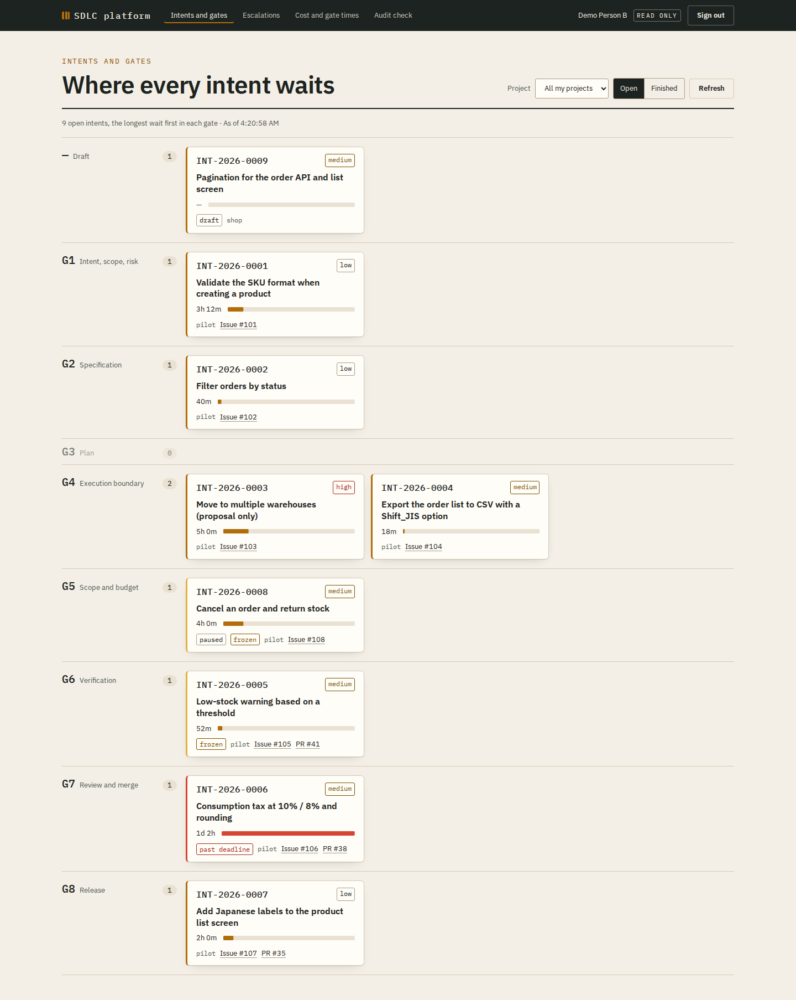
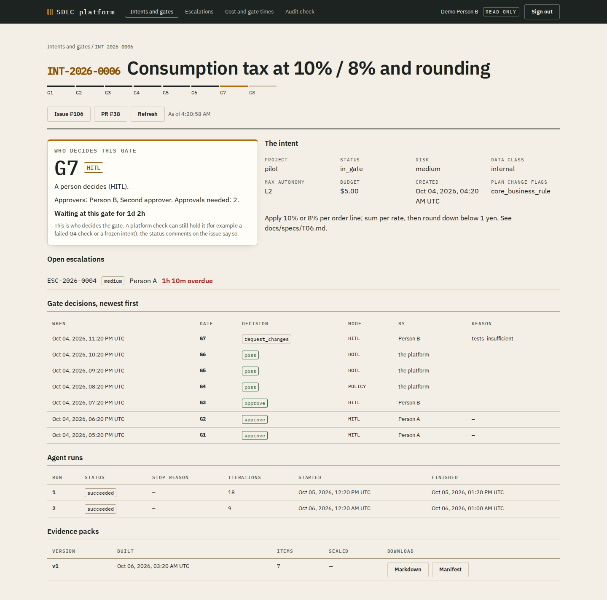

# Tutorial: your first feature, from idea to release

This tutorial follows **one real, small feature** through the platform: Japanese labels on the product list screen of the sample application (`pilot-order-inventory`, an order and inventory system). It shows what each person types, what the platform answers, and what you see on GitHub and on the dashboard.

Read [the platform in five minutes](PLATFORM-IN-5-MINUTES.md) first. The commands are the real ones; the platform's answers are its real message texts. Names, times and numbers are an example.

**The people**

| Person | Role on the project | In this story |
|---|---|---|
| **An** | Person A, the intent owner | Asks for the change, writes the spec and the plan |
| **Binh** | Person B, the independent reviewer and approver | Approves the plan, reviews and merges the pull request, approves the release |
| The agent | `coder-openhands` | Writes the code |

The change is **Low risk** and uses **internal** data only (the application is fictional), so the platform passes some gates by itself. A word you do not know: see the [glossary](../handbook/00-introduction/02-glossary.md).

---

## Step 1. Ask for the change (An, gate G1)

An opens a GitHub issue on the application's repository, as usual: **#107 "Japanese labels on the product list screen"**. Then An creates the intent and links it to the issue:

```bash
sdlc intent create --project pilot --title "Japanese labels on the product list screen" \
  --risk low --data-class internal --issue 107
```

```text
Intent INT-2026-0007 is created in project pilot (status draft, risk low, data class internal,
maximum autonomy L2, budget 10 USD). The platform checks the project AI record and moves it to G1.
```

**L2** (controlled change) is the highest autonomy level a Low-risk intent can get: the agent may change code, but only through the gates. The **project AI record** is the client's recorded consent to AI use, with the data classes it allows; the PM / BrSE keeps it.

A few seconds later the platform posts on issue #107:

> **INT-2026-0007** was submitted and waits at **G1** (Intent, scope, risk). @an: decide with `/approve G1`, `/reject G1 <reason>` or `/request-changes G1 <reason>`.

An checks that the goal, the scope and the risk are right, and comments on the issue (the command must be the first line of a **new** comment):

```text
/approve G1
```

> **INT-2026-0007**: G1 was approved by An. The intent now waits at **G2** (Specification). …

**Why a gate here?** G1 records who asked for what, at which risk. Everything later is bound to it.

## Step 2. Write the specification (An, gate G2)

An writes the spec as a Markdown file and merges it into `main` with a normal pull request. The spec says what must be true when the work is done: its **acceptance criteria**. An extract of `docs/specs/T01-product-list-japanese-labels.md` (the sample application's specs are bilingual, Japanese and English):

```markdown
## 受入基準 / Acceptance criteria

- AC1: 商品一覧画面の文言を次の日本語にする。
  The product list screen shows these Japanese texts.
  (Products → 商品一覧, New product → 商品を登録, Name → 商品名, Price → 価格, …)
- AC2: 販売状態を `on_sale` → 販売中、`discontinued` → 販売終了 と表示する。
- AC3: API の値と API の応答は変えない。
  The API values and the API responses do not change.
- AC5: 商品一覧画面のコンポーネントテストで AC1 と AC2 を確認する。
  A component test of the product list screen checks AC1 and AC2.

## 対象外 / Out of scope
- 他の画面の日本語化 / Japanese labels on other screens
```

An links it to the intent:

```bash
sdlc spec link INT-2026-0007 --path docs/specs/T01-product-list-japanese-labels.md
```

```text
INT-2026-0007: spec version 1 linked: docs/specs/T01-product-list-japanese-labels.md at 4c1e… (SHA-256 9b7f…). Tool -, structure manual_heading, 5 acceptance criteria.
```

The SHA-256 is a fingerprint of the file's content: any change to the file changes it.

The risk is Low, so G2 is **HOTL**: the platform passes it, because a spec is linked and it has acceptance criteria (five, under its `受入基準 / Acceptance criteria` heading; the rule: [handbook Ch.19 §19.8c](../handbook/02-playbook/ch19-approval-queues.md#g2-acceptance-criteria)), and tells the team how long they can still stop it, the **block window** (4 working hours by default):

> **INT-2026-0007**: the platform passed **G2** (HOTL): its conditions hold. The intent now waits at **G3** (Plan). @an: until **2026-10-08 15:00** you can still block G2 with `/reject G2 <reason>` or `/request-changes G2 <reason>`.

**Good to know.** The platform keeps the spec's hash, not its text. If someone edits the spec on `main` later, the intent goes back to G2 by itself.

## Step 3. Write the plan (An writes, Binh approves, gate G3)

The plan tells the agent **what to do and which files it may change**. It is a small YAML file, `.sdlc/plans/INT-2026-0007.yaml`, also merged into `main`:

```yaml
plan:
  intent_id: INT-2026-0007
tasks:
  - id: T1
    summary: Show the product list screen in Japanese (spec T01, AC1 and AC2)
    allowed_paths:
      - apps/web/src/features/products/**
    tools: [file_editor, terminal]
    input: docs/specs/T01-product-list-japanese-labels.md
    output: The product list screen and its component test
    definition_of_done: The component test checks AC1 and AC2; pnpm test passes; the API is unchanged
    escalate_when: A label is shared with a screen outside apps/web/src/features/products
```

- `allowed_paths` is the most important line: the agent may change **only** these files. Here, the product screens of the web application; not the API.
- `tools` are what the agent may use: edit files, run commands in its sandbox.
- If the change were a database migration, a payment or personal data, the plan would say so in `change_flags`, and the platform would ask for more approvals.
- Every field and rule of the plan file: [handbook Ch.19 §19.8c](../handbook/02-playbook/ch19-approval-queues.md#plan-file).

An submits it:

```bash
sdlc plan submit INT-2026-0007
```

```text
INT-2026-0007: plan version 1 submitted at 7a2d… (SHA-256 e41c…); 1 path patterns, tools file_editor,terminal, change flags none.
```

At Low risk without change flags, G3 is HOTL too, so the platform passes it and Binh is told. At Medium risk or higher, Binh would read the plan and comment `/approve G3`. **An never approves G3**: An submitted the plan.

## Step 4. The agent works (the platform, gates G4 and G5)

When every block window has closed, the platform checks, at **G4**, that the agent is registered and active, that the budget is enough and that the project AI record allows internal data. Then it starts the run:

> **INT-2026-0007**: G4 is passed. The platform starts the agent run.

What happens now, without anyone doing anything:

1. The platform makes a fresh copy of the repository in an **isolated sandbox**. The sandbox can reach the model gateway and a package mirror, nothing else: no GitHub, no secrets.
2. The agent reads `AGENTS.md` (the repository's build and test commands), the spec and the plan, edits `ProductListView.vue`, adds a component test, and runs the tests.
3. The run is capped: 30 iterations, 60 minutes and its budget by default. At 80 % of the budget a warning appears on the issue. If the agent repeats itself or stops making progress, the platform stops it.

When the agent finishes:

> **INT-2026-0007**: the agent run ended. The intent now waits at **G5** (Scope and budget), where the platform checks the file scope and the budget.

At **G5** the platform computes the changes itself (it never trusts the agent's report) and compares every changed file with `allowed_paths`. All changed files are under `apps/web/src/features/products/`, and the cost stayed inside the budget, so G5 passes.

**If the agent had changed a file outside the plan**, for example an API file, G5 would fail and send the intent back to G3 for a new plan. Nothing would be pushed.

## Step 5. The pull request and CI (the platform, gate G6)

The platform pushes the checked changes to the branch `agent/INT-2026-0007` and opens a pull request:

> **INT-2026-0007**: the platform pushed the agent's checked changes to the agent branch and opened a pull request. The intent waits at **G6** (Verification) for CI.

The pull request **#35** is titled "INT-2026-0007: changes of the agent run …", and its description says that an agent wrote the code, which run, and that G5 checked it. Your usual CI runs on it. When CI passes and there is no security finding, G6 passes (at Low risk the platform decides; at High risk, Binh would).

If CI fails, the platform starts a new run and tells the agent that CI failed, up to two times; then the intent goes back to G3.

## Step 6. Review and merge (Binh, gate G7)

> **INT-2026-0007**: the pull request of the agent run waits for review at **G7** (Review and merge). @binh: review the pull request on GitHub and submit a review: **Approve**, or **Request changes**. …

Binh reviews pull request #35 on GitHub **exactly as a normal code review**: the diff, the test, the acceptance criteria of the spec.

- If something is wrong, Binh submits **Request changes** with comments. The platform starts a new agent run that reads Binh's review, pushes a new commit, and asks Binh again.
- Here the change is right, so Binh submits **Approve**.

> **INT-2026-0007**: the approvals of the pull request at **G7** are complete. @binh: merge the pull request on GitHub. The platform never merges; it moves on to G8 when the approved commit is merged.

Binh clicks **Merge** on GitHub.

> **INT-2026-0007**: the approved pull request was merged. G7 passed, and the intent now waits at **G8** (Release).

**Why Binh and not An?** An created the intent and submitted the plan, so An is a producer of this change. The platform ignores a producer's approval at G7.

## Step 7. Release (Binh, gate G8)

The platform builds the **Evidence Pack**: the hashes of the spec, the plan and the diff (never the code or the texts), CI, every gate decision with who made it, the runs, the cost, and the client AI disclosure note ([what it holds](../handbook/02-playbook/ch15-p5-release.md#15102-the-evidence-pack)).

> **INT-2026-0007** waits for the release approval at **G8** (Release). The platform built the Evidence Pack (`sdlc evidence show INT-2026-0007`); the approval is bound to its release hash. @binh: check the pack …, then approve with `/approve G8` …

Binh reads it, then approves:

```bash
sdlc evidence show INT-2026-0007
sdlc gate approve G8 INT-2026-0007
```

> **INT-2026-0007**: G8 passed (Binh approved the release). The platform sealed the Evidence Pack, and the intent is closed (`done`).

The feature is merged, and the record of how it was made is sealed. `sdlc evidence export INT-2026-0007 --output INT-2026-0007.md` gives a readable copy for a client.

---

## What the dashboard shows along the way

At any moment, anyone on the team opens the dashboard (read only, [handbook Ch.19 §19.8e](../handbook/02-playbook/ch19-approval-queues.md#198e-using-the-platform-the-dashboard-read-only)) and sees where each intent waits, for how long, and who must act:



Opening an intent shows who decides its current gate, what holds it, every decision so far, the runs and the evidence:



(Screenshots with fictional data from the platform's tests.)

## Who did what, in total

| | An (Person A) | Binh (Person B) | The platform | The agent |
|---|---|---|---|---|
| G1 | Created the intent, `/approve G1` | | Checked the AI record | |
| G2 | Wrote and linked the spec; could block it | | Passed it (HOTL) | |
| G3 | Wrote and submitted the plan | Could block it | Passed it (HOTL) | |
| G4 | | | Checked the agent, budget, data; started the run | |
| Run | | | Sandbox, caps, stop on a loop | Wrote the code and the test |
| G5 | | | Checked files against the plan, and the cost | |
| G6 | | | Pushed, opened the PR, read CI | |
| G7 | | **Reviewed and merged** | Counted only valid reviews | Answered a request for changes, if any |
| G8 | | **Approved the release** | Built and sealed the Evidence Pack | |

An spent the time on **what** to build (the spec and the plan); Binh on **checking** it. Nobody wrote the code by hand, and nobody approved their own work. Who decides each gate by default: [user guide §1](USER-GUIDE.md#who-decides).

## Try it yourself

1. Ask your tenant admin (the person who manages users and projects on the platform) for an account, a role and a first API token ([user guide §2](USER-GUIDE.md#2-before-your-first-intent)).
2. Pick a small, Low-risk change with clear acceptance criteria.
3. Follow the steps above. When something does not go as shown, see [user guide §5, "When something goes wrong"](USER-GUIDE.md#5-when-something-goes-wrong).
